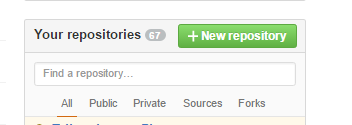
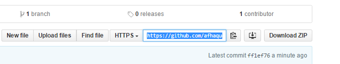
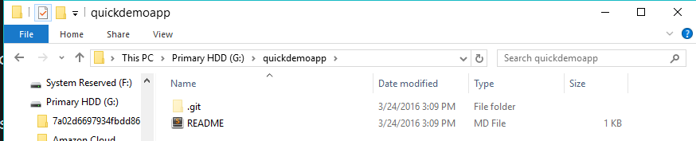

# 1.2 - Git'n Pro with HTML/CSS (6:30 PM)

## Overview

In this class we will be introducing students to Git Version Control and the basics of HTML/CSS.

`Summary: Complete activities 4-6 in Unit 01`

## Instructor Notes

## Slides

* [01.2 Git'n Pro with HTML/CSS](https://docs.google.com/presentation/d/1VZ7hXJWSI0ksJUnUF21LtqiyemdRR2kFSh4cfh700iU/edit?usp=sharing)

## Time Tracker

* [Unit 01-HTML-CSS Day 2 Time Tracker](https://docs.google.com/spreadsheets/d/1nnOcKwpP-H5KQ-L2JusIPvOuCNFqf2prFIE2XPriuQk/edit?usp=sharing)

### Sample Class Video (Highly Recommended)

* [Sample Class Video](https://codingbootcamp.hosted.panopto.com/Panopto/Pages/Viewer.aspx?id=a58da010-fbac-48c5-8d22-907532418158)

- - -

## Class Instruction

### Instructor Do: Open Slide Deck + Welcome Students (1 min) `6:30-6:31`

### Instructor Do: How's Everyone Feeling (2 min) `6:31-6:33`

### Instructor Do: Application Clarification (3 min) `6:33-6:36`

### Instructor Do: Who did the Mini Homework? (2 min) `6:36-6:38`

### Instructor Do: How to Get Help (3 min) `6:38-6:41`

### Instructor Do: Today's Objectives (2 mins) `6:41-6:43`

### Instructor Do: What/Why Git - "The Group Project" (Slides) (10 mins) `6:43-6:53`

* TODO: Maybe do this as a demo along with the slides?

* originally 5 minutes

### Students Do: Quick Activity - Explain Git (3 mins) `6:53-6:56`

### Instructor Do: Recap Answers (3 mins) `6:56-6:59`

* Have students explain their answers back to you. Correct any mistaken answers you hear. Encourage students when they get the right answer.

### Instructor Do: Explain GitHub (Slides) (5 mins) `6:59-7:02`

### Instructor Do: GitHub Examples (5 mins) `7:02-7:07`

### Instructor Do: Get Started with Git - Demo Git add, commit, push (10 mins)

* As an Instructor, create your own GitHub repo. Be sure to stress the importance of the repository being public. Without a public repository, students will not be able to use GitHub Pages in the future. Then walk students through the process of adding a file to GitHub.

* Have students try to follow along on their own accounts if they can.

* Important Note: We teach the process of cloning existing repos for consistency with students. So use the below steps as a guide.

  * Navigate to GitHub in your browser, and click to create a new repository.

      

  * Call your repository whatever you like, but make sure to set it as public. Initialize it with a README. Stress that although we’re breezing through this README for the sake of time, your READMEs are really important to users and recruiters, because it helps them see why your project is helpful, how it works, and the process you took to get it working.

      

  * Then copy the `ssh` or `https` link associated with this GitHub repo. (The difference has to do with whether you need to authenticate each time. SSH is preferred, but if it's not working for you, switch to `https`.)

      

  * Then open up Terminal or Bash and navigate to a folder where you would like to clone the repo. Then type the command `git clone <PASTE THE REPO>`.

    * Git Bash uses SHIFT+INSERT as the shortcut to paste.

    * Terminal uses COMMAND+OPTION+SHIFT+V as the shortcut to paste.

        

  * Point out to the students using Explorer or Finder that this action created a new folder on your machine with the same name as the repository on GitHub. Also point out that this file is directly attached to GitHub and that it includes the README found in GitHub.

      

  * Next, if you haven't already, navigate into this folder in Terminal or Bash.

  * Now add a new file into the folder in Finder or Explorer. This can be any file you want, but in my case, I will add an HTML file.

      

      

  * Now go back to Terminal / Bash, and type each of the following commands:

    * `git add -A` (This will tell Git to track any changes in the current repo.)

    * `git commit -m "Added a new file"` (This will tell Git to commit the changes and to include the comment "Added a new file.")

    * `git push origin master` (This will tell Git to upload the code to GitHub.)

      

  * Navigate back to GitHub in the browser, and show students that the file you uploaded now exists in GitHub.

      

* At this point, students will be completely confused. Take a moment to calm their nerves and to let them know that this will become second nature to them with a little time.

### Instructor Do: Recap Student Resources and Accounts (5 mins)

* It's very likely that there's still confusion among students about the purpose of GitLab, Bootcampspot, GitHub, and their respective roles in homework submission.

* Take a moment to reiterate that GitLab is their *class repo*, the spot that they will pull from every day to get class activities and homework instructions.

* GitHub will be the place that all of their HW code will get uploaded.

* Bootcampspot is the spot that students actually turn in their homework. They will submit two links: One to their repo, one to their live (hosted) version of the web application.

* Take a moment to log in to BCS to show students where they will link to their homework.

* Before slacking out the next activity, have students log into each of these accounts. Tell the students who are having difficulties logging in to either raise their hand or slack a TA.

### Instructor Do: Slack GitHub Guide (2 mins)

* At this point, slack the GitHub guide (found in `Supplemental > GitHub Help > "Steps to Upload GitHub"`). Let them know that this guide will be their best resource on completing their own GitHub pushes.

### Students Do: Git Add, Commit, Push (15 mins)

* Then slack out the following activity (or show them the instructions on the slide):

  * **Instructions:**

    * Using GitHub and the Command Line, do the following:

      * Create a new public GitHub repository, and name it whatever you like. Be sure to check the box for “initialize this repository with a README.”

      * Next, clone the repo to your local directory.

      * Then create an HTML file inside the local directory.

      * Add, Commit, and Push the code to GitHub.

    * Bonus:

      * Create a new public GitHub repository, and name it `zen-garden`. Be sure to check the box for “initialize this repository with a README.”

      * Clone the repo to your local directory.

      * Go to [CSS Zen Garden](http://www.mezzoblue.com/zengarden/alldesigns/). Navigate to a few of the examples and choose a page that you like.

      * Download the HTML and CSS. Each page has a link to download the code, normally near the top of the page.

      * Move the HTML and CSS into your newly cloned repo and open the HTML in Chrome. 

      * Use inspect element to identify a page element you would like to change in some way.

      * Change the CSS in any way you'd like.

      * Add, Commit, and Push the code to GitHub.

* **Instructor:**

  * Once the time is complete, recap the activity with everyone. Have them explain it back to you. Some students will be confused or will struggle with this activity (especially the bonus) so once again reassure the class that this process will become second nature over time.

### Instructor Do: Git Workflow (Slides) (10 mins)

* Walk students through the Git Workflow slides.

* The main objective of these slides is to start getting students familiar with the process of data flow with Git. Don't worry if some students aren't fully grasping the purpose of each conceptual area. 

* The important takeaway is that `git clone`, `git add`, `git commit`, and `git push` all bring your files into the next stage in Git Workflow.

### Instructor Do: HTML Round 2 (Slides) (15 mins)

* Walk students through the HTML Round 2 slides.

* Be concise, when you can, to save time. You don't need to explain every single thing that is on the slides—they will be made available to students after class to go back to. Just hit the high points!

### Students Do: Basic Student Bio Activity (20 mins)

* Open the file `basic-html-bio.html` inside `04-HTML_Git` in your browser.

* Then slack out the following instructions to students (or show them the slide):

  * **Instructions:**

    * Create a basic HTML page with your own information that looks similar to the design shown on screen.

### Instructor Do: Recap Basic Student Bio Activity (5 mins)

* Either live-code or open the solution (`basic-html-bio.html`) to the previous activity in your editor. Then, walk students through the solution line-by-line.

* Explain the `div` and `section` tags that appear in the solution.

  * Explain that `div` tags are used to group elements into *visually* related segments and that they are primarily used as "hooks" for CSS styling.

  * Explain that `section` tags are used to group elements into *thematically* related segments.

  * Explain that `div` and `section` tags behave identically, in that both are block-level tags used to demarcate *sections* of a site.

  * Explain that the difference between `div` and `section` tags is dependent on what we want our source code to communicate to other developers.

  * Encourage students to use a `div` when they're not sure which tag to choose. You can also direct them to the [HTML5 Doctor Flowchart](http://html5doctor.com/downloads/h5d-sectioning-flowchart.pdf).

* Once you are done reviewing, slack out the code to them to see for themselves. (When slacking out the code, use the solution provided in the Lesson-Plan repo as it is extensively commented.)

- - -

### BREAK (15 mins)

* During Break Instructor and TA should re-sync regarding the schedule and should adjust as necessary.

- - -

### Instructor Do: CSS Stylin' - Basics of CSS (Slides) (15 mins)

* Using the CSS Stylin' slides as a guide, provide students with perspective on what CSS is and how it works.

* Explain to them how CSS can be used by tying itself to HTML elements, classes, or IDs. Don't get too bogged down trying to explain things. You will be demonstrating this through examples shortly.

### Instructor Do: CSS Show! Demo (15 mins)

* Take about 15 minutes to quickly demonstrate a few examples of CSS styling. As a starting point you can use the files inside `05-BasicCSS` to showcase the pieces necessary to link an HTML page to CSS.

* Point out the following:

  * That CSS can be linked to tags like `h1`, `h2`, `p`, `img`, and also specific classes (specified by .syntax) and id's (specified by #syntax).

  * Just show enough to give them an idea of what's possible.

* Slack out the `quick-example-internal-css.html` file to them.

### Students Do: CSS Styled Bio Page (20 mins)

* Open the file `html-bio-with-css.html` (`06-HTML_CSS_Layout`) in your browser. Warn students that this might be a tough activity for some of them.

    

* Slack out `06-HTML_CSS_Layout/html-bio-with-css.html` as a starter file.

  * This is important as the **Instructions** given below assume a particular markup structure.

* Then, slack out the following instructions to students:

  * **Instructions**:

    * Put all of this code inside a folder named `week1-day2-html-css`, and put the folder in a place where you normally code. 
    * Use the command line to make a folder called `css`.
    * Use the command line to make a file called `style.css` inside of thee `css` folder.
    * Reference the `style.css` in your `student-bio.html` file. You do this by placing `<link rel="stylesheet" type="text/css" href="css/style.css">` inside the `<head>` tag.
    * Style the example on the projector.
      * Add a `class` called "container" on the `div` tag.
      * Add an `id` called "main-bio" for the first `section` tag.
      * Add an `id` called "contact-info" for the second `section` tag.
      * Add an `id` called "bio-image" for the bio image.
    * Style specs:

      * `body`
        * The background color is `#efeee7`.
        * The font used `"Georgia",Times New Roman,Times,serif;`.
        * The font color is `#333333`.
        * Be sure to zero out the body margins and padding so the page is flush to the top of the page:
          ```css
          body {
            margin: 0;
            padding: 0;
          }
          ```
      * `header`
        * The background color is `#333333`.
      * `h1`
        * The font color is `#eee`.
        * The font size is `28px`.
        * Look at the example on the screen, and eyeball the padding and/or margins and positioning of the text.
      * `h2`
        * The font size is `24px`
      * Make the container have a width of 1024 pixels, and center it. You do this using `margin: 0 auto;`.
      * Make `#main-bio`, `#contact-info`, `#bio-image` all `float: left`.
      * Make the `#bio-image` have a width of 200 pixels.
      * Be sure to include `alt` text in all images
      * `#main-bio` should have a width of `70%`.
        * Add margins to the image so there is distance between it and the bio text.
      * `#content-info` should have a width of `30%`.
      * Adjust the line height so it is 1.5 times the size of the font.
      * Make the link color `#d21034`.

    * If you forgot how to write the CSS properties, you can reference all CSS properties here <https://developer.mozilla.org/en-US/docs/Web/CSS/Reference>

    * Bonus:

      * Stage, commit, and push this new file to Github.

### Everyone Do: Recap Activity (5 mins)

* Have students recap the solution back to you.

    

* Fill in concepts where students are unable to provide a clear answer.

* Emphasize the use of `div` and `section` in the solution.

### Instructor Do: Recap + Questions (Slides) (5 mins)

* Complete the last slide of the slide show.

* Make sure all students feel encouraged and that they're motivated to keep going.

### Instructor Do: Slack out the Video (5 mins)

* After you have slacked out the code, once again remind your students that we also have online videos for them with which to review key activities.

* These videos are a great way to catch up on material if you ever need to review them or if you feel like you are falling behind.

* Slack out [Lesson 1.2 - Student Bio Layout](https://www.youtube.com/watch?v=kMBinXTCrXI).

- - -

### Tips and Tricks

* On Windows devices, you can navigate to a specific folder in Git Bash using the File System Viewer, right clicking, and then selecting the option "Git Bash Here" from the dropdown menu.

