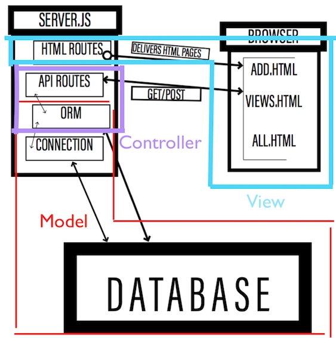
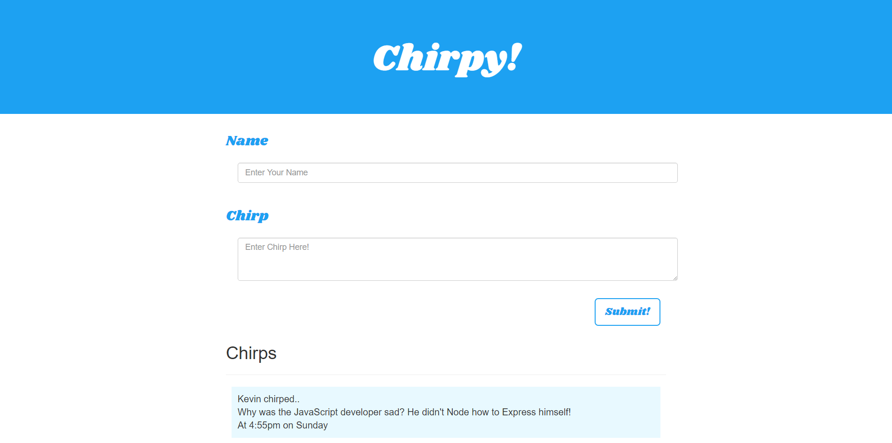
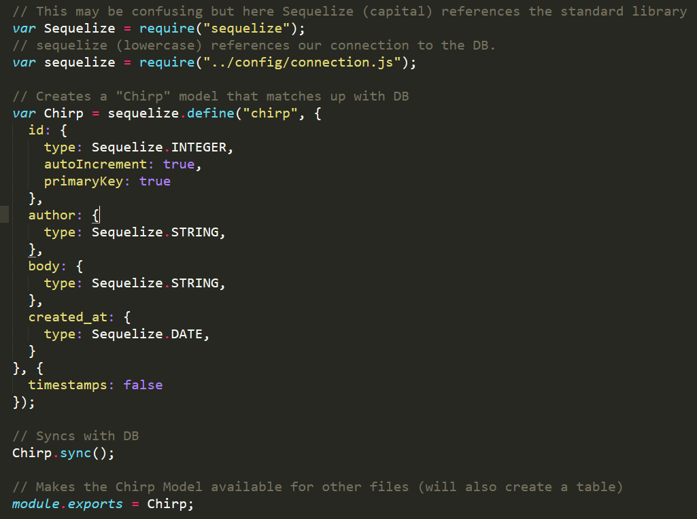
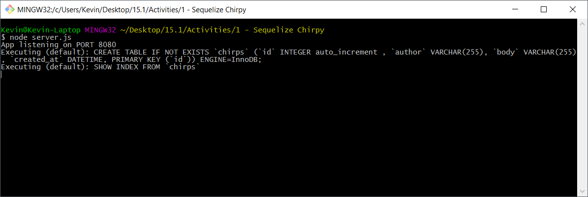

## 14.1 - The Sequel to MySQL (6:30 PM)

## Overview

In this class, we will introduce students to the Sequelize ORM. This tool makes coding with MySQL databases a smoother experience--once you get past the learning curve.

* `Summary: Complete activities 0-6 in Unit 14`

* Make sure you change all of the connection information so the examples have your MySQL username/password!

* If you don't want to have to do it live, create the databases required to show off today's exercises before class!

* THIS IS TOUGH STUFF! This week, tell your class to not feel discouraged if there are concepts that they can't nail down completely. Tell them to try their best, but to speak with you or a TA if they're unsure of anything.

* Let students know Sequelize is a popular and powerful Node ORM. However, it may be important to note that this week is largely an exercise in learning a new library. Students will have to read documentation, go through tutorials, search and post on StackOverflow in order to find specific answers once they've identified specific problems as they're working through projects.

* You should check out the solutions to this week's homework before starting this class, especially if you haven't used Sequelize before. This will give you a brief rundown of how the ORM works.

  * Be sure to check the answers to the quiz in `02-SequelizeQuestions/solution` before starting the class. You should be an expert on these concepts, so that if students ask you about the answers after the quiz, you can give them a thorough explanation.

* **BE VERY CAREFUL TO NOT GO TOO IN DEPTH.** There are a ton of components that make Sequelize work, but much of it is boilerplate that doesn't need much explanation. Focus on the parts we tell you about in this guide.

* **DO NOT HAVE STUDENTS CONNECT TO A REMOTE DATABASE WHEN DEVELOPING LOCALLY.** The correct process is described in `Supplemental/SequelizeHerokuDeploymentProcess.pdf`, and if you try to skip this, your students may not be able to work on activities or homework on your classroom's internet connection (also, using a remote database for local development is considered bad practice).

## Learning Objectives

* To introduce Sequelize as a complex tool that simplifies MySQL.

* To demonstrate the makeup of a Sequelize directory, how to make one, and how to make queries using Sequelize.

### Instructor Do: Refresher on last week

 - (5 min)

* You're going to be going over the concepts of MVC. Open up the PDF inside `00-MVCDiagram`, and ask students which components belong to the model, the view and the controller (the solution is represented in the image below).

  

  * Remember:
    * The Model represents the application core (our database and it's hook to our back-end).
    * The View displays the data (our HTML routes and the public files).
    * The Controller handles the input to our database (accepting input from the view, sending it to the model, taking a response from the model, and sending it back to the view.)

### Students Do: Review MySQL

 - (20 min)

* Before we get into new material, we are going to do a quick review of MySQL concepts by building a simple app. We will revisit this example later on with the Sequelize ORM, but for now we are only going to use the MySQL package.

* Open up the completed Chirpy activity and demonstrate its functionality. It is a simple twitter-like app that allows you to write new Chirps (tweets), and view all of your previous Chirps.

* NOTE: Make sure you have used the schema.sql file to create the Chirpy database and the table that will be used to hold our Chirp data. If you haven't done this the app won't work. You can do it before class or do it live as a review for the students.

* Slack out the `01-Chirpy-mySQL` folder and the following instructions:

  * Using the app skeleton provided to you:
    * Create a MySQL database named `'chirpy'` with a `'chirps'` table to hold your data.
    * Your `'chirp'` table should include a field for id, author, chirp, and time created.
    * Modify the connection.js file to create a connection to your database.
    * Modify the api-routes.js file so that there is a route for adding a new chirp, as well as retrieving all chirps.
    * Modify the chirps.js file so that the page interacts with the database.

* If students finish early, have them work on routes for editing and deleting chirps.

### Instructor Do: Review Chirpy

 - (10 min)

* Review the main parts of the Chirpy application:
  * Creation of the database and the table in mySQL Workbench (or your choice of GUI).
  * Use of mysql npm package to connect to the database as well as configuration of `connection.js` file.
  * API routes and mySQL queries that were used to retrieve data from the DB.
  * Making our AJAX calls and displaying data on the front-end.

### Instructor Do: Introduce Sequelize Before a Quiz

 - (5 min)

* Tell your class while the Chirpy app is functional, there's a way to make it work with our database with a lot less hassle. It might take time to learn, and this week will be a tough one, but this tool is going to take your students from beginners to truly adept MySQL coders.

* Load up the Sequelize site on your screen and slack out the website to your students. (<http://docs.sequelizejs.com/en/latest/>). Tell the class that Sequelize is a premade ORM that simplifies database queries in Node applications, allowing us to do complex data management with simple JavaScript methods.

* Inform your class that today will focus on getting Sequelize set up on their machines and how to navigate a Sequelize project. You'll be doing this by converting the Chirpy app from the last assignment into a Sequelize app.

### Partners Do: Sequelize Quiz

 - (15 min)

* Slack out the unsolved portion of `02-SequelizeQuestions`.

* Have your students partner up into two-person teams. Each team will need to come up with answers to the questions in the quiz. Check out the answers in the solved portion in the meantime.

* Tell them they should use the Sequelize documentation, as well as any info they may find on the usual sites (stack overflow, quora, etc.) to answer these questions.

### Everyone Do: Go over Answers

 - (10 min)

* "Times up! Let's see how everyone did."

* Open the unanswered version of `02-SequelizeQuestions` and display it. Go down the list and ask your students to give you their answers. If everyone is stumped, refer to the answers in the solved version, then ask the students if this makes sense. If not, offer more of an explanation.

* Ask your class the same question you asked on week 1: "How would you define full-stack development?" At this point students should be much more savvy than they were on Week 1, so expect solid answers.

### Instructor Do: Chirpy with Sequelize

 - (15 min)

* Open the Sequelize version of the Chirpy app and show it off again. This time inform students that this new version of Chirpy is using the Sequelize ORM we just learned about. Slack out the completed Chirpy-Sequelize app `03-Chirpy-Sequelize` and encourage students to follow along as you work through the code.

* Open up the Chirpy code in your editor and illustrate the key differences between using Sequelize and stock MySQL.

  * In the connection.js file we require the Sequelize package, and use it to create a connection to our database. This is very similar to how we use the MySQL package.
  * One of the biggest changes is the addition of a models folder with our new `chirp.js` file.

    

    * Note how we first require the Sequelize library, and then the connection that we will use to connect to the database (Sequelize with a little "s").
    * Reiterate the key aspects of Sequelize models. A model represents a table in the database. Here we are defining the different columns that will be in our table, as well as assigning them a data type. In addition, we sync our model with the database. Sequelize will create a table in our database for each model if it does not already exist. Point out that we don't need to define an id column in our Sequelize models. By default, we're given a NOT NULL, auto-incrementing id of type INTEGER to serve as the primary key. We can explicitly define an id column if we wanted to give it a different configuration, but we can just omit this most of the time.

      

  * In api-routes.js we first require the Chirp model, then we use sequelize query methods to query our database. In our example we are using `Model.findAll()` and `Model.create()` but there are many more! Illustrate how instead of having to write out an entire mySQL query string, we can use predefined query methods defined by Sequelize. This allows us to greatly simplify how we retrieve data from our database!

    
  
  * **Note**: If we were to `console.log` the `result` object returned from a sequelize query, we'd see that it is a large object with many nested keys and methods. It contains a `dataValues` property that contains the record data we're looking for.

  * When we send the large `result` object back to the client using `res.json`, only the `dataValues` property is sent back.

  * This is worth knowing since it may come up when debugging students code.

### Students Do: Star Wars MySQL to Sequelize

 - (20 min)

* Now it's the students' turn to get their hands dirty with Sequelize. They will be taking an app that currently uses the MySQL package, and updating it to use the Sequelize ORM.

* Open the Star Wars app `04-StarWars` and demonstrate its functionality. Inform students that they will be taking this fully functioning app and converting it to use Sequelize!

* Slack them the Star Wars skeleton folder `04-StarWars` along with the following instructions:
  * Using the instructions in server.js, reconfigure the Star Wars app to use the Sequelize ORM.
  * If you need help, refer to the previous example for guidance.

* Note that a question mark will appear in certain `get` routes. This `?` character indicates an _optional parameter_—these routes will load even if the parameter wrapped in `:?` is absent from the request.
  * _A question mark in an Express route indicates an optional parameter._
    

### Instructor Do: Review Star Wars Example

 - (10 min)

* Review the Star Wars app with the class, touching once again on the major differences and advantages of using the Sequelize ORM.

* Dismiss the class for a break if all checks out.

### Break (15 mins)

### Students Do: Sequelize Library

 - (25 min)

* In this activity, students will be building the backend of a Sequelize application.

* Open the Sequelize-Library solution `05-SequelizeLibrary` and demonstrate its functionality. Add a few books to the library then show students how we can search for books by title/author/genre, choose to view all books, or view short/long books.

* This app will require students to research more advanced sequelize querying. Urge students to use the Sequelize documentation to find these answers.

* Slack them the Sequelize Library skeleton folder `05-SequelizeLibrary` along with the following instructions:
  * Instructions
    * Create a `'sequelize_library'` DB.
    * Modify `'connection.js'` to include your MySQL user/database information.
    * In the `'models'` folder, modify the `book.js` file to create a book model. Further details can be found inside this file.
      * Your book model must include a title, author, genre, page numbers.
    * Modify `'api-routes.js'` using sequelize query methods to create the required routes.

### Instructor Do: Go over Sequelize Library

 - (10 min)

* Go over Sequelize implementation. Focus on aspects of this activity that were new such as the advanced querying techniques as well as the CRUD operations. Inform students that this was a difficult activity and that we will spend more time with CRUD operations next class.

### Instructor Do: Intro to Sequelize CLI (15 -20 min)

* Explain to students that we can also initialize Sequelize projects using the Sequelize Command Line Interface.

* This will allow us to quickly start new projects, take advantage of advanced Sequelize features, as well as work with multiple models more easily at scale an ultimately have to write less code as our project grows.

* Slack out the Sequelize CLI Skeleton `06-SequelizeCLI` as well as the `Supplemental/SequelizeQuickStartGuide.pdf` have the students follow along with you as you initialize a new project using the Sequelize CLI.

We will be using this method of setting up Sequelize projects going forward, so encourage students to practice with this guide before next class.

**NOTE**: The Sequelize CLI has a lot of functionality, including creating models via the CLI. **We will only be using be using the CLI to initialize an index.js file, and a config.json file**. Discourage model creation with the CLI (if it comes up at any point), as while this is fine for simple models, it will create far more trouble than it's worth later in the week when our models become more complex if students have never written them by hand before.

### Instructor Do: Wrap Up and Dismiss (5 mins)

* Send your students the instructions for this week's `02-Homework/Instructions`.

* Stress that students should deploy their assignments as early as possible, refer to the deployment guide provided, and ask for help if they're unable to sooner rather than later. Explain that not deployed assignments will take a grade hit and won't help students as much professionally.

* Essentially they'll be taking last week's assignment and converting it from a pure MySQL project to one incorporating Sequelize. This will mean connecting their MySQL database to Sequelize, creating a Burger Model, and updating their current queries to use Sequelize queries.

* With what they've learned today, this will be a perfect way for them to work through Sequelize's intricacies.

* With the Sequelize Quick Start guide and examples we went over in class, students should know enough to at least get started tonight.

* Slack out the `Supplemental/SequelizeHerokuDeploymentProcess.pdf`. This describes the process for deploying a Sequelize application to Heroku and making use of JAWSDB.

