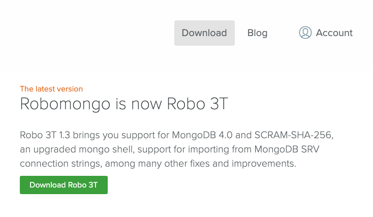
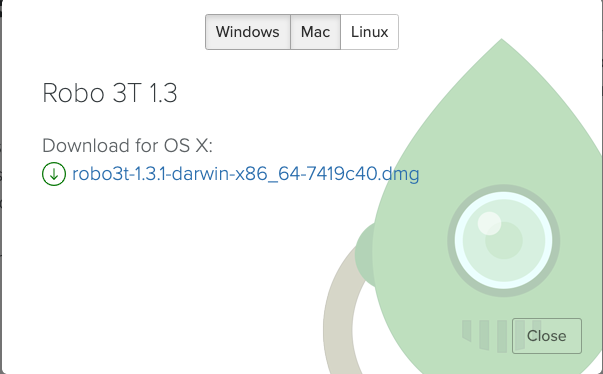
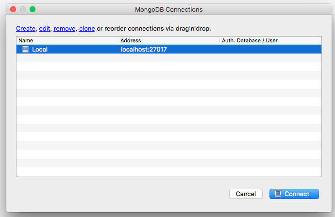

# 17.1 Lesson Plan - Masters of MongoDB (6:30 PM)

## Overview

In this class, you will introduce the concept of the NoSQL database with MongoDB, go over its pros and cons compared with MySQL, and ultimately detail all of the required steps to employ MongoDB in future projects.

## Instructor Notes

* Complete activities `1-8` in `17-NoSQL`

* Before class, make sure you install MongoDB and Robo 3T on your machine--you'll need both.

* If you haven't used MongoDB much in the past, take a look at this week's queries and solutions. This should prime you for the lecture.

## Learning Objectives

* Identify and explain the differences between SQL and noSQL databases.

* Install MongoDB and Robo 3T.

* Create a Mongo database.
  
* Perform basic CRUD actions on their Mongo database.

## Slides

[17.1: Intro To MongoDB](https://docs.google.com/presentation/d/1JHT8-zZ-JWHg_zKDXEVy-leNegSipr26HBTNIEl3J3Y/edit?usp=sharing)

## Time Tracker

[17.1: Intro To MongoDB Time Tracker](https://docs.google.com/spreadsheets/d/1a4JbqI3NUd2qe6nKqYF_w5X0TXz7tG_TKXa1fcvuaXM/edit?usp=sharing)

### 1. Instructor Do: What is MongoDB (10 min)

* Welcome students to class.

* Open the [slide deck](https://docs.google.com/presentation/d/1hXNcmzYqwlhgM-C78vNFKwX10PhW_iwIo0guwzHO48c/edit?usp=sharing) and follow these prompts with their corresponding slides:

  * **Introduction to MongoDB (Title)**: Today's class will be an introduction to MongoDB. 

  * **What's MongoDB?**: MongoDB is a very popular noSQL database that uses a document-oriented model as opposed to a table-based relational model (SQL). MongoDB stores data in BSON format (effectively, compressed JSONs).

  * **Relational Databases**: Relational databases rely heavily on joins to combine relevant data.

  * **Document Database (NoSQL)**: NoSQL databases on the other hand are effectively JSON objects and are very flexible. 
  
  * **MongoDB Storage**: Mongo databases contain collections which contain documents. 

  * **Mongo Terms**: Use this slide to cover the relevant Mongo terms.

### 2. Students Do: Installing MongoDB / Robo 3T (20 min)

**Part 1: Install Mongo**

* Have students install MongoDB by using the [03-Supplemental/Installing-MongoDB.md](../../../../01-Class-Content/17-NoSQL/03-Supplemental/Installing-MongoDB.md).

* After 10 minutes ask the class:

  * Can everyone start up MongoDB by typing `mongod` into your terminal/bash window?

  * If mongo is successfully installed, their terminal/bash screens will look like this:

  ```bash
  ➜  ~ mongod
  2019-05-03T11:00:35.067-0400 I CONTROL  [main] Automatically disabling TLS 1.0, to force-enable TLS 1.0 specify --sslDisabledProtocols 'none'
  2019-05-03T11:00:35.110-0400 I CONTROL  [initandlisten] MongoDB starting : pid=785 port=27017 dbpath=/data/db 64-bit host=Daniels-MBP-2
  2019-05-03T11:00:35.110-0400 I CONTROL  [initandlisten] db version v4.0.3
  2019-05-03T11:00:35.110-0400 I CONTROL  [initandlisten] git version: 7ea530946fa7880364d88c8d8b6026bbc9ffa48c
  2019-05-03T11:00:35.110-0400 I CONTROL  [initandlisten] allocator: system
  2019-05-03T11:00:35.110-0400 I CONTROL  [initandlisten] modules: none
  2019-05-03T11:00:35.110-0400 I CONTROL  [initandlisten] build environment:
  2019-05-03T11:00:35.110-0400 I CONTROL  [initandlisten]     distarch: x86_64
  2019-05-03T11:00:35.110-0400 I CONTROL  [initandlisten]     target_arch: x86_64
  ```

* If there are any remaining students who do not have it installed and configured, ask them to raise their hand so a TA can help debug the issue.

**Part 2: Install Robo 3T**

* Tell the class that they are now going to install Robo 3T, a native cross-platform MongoDB management tool that will make working with MongoDB easier and more intuitive.

* Direct the students to the Mongo 3T install page [https://robomongo.org/download](https://robomongo.org/download) and have them click the green download button.

  

* Next have them choose their OS and download the application.

  

* After installing students should be able to successfully open Robo 3T on their machine.

* Ask the students the following question(s):

  * ☝️ Did anyone have trouble installing Mongo or Robot 3T

  * 🙋 If yes, have a TA come around and help those students.

* Take any questions before moving on.

### 3. Instructor Do: Create, Insert and Find (10 min) 

* In order to get set up for the activity, direct the students to:
  
  * Run `mongod` in one tab, if they haven't already. Explain that `mongod` is the primary daemon process for the MongoDB system that handles data access and requests and background management operations. Tell them that when you start `mongod` you're telling your machine to start the MongoDB process and run it in the background.
  
  * Run `mongo` to start up the mongo shell in another tab. Explain that `mongo` is the command-line shell that connects to the specific instance of `mongod` that they just started.

* Next explain that you'll be going over how to create a database, insert data into a collection and find stored data using MongoDB.

* Following the comments and queries located in [01-Ins-Create-Insert-and-Find/queries.md](../../../..01-Class-Content/17-NoSQL/01-Activities/01-Ins-Create-Insert-and-Find/README.md), demonstrate to the class how to create a new database, insert and find new records.

* Switch to a new database:

  ```
  use lessondb
  ```

* Show the current db:

  ```
  db
  ```

* Insert data:

  ```js
  db.places.insert({"continent": "Africa", "country":"Morocco", "majorcities": ["Casablanca", "Fez", "Marrakech"]})
  ```

* As a class, come up with five more countries and insert them into the db using the same syntax as above.

  * Observe where the data was entered in the MongoDB instance (in mongod).

* Find all data in the collection:

  ```js
  db.places.find()
  ```

  * NOTE: the MongoDB `_id` was created automatically.

  * This id is specific for each doc in the collection:

* Add `.pretty()` to make your data more readable:

  ```
  db.places.find().pretty()
  ```

* Find specific data by matching a field:

  ```js
  db.places.find({"continent": "Africa"})
  db.places.find({"country": "Morocco"})
  ```

* Find specific data by matching an _id:

  ```js
  db.places.find({_id: ObjectId("5416fe1d94bcf86cd785439036")})`
  ```

* When you are done tell the class that this is just the beginning as they will be sharpening their mongo skills in the coming days and weeks.

* Ask the students the following question(s):

  * ☝️ What keyword do we use to switch to a new database?

  * 🙋 The `use` keyword.

  * ☝️ What keyword do we use to find data?

  * 🙋 The `find` keyword.

* Take any questions before moving on.

### 4. Students Do: Create, Insert and Find data in MongoDB (10 min)

* Direct students to the instructions of their next activity in [02-Create-Insert-and-Find/Unsolved/README.md](../../../../01-Class-Content/17-NoSQL/01-Activities/02-Create-Insert-and-Find/Unsolved/README.md).

```md
# Creating, Inserting and Finding in MongoDB

## Instructions

* Use the command line to create a classroom database. 

* Insert entries for yourself and the people in your row in a `students` collection.

* Each document should have:

  * A field of `name` with the person's name.

  * A field of `rownumber` which will contain the row number that they are in.

  * A field of `os` which will contain the Operating System of the computer they are using: 'Mac', 'Win', etc

  * A field of `hobbies` with an array of the hobbies the person likes to do.

* Use find commands to get:

  * A list of everyone in your row.

  * An entry for a single person.

  * The entries for all the Mac users in your row.

## 💡 Hint(s)

* Use the [Mongo guides](https://docs.mongodb.com/guides/) if you are stuck.

## 🏆 Bonus

* If you finish early, check out the MongoDB documentation and figure out how to find users by an entry in an array.

```

### 5. Instructor Do: Review Create, Insert and Find data in MongoDB (5 min)

* Open [02-Stu-Create-Insert-and-Find/Solved/README.md](../../../../01-Class-Content/17-NoSQL/01-Activities/02-Stu-Create-Insert-and-Find/Solved/README.md) in your IDE and run the following commands.

* Create a classroom db and insert a classmate**

  ```sql
  use classroom
  db.students.insert({name: 'Steve', row:3, os:'Mac', hobbies:['Coding', 'Reading', 'Running'] })
  ```

* Find all students in row 3**

  ```sql
  db.students.find({row:3})
  ```

* Find students named Steve**

  ```sql
  db.students.find({name:'Steve'})
  ```

* Find students in row 3 that use Mac's**

  ```sql
  db.students.find({row:3, os:'Mac'})
  ```

* BONUS: Find by entry in an array**

  ```sql
  db.students.find({"hobbies": {$in: ["Coding"]}})
  ```

* Ask the students the following question(s):

  * ☝️ How do we find a record inside an array?

  * 🙋 Review the syntax using `db.students.find({"hobbies": {$in: ["Coding"]}})` as an example.

* Take any questions before moving on.

### 6. Instructor Do: Updating, Deleting and Dropping in MongoDB (10 mins)

* Use the prompts and talking points below to review the following key point(s):

  * ✔ We use `update` to update a value.

  * ✔ We use `$set` to replace the value of a field with the specified value.

  * ✔ We use `push` to update values in an array.

  * ✔ We use `remove` to delete items.

  * ✔ We use `drop` to drop a collection.

* Open [03-Ins-Update-Delete-and-Drop/queries.md](../../../../01-Class-Content/17-NoSQL/01-Activities/03-Ins-Update-Delete-and-Drop/README.md) in your IDE and lead students the following commands.

* Make sure you are using the database, `lessondb`,  that we created earlier.

  ```sql
  db
  use lessondb
  ```

**Update**

* Tell the class that we update data using `db.[COLLECTION_NAME].update()`

  ```sql
  db.places.update({"country": "Morocco"}, {$set: {"continent": "Antarctica"}})
  ```

* Note that the above will only update the first entry it matches.
  
* Explain that to update multiple entries we add `{multi: true}`.

  ```sql
  db.places.update({"country": "Morocco"}, {$set: {"continent": "Antarctica"}}, {multi: true})
  ```

* Recall from the earlier demo the structure of our document:

  ```sql
  db.places.insert({"continent": "Africa", "country": "Morocco", "majorCities": ["Casablanca", "Fez", "Marrakech"]})
  ```

* Ask the students the following question(s):

  * ☝️ What do you think will happen when I run the following command, even though there is not a `capital` field in the document?

    ```sql
    db.places.update({"country": "Morocco"}, {$set: {"capital": "Rabat"}})
    ```

  * 🙋 `$set` will create the field `capital`.

* Tell the class that the newly created field can now be updated with the same command:

  ```sql
  db.places.update({"country": "Morocco"}, {$set: {"capital": "RABAT"}})
  ```

* We can update the values in an array with `$push`:

  ```sql
  db.places.update({"country": "Morocco"}, {$push: {"majorcities": "Agadir"}})
  ```

**Delete**

* We delete an entry with `db.[COLLECTION_NAME].remove()`

  ```sql
  db.places.remove({"country": "Morocco"})
  ```

* We can also empty a collection with `db.[COLLECTION_NAME].remove()`

  ```sql
  db.places.remove({})
  ```

**Drop**

* We drop a collection with `db.[COLLECTION_NAME].drop()`

  ```sql
  db.places.drop()
  ```

* To drop a database:

  ```sql
  db.dropDatabase()
  ```

* Ask the students the following question(s):

  * ☝️ What does the `$push` method do?

  * 🙋 It updates the values in an array, `db.places.update({"country": "Morocco"}, {$push: {"majorcities": "Agadir"}})`

  * ☝️ Which method deletes an entry from a collection?

  * 🙋 We can use remove, `db.[COLLECTION_NAME].remove()`

* Take any clarifying questions before moving on.

### 7. Students Do: Update, Delete and Drop in MongoDB (15 min)

* Direct students towards the next activity in [04-Student-Update-Delete-and-Drop/Unsolved/README.md](../../../../01-Class-Content/17-NoSQL/01-Activities/04-Stu-Update-Delete-and-Drop/Unsolved/README.md)

```md
# Update, Delete and Drop in MongoDB

* Go back to your classroom database. You've decided to take on a new hobby, extreme basket weaving. While practicing for your Extreme Basket Weaving Competition, you broke the computer of the person next to you. They're now using a new operating system now. Another student in your row saw you break that computer and wisely decided to move. You are worried everyone else will leave and you'll have to sit all alone. You decide to bribe everyone who didn’t leave with candy. All this work made you hungry, so you bought yourself some candy. 
  
## Instructions

* Add Extreme Basket Weaving to your array of hobbies.

* Change the operating system of the student next to you.

* Remove the student to the other side of you from your database.

* Add a field of `gavecandy` with a value of `false` to everyone in the array.

* Change the value of `gavecandy` to true for yourself.

## 💡 Hint(s)

* Use the [Mongo guides](https://docs.mongodb.com/guides/) if you are stuck.

## 🏆 Bonus 

* Insert five more documents with one command. Use [https://docs.mongodb.com/manual/tutorial/query-documents/](https://docs.mongodb.com/manual/tutorial/query-documents/) to see how you can accomplish this.

```

### 8. Instructor Do: Review Update, Delete and Drop in MongoDB (5 min)

* Open [04-Stu-Update-Delete-and-Drop/Solved/README.md](../../../../01-Class-Content/17-NoSQL/01-Activities/04-Stu-Update-Delete-and-Drop/Solved/README.md) in your IDE and walk students through the queries.

* Go back to your classroom database.

  ```sql
  db
  use classroom
  ```

* You've decided to take on a new hobby. Add Extreme Basketweaving to your array of hobbies.

  ```sql
  db.students.update({name: "Steve"}, {$push: {"hobbies":"Extreme Basket weaving"}})
  ```

* While practicing for your Extreme Basket weaving Competition, you broke the computer of the person next to you. They're using a new Operating System now. Change their os field.

  ```sql
  db.students.update({name: [name of neighbor]}, {$set: {os:[name of another os]}})
  ```

* Another student in your row saw you break that computer and wisely decided to move. Remove them from your database.

  ```sql
  db.students.remove({name: [name of another neighbor]})
  ```

* You are worried everyone else will leave and you'll have to sit all alone. You decide to bribe everyone who didn't leave with candy. Add a field of `gavecandy` with a value of false to everyone in the array so you can keep track.

  ```sql
  db.students.update({}, {$set: {gavecandy:false}}, {multi:true})
  ```

* All this work made you hungry, so you bought yourself some candy. Change the value of `gavecandy` to `true` in your entry.

  ```sql
  db.students.update({name:'Steve'}, {$set: {gavecandy:true}})
  ```

## Bonus

* Insert five more documents with one command.

  ```sql
  db.students.insertMany([
    {name: 'Jane', row:1, os:'Mac', hobbies:['Coding', 'Sleeping', 'Karate'] },
    {name: 'Mary', row:2, os:'Mac', hobbies:['Baseball', 'Basketball', 'Tai Chi'] },
    {name: 'Alexis', row:3, os:'Lin', hobbies:['Gaming', 'Reading', 'Gardening'] },
    {name: 'Gary', row:4, os:'Mac', hobbies:['Walking', 'Reading', 'Mountain Climbing'] },
    {name: 'Ed', row:5, os:'Win', hobbies:['Coding', 'Karate', 'Scuba Diving'] }
  ]);
  ```

* Return all documents of students who have reading as a hobby or a mac operating system.

  ```sql
  db.students.find(
      {$or:[
          {"hobbies":{"$in":["Reading"]}},
          {"os":{"$in":["mac"]}}
      ]}
  )
  ```

* Ask the students the following question(s):

  * ☝️ What does the `$push` method do?

  * 🙋 It updates the values in an array, `db.places.update({"country": "Morocco"}, {$push: {"majorcities": "Agadir"}})`

  * ☝️ Which method deletes an entry from a collection?

  * 🙋 We can use remove, `db.[COLLECTION_NAME].remove()`

* When you are done take any clarifying questions before moving on.

### 9. Break (15 mins) 

### 10. Instructor Do: Sorting in MongoDB (10 mins)

* Use the prompts and talking points below to demonstrate the following key point(s):

  * ✔ MongoDB has a way to sort results just like MySQL.

  * ✔ We can sort by `integer`, `_id` and `class`.

* Tell the students to create a new db named `zoo` and insert 10 animals with the following attributes:

  * `numLegs` an integer that points to the number of legs.

  * `class` as string that points to the animal's class ("reptile", "mammal" etc).

  * `weight` an integer that points to the animals weight.

  * `name` a string that points to the animal's name.

* Example:

  ```js
  {
    "name": "Panda",
    "numLegs": 4,
    "class": "mammal",
    "weight": 254
  }
  ```

* Open [05-Ins-Sorting-In-Mongo/README.md](../../../../01-Class-Content/17-NoSQL/01-Activities/05-Ins-Sorting-In-Mongo/README.md) in your IDE and demonstrate some of the most common ways we sort using MongoDB.

* In the mongo shell, run the following commands one at a time having students follow along.

* **Sort by id:**

* The id contains a timestamp, so sorting by id will sort by when they were entered to the database.

  * Explain that a value of `1` is for ascending order and `-1` is for descending order.

```sql
db.animals.find().sort({ _id:1 });
db.animals.find().sort({ _id:-1 });
```

* **Sort by an integer - numLegs:**

```sql
db.animals.find().sort({ numLegs:1 });
db.animals.find().sort({ numLegs:-1 });
```

* **Sort by a string - class:**

```sql
db.animals.find().sort({ class:1 });
db.animals.find().sort({ class:-1 });
```

* When you are done, check for understanding and take any further questions before moving on.

### 11. Instructor Do: Introduction to MongoJS (10 mins)

* Tell the class that now that they have an understanding of how MongoDB works we are going to dive into MongoJS.

* MongoJS wraps `mongodb-native` and emulates the official MongoDB API.

  * We are going to use this to interact with our Node.JS applications.
  
* Ask the students the following question(s):

  * ☝️ What does the `sort` method use to determine what order to put records in?

  * 🙋 The `timestamp`.

* When you are done take any clarifying questions before moving on.

* Use the prompts and talking points below to demonstrate the following key point(s):

  * ✔ MongoJS wraps `mongodb-native` and emulates the official MongoDB API.

* Have the students visit [MongoJS](https://www.npmjs.com/package/mongojs) in their browser.

* Ask for a volunteer to guess how you might use `MongoJS`: `find`, `insert`, `remove` and `sort`.

* These methods are nearly identical to running them in the `mongo` shell so they will feel comfortable with MongoJS.

* Tell the class not to worry if they are confused, they will get plenty of practice moving forward.

### 12. Student Do: MongoJS Sorting (15 mins)

* Open [06-Stu-MongoJS-Sorting/Solved/server.js](../../../../01-Class-Content/17-noSQL/01-Activities/06-Stu-MongoJS-Sorting/Solved/server.js) solution on your machine, and run `server.js` with Node.

* Visit the different routes in your web browser to show students the results:

  * `/` will display a simple hello world message.
  * `/all` will display JSON with every animal in your zoo collection.
  * `/name` will display JSON with every animal, sorted by name.
  * `/weight` will display JSON with every animal, sorted by weight.

* Next direct students towards the unsolved version located in [06-Stu-MongoJS-Sorting/Unsolved/server.js](../../../../01-Class-Content/17-noSQL/01-Activities/06-Stu-MongoJS-Sorting/Unsolved/server.js) and have them complete the activity.

* **Instructions:**

* Create four routes that display results from your zoo collection

  * 0: Root: Displays a simple "Hello World" message (no mongo required).
  * 1: All: Send JSON response with all animals
  * 2: Name: Send JSON response sorted by name in ascending order
  * 3: Weight: Send JSON response sorted by weight in descending order

* Tell your students to ask you or a TA for help if they have any questions while working on the assignment.

### 13. Instructor Do: Review Mongo JS Sorting (5 mins)

* Ask the students how the activity went, and encourage anyone who had trouble using it. 

* Remember, even if it is similar to using the `mongo` shell, this is still the first time they've used this node package.

* Open [06-Stu-MongoJS-Sorting/Unsolved/server.js](../../../../01-Class-Content/17-noSQL/01-Activities/06-Stu-MongoJS-Sorting/Unsolved/server.js) on your machine and ask for volunteers to help guide you through the activity.

* After each route, start the `server.js` file and use your web browser to check the route. 

* If it works, great! If not, ask the student who gave the answer if you had mistyped something (since they gave the answer they'll probably be able to point out the error better than anyone).

* Answer any clarifying questions before moving on.

### 14. Student Do: MongoJS CRUD (20 mins)

* Open [07-Stu-Mongo-CRUD/Solved/server.js](../../../../01-Class-Content/17-noSQL/01-Activities/07-Stu-Mongo-CRUD/Solved/server.js) on your machine and demonstrate the solved version of the app by creating, updating and deleting a few notes.

  * Note that to update a note you have to click on it's title, then update the form and submit.

* After demoing, direct students to the unsolved activity located in [07-Stu-Mongo-CRUD/Unsolved/server.js](../../../../01-Class-Content/17-noSQL/01-Activities/07-Stu-Mongo-CRUD/Unsolved/server.js)

* **Instructions:**

  * Update the [server.js](Unsolved/server.js) file to include the following six routes.

  * You can see a list of methods available to you here. [https: github.com/mafintosh/mongojs#api](https://github.com/mafintosh/mongojs#api).

  * Save a note to the database's collection `POST: /submit`

  * Retrieve all notes from the database's collection `GET: /all`
  
  * Retrieve one note in the database's collection by it's ObjectId `GET: /find/:id`
    
  * Update one note in the database's collection by it's ObjectId `POST: /update/:id`

  * Delete one note from the database's collection by it's ObjectId `DELETE: /delete/:id`

  * Clear the entire note collection `DELETE: /clearall`

### 15. Instructor Do: Review MongoJS CRUD (10 mins)

* Open [07-Stu-Mongo-CRUD/Solved/server.js](../../../../01-Class-Content/17-noSQL/01-Activities/07-Stu-Mongo-CRUD/Solved/server.js) and walk students through the code.

* Take any clarifying questions before moving on.

### 16. Instructor Do: Demonstrate Robo 3T (5 mins)

* Instruct your students to open the application. They should see a window like this:

  

* They should hit the connect button. Do the same to show students what comes next.

  * `/all` will display JSON with every animal in your zoo collection.

  * `/name` will display JSON with every animal, sorted by name.

  * `/weight` will display JSON with every animal, sorted by weight.

* When you are done take any clarifying questions before moving on.

### 17. Student Do: Robot 3T Practice (5 mins)

* Instruct students to drop their classroom collection and create a new one.

* **Instructions:**

  * ONLY USE ROBO 3T FOR THIS ASSIGNMENT

  * In a new classroom collection, re-enter your `name`, `os`, and `hobby` info array. 
  
    * This should be entered using the `right-click -> Insert Object` method. 

  * Next, Slack out your `name`, `os` and `hobbies` into the classroom chat.

  * As students enter their BSON info into slack, insert it into your database.

  * By the end of the exercise, you should have every student's information in your classroom collection.

* Direct students to the next activity located in [08-Stu-Robo-3T](../../../../01-Class-Content/17-NoSQL/01-Activities/08-Stu-Robo-3T/README.md).

```md
# Robot 3T

* In this activity, you will practice using Robo 3T.

## Instructions

* Drop your classroom collection and create a new one.

* In a new classroom collection, re-enter your `name`, `os`, and `hobby` info array. 

  * This should be entered using the `right-click -> Insert Object` method. 

* Next, Slack out your `name`, `os` and `hobbies` into the classroom chat.

* As students enter their BSON info into slack, insert it into your database.

* By the end of the exercise, you should have every student's information in your classroom collection.
```

### 18. END (0 mins)

### Lesson Plan Feedback

How did today’s lesson go? Your feedback is important. Please take 5 minutes to complete this anonymous survey.

[Class Survey](https://forms.gle/nYLbt6NZUNJMJ1h38)
