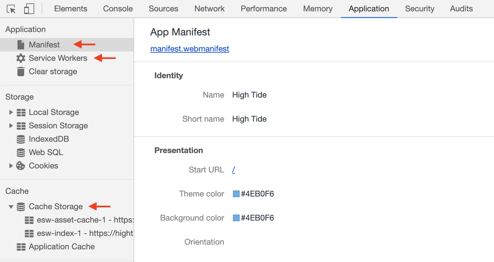
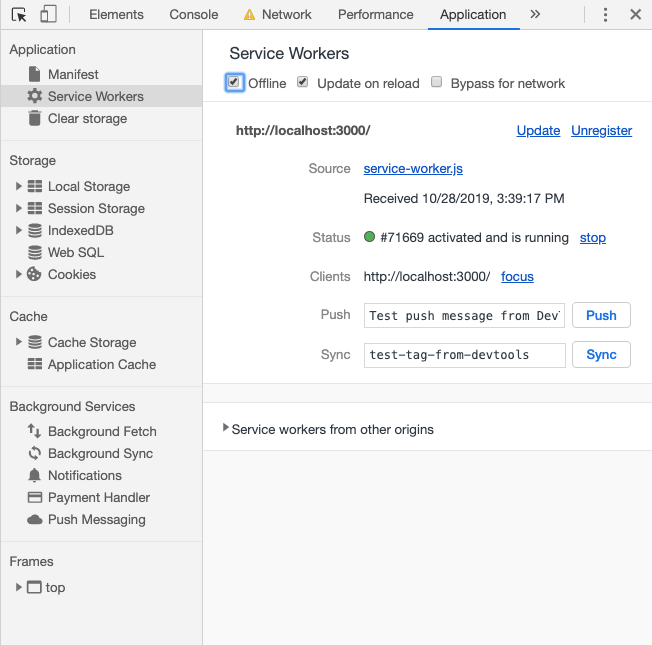
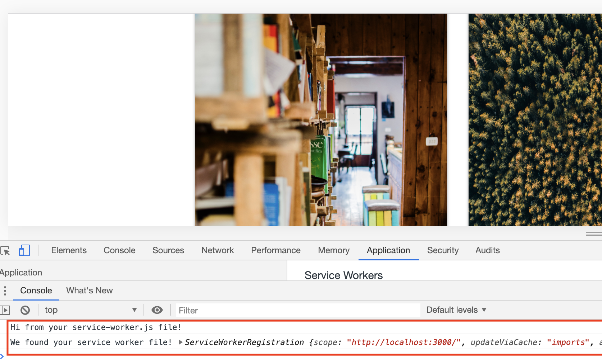
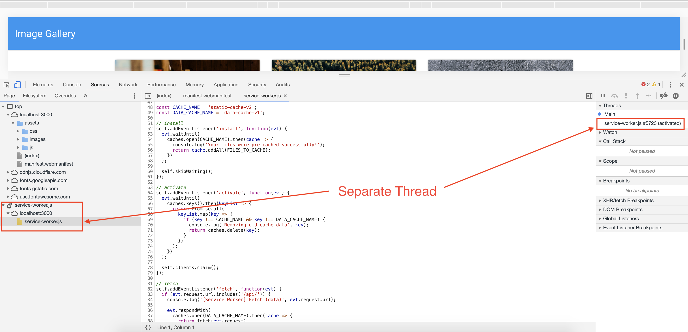
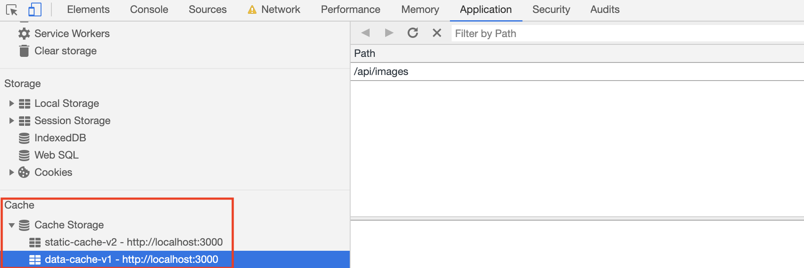

# 18.2 Lesson Plan - Progressive Web Applications (6:30 PM)

## Overview

Today's class will continue our journey into web performance by learning about progressive web apps. We will start with our basic Gallery App and step by step, implement a web app manifest as well as a service worker. This new functionality will provide us with a fully functioning progressive web app that delivers an offline experience to our users.


## Instructor Notes

* Complete activities `07-Stu_PWAs` through `16-Stu_Notetaker-PWA`.

* You may need to clear your storage periodically in order to see each iteration of activities. Do so in DevTools under `Application > Clear storage > Clear site data`.

* Some of today's activities use mongoDB to store data. It is recommended that you open a separate tab in your terminal and run `mongod`. Don't forget to kill the process at the end of class.

* It is recommended that you take some time to familiarize yourself with service workers before class begins. Specifically, look over the service worker lifecycle and caching and returning requests at https://developers.google.com/web/fundamentals/primers/service-workers/.


## Learning Objectives
  
* Explain the benefits a progressive web app offers a user over a traditional app.

* Implement and explain the role of a web app manifest.

* Implement and explain the role of a service worker.

* Successfully cache and fetch files to deliver them in an offline experience.

* Install a PWA on both desktop and mobile devices

## Slides

N/A

## Time Tracker

[18.2 Time Tracker](https://docs.google.com/spreadsheets/d/1nAEVVhWc660YTUTVAVndTty0U7snFwtW/edit#gid=625825419)

---

## Class Instruction

### 1. Instructor Do: Progressive Web Apps (10 mins)

* Welcome students to class.

* Navigate to [https://secure-bayou-27137.herokuapp.com/](https://secure-bayou-27137.herokuapp.com/) in your browser and point out the following: 

  * It's the Image Gallery application from earlier. But there's something different about it...
 
  * If we open the Settings in Chrome, we will see an option to `Install Images App...`
 
  * When we select `Install Images App...` we are presented with an option to "Install app?"
 
  * When we click `Install`, a new Chrome window opens with our application running in it. 
 
  * It is now installed as a desktop app! If we search our applications, we will find "Images App" listed among them.

* Ask the class the following question(s) and call on students for the corresponding answer(s):

  * ☝️ What is different about our Image Gallery application? 
  
  * 🙋 There is added functionality to install it as a desktop application.

  * ☝️ If we can install the Images App application on our laptops, where else might we install it? 
 
* Use student answers to transition to the next activity.

### 2. Student Do: Progressive Web Applications (15 mins)
 
* Direct students to the activity instructions found in [07-Stu_PWAs](../../../../01-Class-Content/18-PWA/01-Activities/07-Stu_PWAs).

```md

  # Progressive Web Applications

  In this activity, you will install a progressive web application (PWA) using your smart phone. You will also research the definition and production of a PWA. If you are unable to find the icons mentioned in this activity, try them in Chrome on your computer.

  ## Instructions

  * Follow these instructions to install a PWA for your specific smartphone OS:

  * iOs:

    * 1. Navigate to [https://secure-bayou-27137.herokuapp.com/](https://secure-bayou-27137.herokuapp.com/) with Safari.

    * 2. Tap the Share button in Safari.

    * 3. Tap the icon labeled Add to Home Screen.

    * 4. Tap Add in the upper-right corner.

    * 5. Name your PWA, then tap Add in the upper-right corner.

  * Android:

    * 1. Navigate to [https://secure-bayou-27137.herokuapp.com/](https://secure-bayou-27137.herokuapp.com/) with Chrome.

    * 2. Tap the menu button in the upper right corner of Chrome.

    * 3. Tap the icon labeled Add to Home Screen.

    * 4. Name your PWA, then tap Add below the promp.

  * Be prepared to answer the following question(s): 

      * What is a progressive web application? 

      * How do we create progressive web applications?


  ## 🏆 Bonus

  * What are examples of popular PWAs?
```

### 3. Instructor Do: Progressive Web Apps Review (5 min)

* Use the prompts and talking points below to review the following key point(s):
  
  * ✔️ Progressive web applications (PWAs) are mobile or desktop apps delivered through the web, built using HTML, CSS & JavaScript, that allow users to work offline
  
  * ✔️ PWAs require a manifest, a service worker and the Cache API
  
* Ask the class the following question(s) and call on students for the corresponding answer(s):

  * ☝️ What is a progressive web application?
  
  * 🙋 Progressive web applications (PWAs) are mobile or desktop apps delivered through the web, built using HTML, CSS & JavaScript
  
  * ☝️ What is meant by the term 'native' app?
  
  * 🙋 The term "native app" refers to applications written for specific platforms. For example, native iPhone apps are written in iOs and Android apps are primarily written in Java. Apple apps will not run on Android devices and vice versa. 

  * ☝️ How are PWAs different from native apps?

  * 🙋 Traditional Mobile Apps require multiple builds across platforms, are less discoverable by search engines and have high abandonment rates.They also offer less usability and don’t leverage mobile device capabilities and are often slow and bloated. PWAs provide advantages of both web and mobile apps such as push notifications, offline experiences,speed and stability. Plus, you can convert a web app into a PWA quickly without the build time of a mobile app.
  
  * ☝️ What do we need to learn to convert an application into a progressive web application?

  * 🙋 There are three primary things we need to learn: Manifests, Service Workers and the Cache API.
  
* Navigate to [https://secure-bayou-27137.herokuapp.com/](https://secure-bayou-27137.herokuapp.com/), open DevTools and explain the following: 
  
  * 🔑 If we look under the Application tab in DevTools for our Image Gallery App, we see **Manifest**, **Service Workers** and **Cache Storage** panels.

    

  * 🔑 If we check the `offline` button in the Service Workers panel, we see that the application still delivers a full experience with an Internet connection!

  

* Answer any lingering questions before proceeding to the next demo. 

### 4. Instructor Do: Web App Manifest Demo (5 mins)

* Use the prompts and talking points below to demonstrate the following key point(s):

  * ✔️ `manifest.webmanifest` is JSON file providing information for mobile and desktop installation
  
  * ✔️ Manifest properties are referred to as members
  
* Open [08-Ins_Manifest/manifest.webmanifest](../../../../01-Class-Content/18-PWA/01-Activities/08-Ins_Manifest/manifest.webmanifest) in your IDE and explain the following: 

  * 🔑 A web app manifest is a simple JSON file containing some metadata about a web application. 
  
 ```js
  {
    "short_name": "Demo",
    "name": "Web App Manifest Demo",
    "icons": [
      {
        "src": "/assets/images/icons-192.png",
        "sizes": "192x192",
        "type": "image/png"
      },
      {
        "src": "/assets/images/icons-512.png",
        "sizes": "512x512",
        "type": "image/png"
      }
    ],
    "start_url": "/",
    "background_color": "	#808080",
    "display": "standalone",
    "theme_color": "#808080"
  } 
  ```
  * 🔑 Each of the properties in our manifest file is referred to as a **member**.

* Ask the class the following question(s) and call on students for the corresponding answer(s):

  * ☝️ What do we think the difference is between `name` and `short_name`?

  * 🙋 `short_name` is used on the home screen and in the application menu
  
  * ☝️ What are "icons"?

  * 🙋 The `icons` array contains information about the thumbnail images used when installing the PWA on mobile or desktop

  * ☝️ What is the `start_url` member?

  * 🙋 Defines what page is opened when the app is first launched (start_url).
  
  * ☝️ What does the `display` member do?

  * 🙋 By using a web app manifest, our app can tell the browser you want your app to open in a standalone window


### 5. Student Do: Web App Manifest (15 mins)

* Direct students to the activity instructions found in [09-Stu_Manifest](../../../../01-Class-Content/18-PWA/01-Activities/09-Stu_Manifest)

```md
  # Web App Manifest

  In this activity, you will write your first progressive web application manifest.

  ## Instructions

  * Using the instructor demo as a guide, create a manifest for the Image Gallery app.

    * 🤔 Where do you create the `manifest.webmanifest` in the application architecture?

    * 🤔 How do you deploy a manifest?

  * When finished, run the commands:

    * `npm install`

    * `npm run seed`

    * `npm start`

  * Navigate to [localhost:3000](http://localhost:3000) and open `DevTools > Application > Manifest` to verify successful loading of the manifest.

  ## 💡 Hint(s)

  Read the [MDN Web App Manifest documentation](https://developer.mozilla.org/en-US/docs/Web/Manifest) 

  ## 🏆 Bonus

  * Add additional members to your manifest.
  ```

### 6. Instructor Do: Review Web App Manifest (10 mins)

* Use the prompts and talking points below to review the following key point(s):

  * The web app manifest tells the browser about your web application and how it should behave once installed. 

* Open [09-Stu_Manifest/Solved/public/manifest.webmanifest](../../../../01-Class-Content/18-PWA/01-Activities/09-Stu_Manifest/Solved/public/manifest.webmanifest) in your IDE and explain the following:

  * We give our PWA a name and short name. These can have different values, but for the sake of simplicity, we give them the same value.

  * There are numerous icons for our app, starting at the size of `72x72` through `512x512`.

  * We set both the theme color and the background color to be white.

  * We tell the app to run in standalone mode, which means the web app will look and feel like a standalone native app. The app runs in its own window, separate from the browser, and hides standard browser UI elements like the URL bar.

  * 📝 The other display modes we could specify are `fullscreen`, `minimal-ui`, and `browser`.

  ```json
    {
    "name": "Images App",
    "short_name": "Images App",
    "icons": [
      {
        "src": "assets/images/icons/icon-72x72.png",
        "sizes": "72x72",
        "type": "image/png"
      },
      ...
      {
        "src": "assets/images/icons/icon-512x512.png",
        "sizes": "512x512",
        "type": "image/png"
      }
    ],
    "theme_color": "#ffffff",
    "background_color": "#ffffff",
    "start_url": "/",
    "display": "standalone"
  }  
  ```

* Ask the class the following question(s) and call on students for the corresponding answer(s):

  * ☝️ Which file do we include the `manifest.webmanifest` in?

  * 🙋 `index.html` 

  * ☝️ What's next on our list of things to do?
  
  * 🙋 Add a service worker!

### 7. Instructor Do: Intro To Service Workers (5 mins)

* Use the prompts and talking points below to demonstrate the following key point(s):

  * ✔️ A service worker is a script that your browser runs in the background on a separate thread from your webpage.

  * ✔️ Certain functionality can _only_ be implemented from within a service worker, such as caching assets in order to make the application useable without an internet connection or notifying the browser that the application should be installable.

  * ✔️ **Cache API** Similar to localstorage and indexedDB in that this browser API is used for storing data. However Cache API can be used to store entire all front end assets such as images, javascript, HTML, CSS, etc. along with API responses.

  * ✔️ **Thread** A thread is an independent set of values for the processor that controls what executes in what order. Think of this as another JavaScript application running at the same time as our main application, with the ability to communicate and pass data between threads.

  * ✔️ Service workers have a lifecycle that consists of 3 main parts.

  * ✔️ **Installation**: The service worker creates a version-specific cache.

  * ✔️ **Waiting**: The updated service worker waits until the existing service worker is no longer controlling clients. This step is often skipped with a function, since service workers rarely exist past a new service workers installation.

  * ✔️ **Activation**: This event fires after the service worker has been installed and the previous one has been removed.

* Navigate to [10-Ins_Service_Workers](../../../../01-Class-Content/18-PWA/01-Activities/10-Ins_Service_Workers) and run the following commands in your terminal:

  ```
  npm install
  npm run seed
  node server.js
  ```

* In a separate tab, run `mongod`.

* Open your Chrome Dev Tools > Application and demonstrate that the service worker has been registered, installed, and that the service worker is caching files.

  * When our app launches, it registers and installs the service worker.

  * Using the Chrome Dev Tools, we can unregister the service worker.

  * Now, if we refresh the page, we can see that the service worker was installed and registered again.

  * We can navigate to the Cache Storage tab to see that our files have been cached.

  * Lastly, we can open the console to see the service worker object as well as a message saying that our files have been cached.

* Ask the class the following question(s) and call on students for the corresponding answer(s):

  * ☝️ What are the 2 main steps in service worker lifecycle?

  * 🙋 Installation and activation. There is also a waiting step that is often skipped. 

### 8. Student Do: Register Service Worker (15 mins)

* Direct students to the next activity located in [11-Stu_Service_Workers](../../../../01-Class-Content/18-PWA/01-Activities/11-Stu_Service_Workers/Unsolved).

* **Instructions**

* Add the following script just above the closing `</body>` tag in `index.html`

```js
<script>
  if ('serviceWorker' in navigator) {
    window.addEventListener('load', () => {
      navigator.serviceWorker.register('service-worker.js')
        .then((reg) => {
          console.log('We found your service worker file!', reg);
        });
    });
  }
</script>
```

* Create a `service-worker.js` file in the `public` directory and add the following line of code.

```js
console.log("Hello from your service worker file!");
```

* Refresh your Gallery App or launch it with `npm start` if it is not running.

* Open your Chrome Dev Tools and navigate to Application then your Service Worker tab. Check to see if your service worker file was successfully found. You should see two messages, one from the `service-worker.js` file and one from the script tag that you put in your `index.html` file.

  

### 9. Instructor Do: Review Register Service Worker (15 mins)

* Use the prompts and talking points below to review the following key point(s):

  * ✔️ We are adding an event listener to our window element, listening for the `load` event.

  * ✔️ We register our service worker using the `navigator` object.

  * ✔️ We console.log a message letting us know that the service worker registration was successful.

* Open [11-Stu_Service_Workers/Solved/public/index.html](../../../../01-Class-Content/18-PWA/01-Activities/11-Stu_Service_Workers/Solved/public/index.html) and explain the following points:

  * We tell the browser to register our service worker file.

```js
<script>
  if ('serviceWorker' in navigator) {
    window.addEventListener('load', () => {
      navigator.serviceWorker.register('service-worker.js')
        .then((reg) => {
          console.log('We found your service worker file!', reg);
        });
    });
  }
</script>
```

* Ask the class the following question(s) and call on students for the corresponding answer(s):

  * ☝️ What step of the service worker lifecycle have we just completed? 

  * 🙋 The registration step. 

---

### 10. Break (15 mins)

---

### 11. Instructor Do: Creating An Offline Experience (5 mins)

* Use the prompts and talking points below to demonstrate the following key point(s):

  * ✔️ All files that need to be cached are stored as strings in an array.

  * ✔️ All files that need to be cached are precached in the `install` step.

  * ✔️ The `activate` step clears out the all outdated caches.

  * ✔️ The `fetch` listener intercepts all fetch requests and uses data from the cache to return a response.

* Open [12-Ins_Caching_Fetching_Files/Solved/](../../../../01-Class-Content/18-PWA/01-Activities/12-Ins_Caching_Fetching_Files/Solved/) in your IDE and run the following commands:

  * `npm install`

  * `npm start`

* Navigate to [localhost:3000](http://localhost:3000) in your browser and explain the following points:

  * If we inspect our Sources with DevTools, we can see that our service worker is running on a separate thread.

  

* Open [12-Ins_Caching_Fetching_Files/Solved/public/service-worker.js](../../../../01-Class-Content/18-PWA/01-Activities/12-Ins_Caching_Fetching_Files/Solved/public/service-worker.js) in your IDE and explain the following: 

  * Now that we have successfully registered our service worker, we'll step through the code that will install and activate it. This will give our service worker the ability to cache the files we tell it to and deliver them in an offline experience for our users.

  * Our `FILES_TO_CACHE` variable keeps track of each file that we want to store in our cache. 

  * This is an array of _files_ only, attempting to include entire folders won't work.

  📝 The `ALL_CAPS_SEPARATED_BY_UNDERSCORES` style is just standard convention for the global variables in our service worker. 

  ```js
  const FILES_TO_CACHE = [
    "/",
    "/index.html",
    "/assets/css/style.css",
    "/assets/js/loadPosts.js",
    "/assets/images/Angular-icon.png",
    "/assets/images/React-icon.png",
    "/assets/images/Vue.js-icon.png",
    "/manifest.webmanifest",
    ...
    ...
  ];

  // set cache variable names
  const CACHE_NAME = 'static-cache-v2';
  const DATA_CACHE_NAME = 'data-cache-v1';
  ```

  * Inside our install event listener callback we open our cache and call `addAll`, passing in `FILES_TO_CACHE`.

  ```js
  // install
  self.addEventListener('install', function(evt) {
    evt.waitUntil(
      caches.open(CACHE_NAME).then(cache => {
        console.log('Your files were pre-cached successfully!');
        return cache.addAll(FILES_TO_CACHE);
      })
    );

  // skipWaiting() ensures that any new versions of our service worker will take over the page and become activated immediately
    self.skipWaiting();
  });
  ```

  * Inside the activate event listener callback, we activate our service worker, cleaning up outdated caches.

  ```js
  // activate
  self.addEventListener('activate', function(evt) {
    evt.waitUntil(
      caches.keys().then(keyList => {
        return Promise.all(
          keyList.map(key => {
            if (key !== CACHE_NAME && key !== DATA_CACHE_NAME) {
              console.log('Removing old cache data', key);
              return caches.delete(key);
            }
          })
        );
      })
    );

  // Tells our new service worker to take over.
    self.clients.claim();
  });
  ```

  * Here we modify the service worker to handle requests to `/api` and store the responses in our cache, so we can easily access them later.

  ```js
  // fetch
  self.addEventListener('fetch', function(evt) {
    if (evt.request.url.includes('/api/')) {
      console.log('[Service Worker] Fetch (data)', evt.request.url);

      evt.respondWith(
        caches.open(DATA_CACHE_NAME).then(cache => {
          return fetch(evt.request)
            .then(response => {
              // If the response was good, clone it and store it in the cache.
              if (response.status === 200) {
                cache.put(evt.request.url, response.clone());
              }

              return response;
            })
  ```

  * If the network request fails, we try to get the response from our cache.

  ```js
    .catch(err => {
      return cache.match(evt.request);
    });
  ```

* Open [13-Ins_Caching_Fetching_Files/public/assets/js/loadPosts.js](../../../../01-Class-Content/18-PWA/01-Activities/13-Stu_Caching_Fetching_Files/public/assets/js/loadPosts.js) in your IDE and explain the following: 

  * We are going to skip past the DOM element creation and focus on the handling of our "like" POST request. 

  * When a user likes a post, we increment it's `data-likes` attribute by 1.

  ```js
  function incrementLikes(event) {
    const statusEl = document.querySelector("#status")

    const id = event.currentTarget.getAttribute("id");
    const oldLikes = parseFloat(event.currentTarget.getAttribute("data-likes"));
    const likes = oldLikes + 1;

    event.currentTarget.setAttribute("data-likes", likes);

    statusEl.innerText = "";
  ```

  * `incrementLikesRequest` makes an API call, then sets a status DOM element at the top of the page to let the user know whether of not their save was successful. 

  ```js
  incrementLikesRequest(id, likes)
    .then(() => {
      statusEl.innerText = "Save successful!"
      updateLikesDisplay(id, likes, true)
    })
    .catch(() => {
      statusEl.innerText = "Sorry, your 'like' cannot be recorded while you are offline."
      updateLikesDisplay(id, likes, false)
    });
  ```

  * In `updateLikesDisplay` we indicate to the user whether or not their likes count is up to date by appending `(not saved)` to the like count for each post.

  ```js
  function updateLikesDisplay(id, likes, saved) {
    const likesCount = document.querySelector(`#likes-count-${id}`);
    likesCount.innerText = `Likes: ${likes}`;
    if(!saved) {
      likesCount.innerText += " (not saved)";
    }
  }
  ```

* There is quite a bit of code here so take the time to step through it, clarifying any questions as you go.

  * Our service worker is caching all of the files we tell it to so when a user doesn't have a connection, it can deliver them an offline browsing experience. If a user is offline, we must make sure that they can still use the application as much as possible, even if this means letting them know their data won't be saved until later.

* Ask the class the following question(s) and call on students for the corresponding answer(s):

  * ☝️ What kind of events do we have to listen for in our service worker file?

  * 🙋 Install and activate. We also listen for `fetch` if our application interacts with an API.

### 12. Student Do: Caching Files (10 mins)

* Direct students to the next activity located in [13-Stu_Caching_Fetching_Files](../../../../01-Class-Content/18-PWA/01-Activities/13-Stu_Caching_Fetching_Files/Unsolved/).

```md
# Caching Files

In this activity you will be enabling functionality to allow your application to work offline.

## Instructions

* Add the following code to your `service-worker.js` file.

* Type out the following code snippets when adding them to your application, it will help you solidify what you are doing!

* As you go through each step, keep your Chrome Develop tools open to monitor your progress and debug if needed.

   1. Set Up Cache Files

   

   1. Install and Register Your Service Worker

   

   1. If done successfully, you should see your static cache in your Application tab.

   

   1. Activate Service Worker

   

   1. Fetch Files

   

  * If done successfully you will see your data cache in your Application tab. At this point you should be able to put your application in offline mode for an offline experience.

   

   
```

### 13. Instructor Do: Review Caching Files (5 mins)

* Open [13-Stu_Caching_Fetching_Files/Solved/public/service-worker.js](../../../../01-Class-Content/18-PWA/01-Activities/13-Stu_Caching_Fetching_Files/Solved/public/service-worker.js) in your IDE and explain the following: 

  * First we set up the files that we need to cache.

  ```js
  const FILES_TO_CACHE = [
    '/',
    '/offline.html',
    '/index.html',
    '/assets/css/style.css',
    '/assets/js/app.js',
    '/assets/js/loadImages.js',
    '/assets/js/install.js',
    '/assets/images/1.jpg',
    '/assets/images/2.jpg',
    ...
    ...
  ];

  const CACHE_NAME = 'static-cache-v2';
  const DATA_CACHE_NAME = 'data-cache-v1';
  ```

* Then, we install and register our service worker.

  ```js
  self.addEventListener('install', function(evt) {
    evt.waitUntil(
      caches.open(CACHE_NAME).then(cache => {
        console.log('Your files were pre-cached successfully!');
        return cache.addAll(FILES_TO_CACHE);
      })
    );

    self.skipWaiting();
  });
  ```

  * If done successfully, we should see our static cache in our Application tab.

  

  * Next we activate our service worker.

  ```js
  self.addEventListener('activate', function(evt) {
    evt.waitUntil(
      caches.keys().then(keyList => {
        return Promise.all(
          keyList.map(key => {
            if (key !== CACHE_NAME && key !== DATA_CACHE_NAME) {
              console.log('Removing old cache data', key);
              return caches.delete(key);
            }
          })
        );
      })
    );

    self.clients.claim();
  });
  ```

  * Lastly, we handle all fetching for any request with a url that includes `/api/`.

  * If the response is successful, we clone it and store it in our cache.

  * If the network request fails, we grab it from our cache.

  ```js
  self.addEventListener('fetch', function(evt) {
    if (evt.request.url.includes('/api/')) {
      evt.respondWith(
        caches.open(DATA_CACHE_NAME).then(cache => {
          return fetch(evt.request)
            .then(response => {
              if (response.status === 200) {
                cache.put(evt.request.url, response.clone());
              }

              return response;
            })
            .catch(err => {
              return cache.match(evt.request);
            });
        })
      );

      return;
    }

    evt.respondWith(
      caches.open(CACHE_NAME).then(cache => {
        return cache.match(evt.request).then(response => {
          return response || fetch(evt.request);
        });
      })
    );
  });
  ```

  * If done successfully we will see your data cache in your Application tab. At this point we should be able to put our application in offline mode for an offline experience.

  

  
  
* Ask the class the following question(s) and call on students for the corresponding answer(s):

  * ☝️ What does a service worker do?

  * 🙋 A service worker acts as an intermediate step in between an API call and the browser. It can cache files and help provide an offline experience.

  * ☝️ When using a service worker, can we send POST requests to an API while offline?

  * 🙋 No, POST/PUT requests must be handled separately. If we wish to "cache" the POST data, we can store it in IndexedDb.

  * ☝️ How many times does the install event run for each service worker? 

  * 🙋 Once.

  * ☝️ What does `self.skipWaiting()` do? 

  * 🙋 `self.skipWaiting()` forces the service worker to activate as soon as it's finished installing.

### 14. Instructor Do: Demo Notetaker PWA (5 mins)

* Use the prompts and talking points below to demonstrate the following key point(s):

* Navigate to [14-Stu_Notetaker_PWA](../../../../01-Class-Content/18-PWA/01-Activities/16-Stu_Notetaker_PWA/Solved) and demonstrate the following functionality: 

  * First let's make sure our app works as expected by adding a note normally.

  * Next, we'll open up the Chrome Developer Tools and navigate to the `Service Worker` tab. Here, let's toggle the offline version and refresh the app.

  

  * Just like our other two apps, all of our resources have been cached and do not require a connection to access.

### 15. Student Do: Notetaker PWA (30 mins)

* Direct students to the activity instructions found in [14-Stu_Notetaker_PWA](../../../../01-Class-Content/18-PWA/01-Activities/14-Stu_Notetaker_PWA)

```md
# Final Activity

For this final activity you are going to convert the Notetaker that your previously worked on into a PWA.

## Instructions

* Refer back to the activities we previously worked through to help you accomplish the following steps.

  * Create an app manifest.

  * Register and install a service workers.

  * Cache your files and deliver and offline experience.

  * Make your app downloadable.

## BONUS

* Push your app to heroku!
```

### 16. Instructor Do: Review Notetaker PWA (15 mins)

* Open [14-Stu_Notetaker_PWA/Solved/public/manifest.webmanifest](../../../../01-Class-Content/18-PWA/01-Activities/14-Stu_Notetaker_PWA/Solved/public/manifest.webmanifest) in your IDE and explain the following: 

  * Our manifest includes a name, `short_name`, several icons, and theme colors for our PWA.

```json
{
  "name": "Notetaker",
  "short_name": "Notetaker",
  "icons": [
    {
      "src": "assets/images/icons/icon-72x72.png",
      "sizes": "72x72",
      "type": "image/png"
    },
    {
      "src": "assets/images/icons/icon-96x96.png",
      "sizes": "96x96",
      "type": "image/png"
    },
    {
      "src": "assets/images/icons/icon-512x512.png",
      "sizes": "512x512",
      "type": "image/png"
    }
  ],
  "theme_color": "#ffffff",
  "background_color": "#ffffff",
  "start_url": "/",
  "display": "standalone"
}

```

* Open [14-Stu_Notetaker_PWA/Solved/public/service-worker.js](../../../../01-Class-Content/18-pwa/01-Activities/14-Stu_Notetaker_PWA/Solved/public/service-worker.js) in your IDE and explain the following: 

  * The only files we need to cache are `index.html`, `app.js`, and our favicon.

  * Our caches will be named `static-cache-v2` and `data-cache-v1` respectively.

  ```js
  const FILES_TO_CACHE = ["/", "/index.html", "app.js", "favicon.ico"];

  const CACHE_NAME = "static-cache-v2";
  const DATA_CACHE_NAME = "data-cache-v1";

  ```

  * When install is triggered, we will add all of our specified files to the cache.

  ```js
  // install
  self.addEventListener("install", function(evt) {
    evt.waitUntil(
      caches.open(CACHE_NAME).then(cache => {
        console.log("Your files were pre-cached successfully!");
        return cache.addAll(FILES_TO_CACHE);
      })
    );

    self.skipWaiting();
  });
  ```

  * The activate event fires when an old service worker is gone and the new one is installed. We use this listener to get rid of our old cache.

  ```js
  self.addEventListener("activate", function(evt) {
    evt.waitUntil(
      caches.keys().then(keyList => {
        return Promise.all(
          keyList.map(key => {
            if (key !== CACHE_NAME && key !== DATA_CACHE_NAME) {
              console.log("Removing old cache data", key);
              return caches.delete(key);
            }
          })
        );
      })
    );
    self.clients.claim();
  });
  ```

  * 📝 Our `fetch` call has changed, since we are only fetching our cached static resources.

  ```js
  // fetch
  self.addEventListener('fetch', function(evt) {
    evt.respondWith(
      caches.open(CACHE_NAME).then(cache => {
        return cache.match(evt.request).then(response => {
          return response || fetch(evt.request);
        });
      })
    );
  });
  ```

### 17. END (0 mins)

### Lesson Plan Feedback

How did today's class go?

[Went Well](http://www.surveygizmo.com/s3/4325914/FS-Curriculum-Feedback?format=pt&sentiment=positive&lesson=18.02)

[Went Poorly](http://www.surveygizmo.com/s3/4325914/FS-Curriculum-Feedback?format=pt&sentiment=negative&lesson=18.02)
