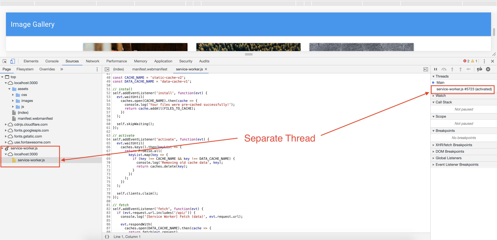
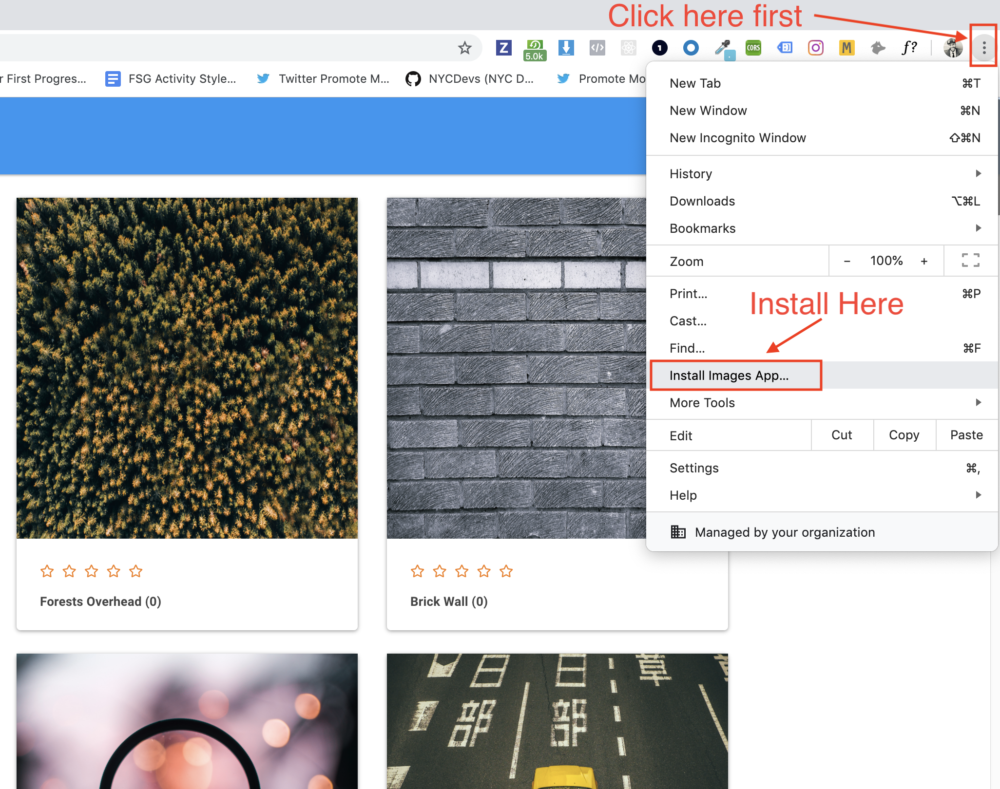

# 18.2 Lesson Plan - Progressive Web Applications (6:30 PM) <!--links--> &nbsp; [⬅️](#todo-fix-when-merged-to-dev) &nbsp; [➡️](#todo-fix-when-merged-to-dev)

## Overview

Today's class will continue our journey into web performance by learning about progressive web apps. We will start with our basic Gallery App and step by step, implement a web app manifest as well as a service worker. This new functionality will provide us with a fully functioning progressive web app that delivers an offline experience to our users.


## Instructor Notes

* You may need to clear your storage periodically in order to see each iteration of activities. Do so in DevTools under `Application > Clear storage > Clear site data`.

@TODO what else


## Learning Objectives

* By the end of class students will be able to:
  
  * Explain the benefits a progressive web app offers a user over a traditional app.
  
  * Implement and explain the role of a web app manifest.
  
  * Implement and explain the role of a service worker.
  
  * Successfully cache and fetch files to deliver them in an offline experience.


### 1. Instructor Do: Progressive Web Apps (5 min) (HIGH)

* Welcome students to class.

* Navigate to [https://guarded-waters-72148.herokuapp.com/](https://guarded-waters-72148.herokuapp.com/) in your browser and point out the following: 

 * It's the Notetaker application we built in the previous unit. But there's something different about it...
 
 @TODO insert image
 
 * If we open the Settings in Chrome, we will see an option to `Install Notetaker...`
 
 * When we select `Install Notetaker...` we are presented with an option to "Install app?"
 
 * When we click `Install`, a new Chrome window opens with our application running in it. 
 
 * @TODO it is now installed as a desktop app! If we search our applications, we will find "Notetaker" listed among them.
 
* Ask the class the following question(s):

 * If we can install the Notetaker application on our laptops, where else might we install it? 
 
* Use student answers to transition to the next activity.

### 2. Student Do: Progressive Web Applications (5 min)
 
* Direct students to the instructions found in [@TODO](@TODO).

```md

@TODO insert instructions


```


### 3. Instructor Do: Progressive Web Apps Review (5 min)

* Ask the class the following question(s)

  *  What is a progressive web application?
  
  @TODO more detailed definition
  *  Progressive web applications (PWAs) are a new trend in web development that can solve problems users face with native apps and web apps.
  
  *  What is meant by the term 'native' app?
  
  *  The term "native app" refers to applications written for specific platforms. For example, native iPhone apps are written in iOs and Android apps are primarily written in Java. Apple apps will not run on Android devices and vice versa. 

  *  How are PWAs different from native apps?

  *  Traditional Mobile Apps require multiple builds across platforms, are less discoverable by search engines and have high abandonment rates.They also offer less usability and don’t leverage mobile device capabilities and are often slow and bloated. PWA's provide advantages of both web and mobile apps such as push notifications, offline experiences,speed and stability. Plus, you can convert a web app into a PWA quickly without the build time of a mobile app.
  
  * What do we need to learn to convert Notetaker into a progressive web application?

  * 
  
@TODO the notetaker app does not work in offline mode

* Open your Chrome Developer tools and navigate to the Application tab. 

  * If we look under the Application tab in DevTools for our "Notetaker PWA", we see **Manifest**, **Service Workers** and **Cache Storage** panels.

    

* Open up your Chrome Dev Tools and navigate to the `Application` tab to demonstrate the `manifest.webmanifest`, `Service Worker` and `Cache Storage` tabs as done earlier.

  * Check the `offline` button inside of the `Application` tab and refresh your application.

  

  * Demonstrate how the application still delivers a full experience even though it is offline.

* Answer any questions before proceeding to the next demo. 

### 2. Instructor Do: Web App Manifest (5 mins)

@TODO instructor needs a demo!!!!!!!!!!!!!!!!!!!!!!!!!!!!!!!!!!!!!

@TODO demo manifest in deployed app
* Open [ ](@TODO) in your browser and under Application in DevTools, select Manifest and explain the following: 

  * 

@TODO demo example of a manifest file
* Open [08-Ins_Manifest]@TODO) and explain the following: 

  * A web app manifest is a simple JSON file containing some metadata about a web application. Later when we add functionality to make our web app installable, it will be used to describe the installed application's name, icon, description, and more. 
  
 ```js
 @TODO insert manifest example
 ```
  
  * By using a web app manifest, our app can tell the browser you want your app to open in a standalone window (display).

  * Define what page is opened when the app is first launched (start_url).

  * Define what the app should look like on the dock or app launcher (short_name, icons). This includes various icon sizes for different sized devices. The appropriate icon to use is automatically determined by the device.

  * Create a splash screen (name, icons, colors).

  * Tell the browser to open the window in landscape, or portrait mode (orientation).
  
* Open (...index.html)(@TODO) in your IDE and point out the following: 

  * Web app manifests are deployed in your HTML pages using a `<link>` element in the `<head>` of a document:

  * `<link rel="manifest" href="/manifest.webmanifest">`

@TODO transition!!!!!!!!!!!!!!!!!!!!!!!!!!!!!!!!!!!!!!!!!!!


### 3. Student Do: Web App Manifest (10 mins) (CRITICAL)

* Direct students to the activity instructions found in [Unsolved/Gallery-App-Manifest](../../../../01-Class-Content/18-pwa/Activities/01-Stu_Web-App-Manifest/Unsolved/Gallery-App-Manifest)

```md
@TODO add instructions
```

### 4. Instructor Do: Review Web App Manifest (5 mins)

* Open [...public/manifest.webmanifest](@TODO) in your IDE and explain the following:

  ```json
  
  @TODO insert codez!
  
  ```


  


* Ask the class the following question(s): 

  * What's next on our list of things to do?
  
  *  Add a service worker!


### 5. Instructor Do: Intro To Service Workers (15 mins) (CRITICAL)

@TODO need an instructor demo!!!!!!!!!!!!!!!!!!!!!!!!!!!!!!!!!!!!!!

* Run [ ](../../../../01-Class-Content/18-pwa/Activities/03-Stu_Caching-Fetching-Files/Solved/Gallery-App-Caching) and re-launch the Gallery app if it is not already running.

* Tell the class that a service worker is a script that your browser runs in the background on a separate thread from your webpage.

* Certain functionality can _only_ be implemented from within a service worker, such as caching assets in order to make the application useable without an internet connection or notifying the browser than the application should be installable.

* Before we look at our service worker code, let's cover a few terms.

  * **Cache API** Similar to localstorage and indexedDB in that this browser API is used for storing data. However Cache API can be used to store entire all front end assets such as images, javascript, HTML, CSS, etc. along with API responses.

  * **Thread** A thread is an independent set of values for the processor that controls what executes in what order. Think of this as another JavaScript application running at the same time as our main application, with the ability to communicate and pass data between threads.


* Open your Chrome Dev Tools > Application and click on the Service Worker tab.

  * Demonstrate how when your web app launches, it registers and installs the service worker.

* Follow these steps:

  * In the Service Worker tab click un-register service worker.

  * Refresh your app.

  * Point out how the service worker has installed and re-registered on refresh.

  * Move into the Cache Storage tab to show our cached files.

  * Switch into your console to demo the service worker object as well as the message saying that our files have been cached.

* Tell the students that our service worker is launching when our app hits the index page, installing and registering and caching our files.

* Successful registration of the Service Worker means that the script has been successfully parsed, it is on the same origin as the document, and the origin is HTTPS.


### 6. Student Do: Register Service Worker (10 mins) (HIGH)

* Direct students to the next activity located in [02-Stu_Service-Workers](../../../../01-Class-Content/18-pwa/Activities/02-Stu_Service-Workers/Unsolved).

* **Instructions**

* Add the following script just above the closing `</body>` tag in `index.html`

```js
<script>
  if ('serviceWorker' in navigator) {
    window.addEventListener('load', () => {
      navigator.serviceWorker.register('service-worker.js')
        .then((reg) => {
          console.log('We found your service worker file!', reg);
        });
    });
  }
</script>
```

* Create a `service-worker.js` file in the `public` directory and add the following line of code.

```js
console.log("Hello from your service worker file!");
```

* Refresh your Gallery App or launch it with `npm start` if it is not running.

* Open your Chrome Dev Tools and navigate to Application then your Service Worker tab. Check to see if your service worker file was successfully found. You should see two messages, one from the `service-worker.js` file and one from the script tag that you put in your `index.html` file.

  

* If you are stuck and need help troubleshooting please ask a TA!


### 7. Instructor Do: Review Register Service Worker (5 mins)

* Open [03-Stu_Caching-Fetching-Files/Solved/Gallery-App-Caching](../../../../01-Class-Content/18-pwa/Activities/03-Stu_Caching-Fetching-Files/Solved/Gallery-App-Caching) and navigate to `public/index.html`.

```js
<script>
  if ('serviceWorker' in navigator) {
    window.addEventListener('load', () => {
      navigator.serviceWorker.register('service-worker.js')
        .then((reg) => {
          console.log('We found your service worker file!', reg);
        });
    });
  }
</script>
```

* Ask for a volunteer to help step you through the code. The main takeaway is we are adding an event listener to our window element, registering our service worker and then logging a simple message to let us know it was successful.

* Reiterate that it is not necessary to understand every single line of code at this point, but to have a general understanding of we we are doing. Explain that the fluency with this code will come after seeing it a few times.

* Take any clarifying questions before moving into break.

---

### 8. Break (15 mins)

---

### 9. Instructor Do: Creating An Offline Experience (15 mins) (HIGH)

* Now that we have successfully registered our service worker, let's step through the code that will install and activate it. This will give our service worker the ability to cache the files we tell it to and deliever them in an offline experience for our users.

* Change into [03-Stu_Caching-Fetching-Files/Solved/Gallery-App-Caching](../../../../01-Class-Content/18-pwa/Activities/03-Stu_Caching-Fetching-Files/Solved/Gallery-App-Caching) and launch your app if it is not running.

* Visit <http://localhost:3000> and open your Chrome Dev Tools > Sources.

* In the Sources tab, point out how our service worker is running on separate thread.

  

* Then move into `service-worker.js` and give a general overview of the code. Explain that they will be adding this code to their `service-worker.js` file in the next activity, but for now the goal is to gain a high level understanding of what is happening.

* **Tell Our App What To Cache**

```js
const FILES_TO_CACHE = [
  '/',
  '/offline.html',
  '/index.html',
  '/assets/css/style.css',
  '/assets/js/app.js',
  '/assets/js/loadImages.js',
  '/assets/images/1.jpg',
  ...
  ...
];

// set cache variable names
const CACHE_NAME = 'static-cache-v2';
const DATA_CACHE_NAME = 'data-cache-v1';
```

* **Create Our Install Event Listener**

  * Tell that class that here we open our cache and call `addAll`, passing in `FILES_TO_CACHE`.

```js
// install
self.addEventListener('install', function(evt) {
  evt.waitUntil(
    caches.open(CACHE_NAME).then(cache => {
      console.log('Your files were pre-cached successfully!');
      return cache.addAll(FILES_TO_CACHE);
    })
  );

// skipWaiting() ensures that any new versions of our service worker will take over the page and become activated immediately
  self.skipWaiting();
});
```

* **Create Our Activate Event Listener**

  * Tell the class that here we are activating our service worker cleaning up outdated caches.

```js
// activate
self.addEventListener('activate', function(evt) {
  evt.waitUntil(
    caches.keys().then(keyList => {
      return Promise.all(
        keyList.map(key => {
          if (key !== CACHE_NAME && key !== DATA_CACHE_NAME) {
            console.log('Removing old cache data', key);
            return caches.delete(key);
          }
        })
      );
    })
  );

// Tells our new service worker to take over.
  self.clients.claim();
});
```

* **Fetch Our API Data**

  * Tell the class that here we modify the service worker to handle requests to `/api` and store the responses in our cache, so we can easily access them later.

```js
// fetch
self.addEventListener('fetch', function(evt) {
  if (evt.request.url.includes('/api/')) {
    console.log('[Service Worker] Fetch (data)', evt.request.url);

    evt.respondWith(
      caches.open(DATA_CACHE_NAME).then(cache => {
        return fetch(evt.request)
          .then(response => {
            // If the response was good, clone it and store it in the cache.
            if (response.status === 200) {
              cache.put(evt.request.url, response.clone());
            }

            return response;
          })
          .catch(err => {
            // Network request failed, try to get it from the cache.
            return cache.match(evt.request);
          });
      })
    );

    return;
  }

  evt.respondWith(
    caches.open(CACHE_NAME).then(cache => {
      return cache.match(evt.request).then(response => {
        return response || fetch(evt.request);
      });
    })
  );
});
```

@TODO yes, there is; let's fix it
* There is quite a bit of code here so take the time to step through it, clarifying any questions as you go.

  * Remind students to focus on the big picture of creating an offline experience and the details will fall into place.

* Recap that our service worker is caching all of the files we tell it to so when a user doesn't have a connection, it can deliever them an offline browsing experience.

* Take any clarifying questions before moving on.


### Student Do: Caching Files (10 mins) (CRITICAL)

* Direct students to the next activity located in [Unsolved/Gallery-App-Caching](../../../../01-Class-Content/18-pwa/Activities/03-Stu_Caching-Fetching-Files/Unsolved/Gallery-App-Caching).

* In this activity students will be given screenshots of the code they need to add to implement caching as to discourage simply copying and pasting.

* **Instructions:**

  * Add the following code to your `service-worker.js` file.

  * Type out the following code snippets when adding them to your application, it will help you solidify what you are doing!

  * As you go through each step, keep your Chrome Develop tools open to monitor your progress and debug if needed.

* **Set Up Cache Files**

```js
const FILES_TO_CACHE = [
  '/',
  '/offline.html',
  '/index.html',
  '/assets/css/style.css',
  '/assets/js/app.js',
  '/assets/js/loadImages.js',
  '/assets/js/install.js',
  '/assets/images/1.jpg',
  '/assets/images/2.jpg',
  ...
  ...
];

const CACHE_NAME = 'static-cache-v2';
const DATA_CACHE_NAME = 'data-cache-v1';
```

* **Install and Register Your Service Worker**

```js
self.addEventListener('install', function(evt) {
  evt.waitUntil(
    caches.open(CACHE_NAME).then(cache => {
      console.log('Your files were pre-cached successfully!');
      return cache.addAll(FILES_TO_CACHE);
    })
  );

  self.skipWaiting();
});
```

* If done successfully, you should see your static cache in your Application tab.

  
  
  
  
@TODO is this a demo or activity?

* **Activate Service Worker**

```js
self.addEventListener('activate', function(evt) {
  evt.waitUntil(
    caches.keys().then(keyList => {
      return Promise.all(
        keyList.map(key => {
          if (key !== CACHE_NAME && key !== DATA_CACHE_NAME) {
            console.log('Removing old cache data', key);
            return caches.delete(key);
          }
        })
      );
    })
  );

  self.clients.claim();
});
```


### Student Do: Fetching Files ( mins) 

* **Fetch Files**

```js
self.addEventListener('fetch', function(evt) {
  if (evt.request.url.includes('/api/')) {
    evt.respondWith(
      caches.open(DATA_CACHE_NAME).then(cache => {
        return fetch(evt.request)
          .then(response => {
            // If the response was good, clone it and store it in the cache.
            if (response.status === 200) {
              cache.put(evt.request.url, response.clone());
            }

            return response;
          })
          .catch(err => {
            // Network request failed, try to get it from the cache.
            return cache.match(evt.request);
          });
      })
    );

    return;
  }

  evt.respondWith(
    caches.open(CACHE_NAME).then(cache => {
      return cache.match(evt.request).then(response => {
        return response || fetch(evt.request);
      });
    })
  );
});
```

* If done successfully you will see your data cache in your Application tab. At this point you should be able to put your application in offline mode for an offline experience.

  

  


### 11. Instructor Do: Review Caching and Fetching Files (5 mins)

* Open [03-Stu_Caching-Fetching-Files/Solved/Gallery-App-Caching](../../../../01-Class-Content/18-pwa/Activities/03-Stu_Caching-Fetching-Files/Solved/Gallery-App-Caching) and launch your app.

* Ask for a volunteer to step you through the code, starting with `install` then moving on to `activate` and `fetch`.

* There is a lot of code here, reiterate that it is ok if they don't completely understand every line, fluency will come with practice.

* After stepping through the code take any questions before moving on.


### 12. Instructor Do: Intstalling Your App (5 mins) (HIGH)

* When a Progressive Web App is installed, it looks and behaves like all of the other installed apps.

* It runs in an app without an address bar or other browser UI and nd like all other installed apps, it's a top level app in the task switcher.

* Demonstrate how to install the Gallery App on desktop for the students.

* **Open Chrome Menu**

  

* **Install**

  

* **See Your App Successfully Installed**

  

* Now it's the students turn. Take any questions before having them follow the same process in the next activity.

### 13. Student Do: Installing Your App (15 mins)

In this activity you will install your PWA on your computer and mobile device.

* **Instructions**

* **Part One: Installing On Desktop**

    1. Open Chrome Menu

       

    2. Install

       

    3. See Your App Successfully Installed

       

* **Part Two: Installing On Mobile**

* In order to install your app on your phone you are first going to push it to Heroku.

    1. Create A Heroku App by running `heroku create`

       

    2. Install `mlab`

    3. Run `heroku addons:create mongolab`

       

    4. After updating both files, add and commit your code.

* **Part Three: Push and Seed The Application**

    1. Run `git push heroku master` followed by `heroku run npm run seed` in your terminal.

       

* **Part Four: Install The Application**

    1. Visit the deployed application in your web browser.

    2. Click the share button on your mobile device.

       

    3. Add The App To Your Homescreen

       

    4. See the app installed on your device!

       

### 14. Instructor Do: Review Installing Your App (5 mins)

* At this point students may be in a few different stages of installation.

  * Desktop should be relatively straightforeward but there might be some snags for mobile.

* Use this time to help debug any issues the students may have run into.

### 15. Instructor Do: Intro Final Activity (5 mins)

* Tell students they are now going to test out their newly acquired PWA skills on their own.

* In the next activity, they are going to convert their previous Notetaker application into a PWA.

* Open [05-Stu_Final-Project/Solved](../../../../01-Class-Content/18-pwa/Activities/05-Stu_Final-Project/Solved) and demo the offline experience for the solved Notetaker app.

* Open your Chrome Developer tools and navigate to the `Service Worker` tab, toggling the offline version and then refreshing the app.

* Explain that they are going to follow the same steps they took for the Gallery App which are creating a web app manifest, caching the appropriate files and creating a service worker to deliver the offline experience.

* Take any questions before directing them to the next activity.

### 16. Student Do: Notetaker PWA (30 mins)

* Direct students to the Notetaker app located in [05-Stu_Final-Project/Unsolved](../../../../01-Class-Content/18-pwa/Activities/05-Stu_Final-Project/Unsolved)

* **Instructions**

* For this final activity you are going to convert the Noteteaker that your previously worked on into a PWA.

* Use the activities from this lesson to guide you along the following steps.

  * Create an app manifest.

  * Register and intall a service workers.

  * Cache your files and deliver and offline experience.

  * Make your app downloadable.

* **BONUS**

* Push your app to heroku!

### 17. Instructor Do: Review Notetaker PWA (15 mins)

* Open [05-Stu_Final-Project/Solved](../../../../01-Class-Content/18-pwa/Activities/05-Stu_Final-Project/Solved) and step through the `manifest.webmanifest` file as well as `service-worker.js`.

* One thing to note is that our `fetch` call has changed, since we are onlying fetching our cached static resources.

```js
// fetch
self.addEventListener('fetch', function(evt) {
  evt.respondWith(
    caches.open(CACHE_NAME).then(cache => {
      return cache.match(evt.request).then(response => {
        return response || fetch(evt.request);
      });
    })
  );
});
```

* Help any students who are struggling and answer any lingering questions before wrapping up for the day.

### 18. END (0 mins)
