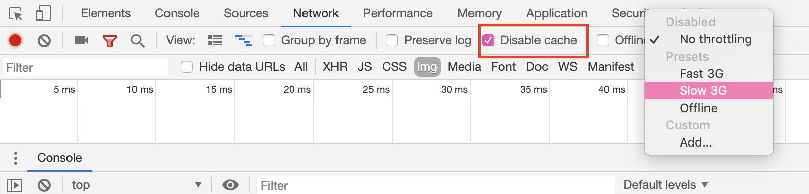
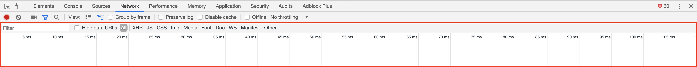
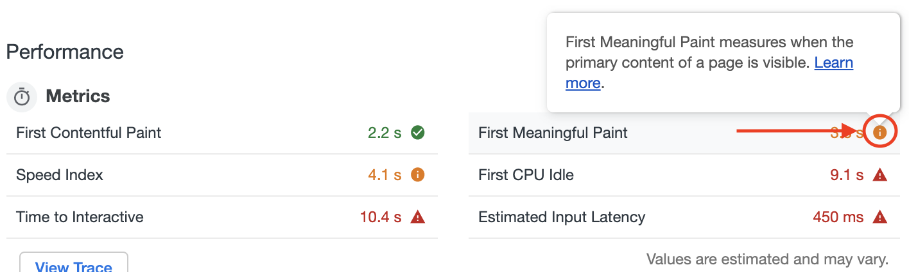
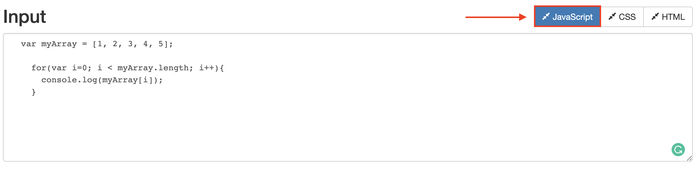

# 18.1 Lesson Plan - Web Performance (6:30 PM)

## Overview

Todays class will be focused on Web Performance. We will use Lighthouse to audit the performance of webpages, and go through the different options we have to increase performance in our applications. Performance is an incredibly important aspect of being a developer. While building large applications, keeping them performing is a top priority.

- - -

## Learning Objectives

* By the end of class student's will be able to...
  * Articulate the meaning of web performance and how it effects their users.
  * Explain how assets like JavaScript files and images impact the performance of a web page.
  * Use Lighthouse to audit a sites various performance metrics.
  * Use minification to lower JS file sizes.
  * Use the compression npm package to enable gzip compression in their applications
  * Use online image compression to compress image files while retaining image quality.
  * Explain and implement lazy loading into their applications so images are only loaded as needed.

## Instructor Notes

* We will be making use of students Project 2 during the first half of todays class. Ensure all students have a deployed project to work with.

* Todays class you will be using an auditing system by Google called Lighthouse. Familiarize yourself with the tool prior to class. You can find the documentation [here](https://developers.google.com/web/tools/lighthouse/). 

  * Lighthouse can hang in some browsers, if possible please use Chrome.

* Improving scores in Lighthouse will be a big win for students today, so be sure to slowly go through the first audit report of the day to give students an understanding of how they can improve.

## Slides

* N/A

## Time Tracker

[18.1 Time Tracker](https://docs.google.com/spreadsheets/d/1s5szPwHVNDpeiUlZ8ndGBiq6QTeTo7YW/edit#gid=130565440)

- - -

### 1. Instructor Do: Welcome/Intro Web Performance (5 mins)

* Welcome students to class and then open Google Chrome. 

* Open your Dev Tools Network Tab and Throttle your connection to `Slow 3G`

  * 

* Navigate to [Amazon.com](https://amazon.com/).
  
  * The page is going to load extremely slowly.

* Ask the class, "What can the Network Tab show us?"

  * The network tab gives developers a view into what assets are being loaded and when, as well as total load times. Direct the students attention to the loading time chart.

  

  * Amazon will load assets for well over a minute, and this traffic can all be watched inside of our dev tools.

* Ask the class, "What is throttling?"

  * Throttling a connection is the act of using software to deliberately slow down or "throttle" a connections speed to be slower than it would normally.

* Ask the class, "Why would we want to throttle our connection?"

  * While we might have a nice and fast connection, a large portion of the planet does not have access to speeds even comparable to a slow 3g cellular network. 

  * By throttling our connection, we can see how our users with worse connections might experience our content, and will help us understand what is slowing loading times most.
  
* Loading times like we are seeing with a throttled connection on Amazon can be a huge deterrent to users.

* Ask the class, "Have you ever left a webpage due to it taking too long to load"

  * It's safe to say anyone who has used the internet has experienced this.. This is a common occurrence all over the world, as not all people have access to fast network connections.
  
  * One of the biggest factors that leads to a poor user experience is slow page load times.

* Ask the class, "What do you think the most important part of the user experience is?". Call on one or two students for answers.

  * Performance. Speed and response times are paramount, as making users wait for response to input or loading information is a guaranteed way to lose those users.

  * When it comes to the web every second counts. Todays class will be about how webpages can be optimized to save the end user time and provide a more fluid experience.

* Ask the class, "How do we know what is causing our page to perform poorly or well?"

  * Getting concrete analysis on the performance metrics of a web page is important in improving it in the future.

* Use student answers to transition to demoing Lighthouse.

### 2. Instructor Do: Demo Lighthouse (10 mins)

* Open the [Gallery App](https://ancient-brushlands-76706.herokuapp.com/) and run the application. Let students know this is an application they will be working with after break later today.

  * Google has created a tool called Lighthouse which will allow us to run an audit on our page and find out different metrics about how it performs and what is hindering its performance. Lighthouse is a quality auditing tool developed by Google for analyzing web pages.

  * It provides audits for performance, accessibility, SEO, and progressive web applications.

  * Lighthouse can be run directly from our Chrome Dev Tools. This makes it a fast, simple, and effective way to get insights into our pages overall performance metrics.

  * Open chrome dev tools, and click the `Audits` tab.

  

  * Scroll down and click `Run Audits`

  

* Open the generated `Audit Report` and walk students through the following:

  * The *performance* section will be the first you encounter, and one of the most useful for todays class. This section will tell us why our site might be performing poorly and delivering a poor user experience. It will also give us actionable items to fix.

  * Hovering over the different status signs next to the times shown will give you information on what that test means.

  

  * Each audit has a reference doc explaining why the audit is important, as well as how to fix it. These reference docs will lay out why this metric is important to the user experience and give reasons why we might be lacking in the specified audit.

  * One of the main metrics Lighthouse looks for is the *first meaningful paint*.

  * A paint occurs when content is loaded on the screen. Lighthouse measures the first *Contentful* paint, which means when any content is loaded. It also measures the first *meaningful* paint which occurs when the primary content becomes visible.

  * One of the most important metrics it takes is *Time to Interactive*. This is the time it takes for the webpage being audited to become usable. A long delay in interactivity can lead to page abandonment.

* Ask the class, "What is web page abandonment?"

  * Abandonment occurs when a user leaves a web page without completing the task they set out to.

* When working on improving a webpage's performance, we should use Lighthouse to complete frequent audits. These can be incredibly helpful in pinpointing where our efforts should be focused.

### 3. Student Do: Lighthouse Audit (10 mins)

* Direct students to the activity instructions found in [01-Stu_Lighthouse](../../../../01-Class-Content/18-PWA/01-Activities/01-Stu_Lighthouse/README.md)

```md
# Lighthouse Audits

In this activity you will use Google Lighthouse to audit your second group project to find out performance metrics.

## Instructions

* We are going to utilize your second group project for these coming activities to check its performance metrics.

* Navigate to the deployed URL of your project.

* Open the Chrome Dev Tools and click the `Audits` tab.

* Scroll down and click `Run Audits` and allow Lighthouse to run.

* Read through the provided report and be prepared to talk about the `Opportunities` portion of your audit!
```

### 4. Instructor Do: Review Audits (5 mins)

* Ask the class the following question(s):

  * What are some of the 'Opportunities' for improvement you found in your applications?

  * How long did the first content paint take?

  * How long did the first meaningful paint take?

  * How long did it take to become interactive?

* Are there any commonalities you hear?

### 5. Instructor Do: JS Minification (10 mins)

* Ask the class the following question(s):

* "What do you think minification means"?

  * Minification is the process of taking our code and removing all unnecessary characters and whitespace without loss of functionality in an attempt to save file space.

* Ask the class, "Where have we seen minification before?"

  * Bootstrap and jQuery are two examples of minified source code

* Open [Online Minification](http://refresh-sf.com/) and paste the following code into the textarea:

    ```js
    var myArray = [1, 2, 3, 4, 5];

    for(var i=0; i < myArray.length; i++){
      console.log(myArray[i]);
    }
    ```

* Click the JavaScript button to minify the code snippet and explain the following point(s):

* 

  * The minifier moved our `myArray` declaration into our `for loop`.

  * The minifier removed all whitespace between characters, and put all of our code on one line.

  * The minification process resulted in a 25% decrease in the size of the JavaScript.

  

  * While the code may look different after minification, it will function exactly the same

* Ask the class, "What are the benefits of minification?"

  * Minification saves us space, and smaller file sizes create faster downloads for the user. The faster our assets can download, the faster the page will load them for our user.

### 6. Student Do: Minify your JavaScript (10 mins)

* Direct students to the activity instructions located in [02-Stu_Minifiy-JS](../../../../01-Class-Content/18-PWA/01-Activities/02-Stu_Minifify-JS/README.md)

```md
# Minify Your JS

In this activity you will minify your JavaScript using an online tool.

## Instructions

* Using the project you audited previously, navigate to [Online JavaScript/CSS/HTML Compressor](http://refresh-sf.com/)

* Copy the contents of one of your JS files into the compressor and click on the `JavaScript` button.

* Note the resulting Input/Output sizes of the JS as shown to the bottom right of the textarea.

* Create a `dist` folder in the root of your project.

  * Create an `index.js` file inside of your `dist` folder.

  * Copy/paste the minified JS of your dist folder into your `dist/index.js`

* Be sure to link your `dist/index.js` code to your application.
```
### 7. Instructor Do: Review Minification (5 mins)

* Ask the class the following question(s):

  * How much of a reduction they saw in JS sizes from Input to Output?

  * How this could benefit developers, especially those with massive code bases?

* While the minified code certainly appears different than the code we input to start, all of the functionality is retained.

* Ask the class, "Why might we not want to edit our minified code?".

  * It is important to have minified code in it's own file. It is not recommended to attempt editing minified code as it can be difficult to read, and even more difficult to debug due to the lack of readability.

* Ask the class the following question(s):

  * How might we minify image files?

* Use students answers to transition to the next activity.

### 8. Instructor Do: Compression npm package (10 mins)

* Ask the class, "What do we do with files that are so large they are slowing load times?"

  * We compress those files.

* Ask the class, "What is a zip file?"
  
  * A `.zip` file is a compressed version of a normal folder. When you `unzip` it, the folder contains all of the information it had before it was zipped.

* On the web we can use something called GZip compression via an NPM Package called `compression`.

  * GZip is a form of data compression -- it takes a piece of data and makes it smaller. The original data can be restored by un-zipping the compressed file.

  * It is relevant to web apps and web sites because the HTTP protocol includes the ability to gzip data that is being sent.

  * This middleware will enable compression for our project, allowing for compressed versions of our files to be sent over the network for faster download times.

* Navigate to [compression npm](https://www.npmjs.com/package/compression)

* Tell the class that using this middleware enables compression with just 3 lines of code.

* Now we are going to show students around the `Network` tab in Chrome Dev Tools.

* Open up your `network` tab in the chrome dev tools. Navigate to the [New York Times](https://www.nytimes.com/). 

  

* Point students to all the incoming network traffic shown, and more specifically the file sizes column.

  

* There is a file size showing the compressed size (Smaller number) and its uncompressed size (larger number).

  * Files that don't have two numbers are uncompressed files being sent unchanged.

### 9. Students Do: Enable Compression (10 mins)

* Direct students to the activity instructions located [03-Stu_Enable-Compression](../../../../01-Class-Content/18-PWA/01-Activities/03-Stu_Enable-Compression/README.md)

```md
# GZip Compression

In this activity you are going to use an NPM package called compression to enable GZip compression in your project.

## Instructions

* Navigate to [compression npm](https://www.npmjs.com/package/compression)

  * Read about the installation procedure and some of the API's functionality. Use the docs to enable compression in your application.

* Once completed, navigate to your page and look at the traffic via the Network tab.

  * You should be able to see the sizes of the files your page is requesting.

  * Take note of the differing file sizes.

  * This shows your Uncompressed/Compressed file sizes.
```

### 10. Instructor Do: Review Compression (5 mins)

* Open [03-Stu_Enable-Compression](../../../../01-Class-Content/18-PWA/01-Activities/03-Stu_Enable-Compression/Solved) in your IDE and explain the following points

  * We first `npm install compression`

  * We then add the following code to our `server.js`:

  ```js
  const express = require("express");
  const mongoose = require("mongoose");
  const compression = require("compression");

  const app = express();

  app.use(compression());
  ```

* Answer any questions before proceeding to break.

### 11. BREAK (15 mins)

### 12. Instructor Do: Introduce Image Compression (5 mins)

* Ask the class the following question(s):

* Have you ever gone to a site and experienced slow image loading times?

  * Images are one of the most used assets on the web. They are everywhere, and there are more than you can imagine.

  * This is normally due to oversized images or high resolution images being downloaded and taking time. Images are one of the main culprits in slowing down web loading times.

* How might we be able to fix the problem of images that are too large?

  * We can use a concept called *Image Compression*. For the purposes of our course we are going to talk about *Lossy Image Compression*.

* What do we mean by "lossy" image compression?

  * What lossy image compression basically means is that some of the image data is lost during compression. Once an image has used lossy compression, you cannot reverse the process due to this loss of data. The data lost will normally result in almost unnoticeable changes in image quality most of the time. 

### 13. Student Do: Image Compression (10 mins)

* Direct students to the activity instructions located in [04-Stu_Image-Compression](../../../../01-Class-Content/18-PWA/01-Activities/04-Stu_Image-Compression/README.md)

```md
# Image Compression

In this activity you are going to use an online compression tool to decrease image file sizes for the Gallery App.

## Instructions

* In this activity you will be using ImageOptim Online to compress images.

* First, unzip the `uncompressedImages.zip` file.

* Next, navigate to [ImageOptim Online](https://imageoptim.com/online)

* Select the following options:

  * Quality - Medium

  * Color Quality - Auto

  * Format - JPEG

* Now that our options are selected, click `Choose Files`.

* This will prompt you to select an image or images you would like to pass through the compressor.

* Go ahead and choose 3-5 images. Before accepting the choices, note the original file sizes so you can compare against the compressed image.

* Finally, click `Submit`.

* Once the compression is complete, a `zip` file will automatically download to your computer.

  * This will most likely be downloaded to your `Downloads` folder.
```

### 14. Instructor Do: Review Image Compression (5 mins)

* Ask the class the following question(s):

* Did you see a loss in image quality?

  * Image compression allows us to lower load times for our users without a loss of visual fidelity.

* Do you see the benefits of compressing images?

  * When we can save space while maintaining visual quality, that is a win win. It allows for us to have high resolution images for our page while we are still decreasing download/load times for our user.

* What are some other things we can do to decrease our load times?

  * We can load only images that are present on the screen. If the image is not visible to the user, we shouldn't bother downloading it yet.

* Ask the class, "What if a user doesn't scroll through all of the images?"

  * Now that we have compressed all of our images, we are certainly saving space. Point out, we are loading all 38 images when there is only 6-9 images showing at any time. If a students user is on mobile, it would only be 1-2 images at any time.

  * This poses multiple problems. It not only makes loading slower, but is costly when it comes to data and those people using mobile who may not have an unlimited data plan. We certainly don't want to cost our user time and money, so what can be done?

* Ask the class, "Why do we load all of the images at page load, if the user might not see them all?"

  * Loading everything at once is the default. There is a concept in programming referred to as `lazy loading` that allows us to only download assets as they are needed.

* Use students answers to transition to the next activity.

### 15. Instructor Do: Lazy Loading (10 mins)

* Open our completed [Lazy Loading Gallery App](https://ancient-brushlands-76706.herokuapp.com/) and demo the lazy loading functionality by scrolling to the bottom of the page.

  * If it loads too quickly, open your `Network` tab in your Dev Tools and throttle to `slow 3g`, disable cache, and refresh the page.

  * 

* Ask the class, "What would enable us to know when an image is coming into the users viewport?"

  * A Web API based on `scroll` events and the viewport intersection would allow us to keep an eye on when an element is or is not in view of our user.

  * In the case of this application, we are loading 38 images when we may not need them all. Using lazy loading, If images were scrolled onto the screen that event would then load the images if they had entered the viewport.

* Ask the class, "What web API would allow us this functionality?

  * The `Intersection Observer API`. It provides a way to asynchronously observe when an element is or is not within our users viewport. 

  * We can use this API to watch and then target elements as they enter the viewport

* Ask the class, "How can the Intersection Observer API help us with loading images?"

  * We are able to target images we would like, and observe them. As they enter the viewport of our user we can trigger a function that will then and only then load the image that has entered the viewport.

  * Let's look at a code snippet that enables image lazy loading via JavaScript.
  
* Walk through the comments below:

```js
function initLazyImages() {
  // Gather all of our images into a variable
  const lazyImages = document.querySelectorAll(".lazy-image"); 
  
  function onIntersection(imageEntities) {
    imageEntities.forEach(image => {
      // When the image begins to intersect viewport, execute the if code block
      if (image.isIntersecting) {
        // Now that it is in viewport, we do not need to observe it anymore.
        observer.unobserve(image.target);
        // Set the image src to the image that has entered viewport.
        image.target.src = image.target.dataset.src;
      }
    });
  }
  // Create a new instance of Intersection Observer
  const observer = new IntersectionObserver(onIntersection);
  // Observe all images on load.
  lazyImages.forEach(image => observer.observe(image));
}
```

* Ask the class, "How does this benefit our user?"

  * By loading only necessary images, we can cut download/load times consistently and ensure as fast an experience as possible.

* Use student answers to transition to the next activity.

### 16. Student Do: Lazy Loading (15 mins)

* Direct students to the activity instructions located in [05-Stu_Gallery-Lazy-Load](../../../../01-Class-Content/18-web-performance/01-Activities/05-Stu_Gallery-Lazy-Load/README.md)

```md
# Lazy Loading Images

In this activity you are going to work with the Intersection Observer API to implement lazy loading functionality for our Gallery App.

## Instructions

* In this activity you are going to take the Gallery App and implement Lazy Loading functionality.

  * This will allow for us to load images only as they are needed, saving loading times.

* You will primarily be working within `loadImages.js`

* Inside of `public/assets/images` is a `.zip` file containing all the images needed for the app. Unzip this file and make sure the contents end up in your images folder.

* After you have completed implementing lazy loading, open your Dev Tools and run another Lighthouse Audit.
```

### 17. Instructor Do: Review Lazy Loading (5 mins)

* Open the [solved Gallery Lazy Loading app](../../../../01-Class-Content/18-web-performance/01-Activities/05-Stu_Gallery-Lazy-Load/Solved/).

* Walk students through the code that enables lazy loading in our application.

```js
function initLazyImages() {
  const lazyImages = document.querySelectorAll(".lazy-image");
```

  * First we create a `const` called `lazyImages`. We save all elements with the class `lazy-image` to this constant variable

```js
  function onIntersection(imageEntities) {
    imageEntities.forEach(image => {
      if (image.isIntersecting) {
        observer.unobserve(image.target);
        image.target.src = image.target.dataset.src;
      }
    });
  }
```
  * Next, we create an `onIntersection` function. In this function we state that for each mage, if the image is intersecting the viewport we load our image and stop observing it as it is now on screen.

```js
  const observer = new IntersectionObserver(onIntersection);
```

  * We used a constructor function to create a new instance of IntersectionObserver, saving it to a constant variable `observer`. This allowed us to use it in our `onIntersection` function.

```js
  lazyImages.forEach(image => observer.observe(image));
}
```
  * The final line subscribes all images to be observed by IntersectionObserver to it can download the proper image when the placeholder is scrolled into view.

* Answer any questions before introducing the final activity.

### 18. Instructor Do: Intro Gallery App Full Optimization (5 mins)

* Let students know they did a great job today. Web performance is important, and they now have a foundation to learn more and become great at optimizing applications.

* For the final activity of the day students wil take the completed gallery application and minify all of the JS.

### 19. Student Do: Optimize Gallery App (20 mins)

* Direct students to the activity instructions found in [Solved Lazy Loading Gallery](../../../../01-Class-Content/18-web-performance/01-Activities/06-Stu_Gallery-Optimize/Solved)

```md
# Optimize Gallery App

In this activity you will use the Lazy Loading, GZip Compression, Image Compression, and Lighthouse to improve the performance of the Gallery App.

## Instructions

* First, unzip the uncompressed images zip file found in `public/assets/images`.

* Run the following commands:

  * Start MongoDB (run `mongod` in your terminal)
  * In a new terminal window run `npm install`
  * `npm run seed`
  * `node server.js`

* Now that the application is running, navigate to the [localhost](https://localhost:3000)

* Open your Chrome Dev tools and run a Lighthouse audit on the application. Take note of the `performance` score listed at the top of the audit report.

* Now, using the compression npm package, enable gzip compression in the application.

* Restart your server and run a new audit.

* Next, using [ImageOptim Online](https://imageoptim.com/online), compress all of the images found within the `public/assets/images`

* Once you have compressed all of the images, replace the newly compressed images with the original uncompressed found in the applications images directory.

* Restart your server and run a new audit.

* Now that we have compressed our images and enabled gzip compression, our last step is to minify our JavaScript.

* Create a `dist` folder in the root of your project folder

  * Inside of `dist` create a file called `index.js`

  * Link this `index.js` to your application

* Head to [Online Minification](http://refresh-sf.com/).

* Take the contents of `server.js` and paste it into the text area. Click `JavaScript`.

  * Take the resulting minified code and copy/paste it into your `dist/index.js`

  * Go through the same process with the remaining JS files in the project.

* Finally, restart your server and run a new audit.
```

### 20. Instructor Do: Review Final Gallery App (5 mins)

* Navigate to [06-Stu_Gallery-Optimize/Solved](../../../../01-Class-Content/18-PWA/01-Activities06-Stu_Gallery-Optimize/Solved) and run the following commands:

  * npm install

  * npm install compression

* Navigate to the [06-Stu_Gallery-Optimize/Solved/server.js](../../../../01-Class-Content/18-PWA/01-Activities06-Stu_Gallery-Optimize/Solved/server.js)
  
```js
const compression = require("compression");

app.use(compression());  
```

  * With these two lines of code we can easily enable GZip compression in our application for our served files.

* Ask the class, "Is ImagOptim our only option for Image Compression?"

  * We can use many different tools when looking to compress images. For our purposes we chose to use ImagOptim for its ease of use. Feel free to research other image compression tools if you'd like to dive deeper.

  * We will not go through the process of compressing all of the images as we did that earlier in the class, but image compression is an important and easy way to decrease load times.

* Ask the class, "Can you see the ways you can use these performance enhancements in your existing applications?"

  * Optimizing our applications to be performant on all devices and connection speeds will make us better developers. We need to consider those with smaller devices or slower speeds at all times as to not alienate any user base.

* Answer any remaining questions.

### 21. Instructor Do: End (0 mins)

* Congratulate students on beginning their journey into web performance. They learned a lot today, let them know they did a good job.

* Answer any questions before wrapping up.