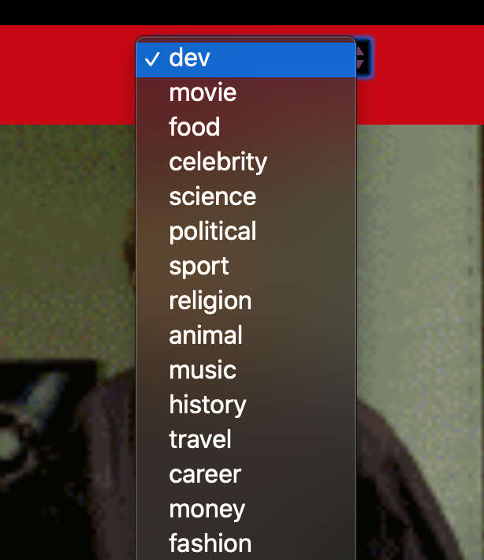
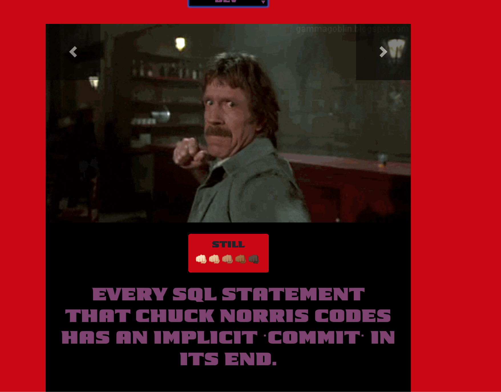

# [Chuck Norris Facts](https://elreyb.github.io/chuck-norris-facts/)

#### `06-server-side-apis` week review.

## Content

- [Description](##-description)
- [Tips and Tricks](##-tips-and-tricks)
  - [what to do when you don't know where to start](####-what-to-do-when-you-don't-know-where-to-start)
  - [what to do when you get stuck](####-what-to-do-when-you-get-stuck)
- [Some Perspective](##-some-perspective)

## Description

This app is to demonstrate how to use jquery ajax and manipulate the DOM to display gifs and 'facts' about Chuck Norris.

- You can select a 'fact' category

  

    
  

- I will display a gif and a quote based on what was selected

 

    
  

- You can pause and animate gif

 

    
    
  

Take a look at the `script.js` and look through. See you if understand the different parts of the code and how they interact with each other. I left some comments to the activity where that code concept was introduce.

## Tips and Tricks

After the last assigment many people ask me how to get unstuck when you don't know what to do next or even how to start. In preparation for your first project below are a few tips and tricks that I have come across. As always you can google fu other approaches and ideas.

#### what to do when you don't know where to start

- [Slow Is Smooth; Smooth Is Fast](https://medium.com/@webseanhickey/slow-is-smooth-smooth-is-fast-8d3061aa3ad0)

- [Start Small](https://levelup.gitconnected.com/learning-python-start-small-29d15881f780) _This blog is center around Python but can be applied to any computer language_
- [How to start a large code project](https://medium.com/@brianwill/how-to-start-a-large-code-project-20824ee9d6e0)
- pseudocode

  - [How to write Pseudocode: A beginner’s guide](https://blog.usejournal.com/how-to-write-pseudocode-a-beginners-guide-29956242698)
  - [Short Video on Pseudocode](https://www.youtube.com/watch?v=D0qfR606tVo)
  - [Slides on Pseudocode](https://www.slideshare.net/DamianGordon1/pseudocode-10373156)

#### what to do when you get stuck

- [rubber duck debugging](https://rubberduckdebugging.com/)
- pomodoro breaks
  - [Original Book](https://lasolutionestenvous.com/wp-content/uploads/2014/04/ThePomodoroTechnique_v1-3.pdf)
  - [Short Pamphlet](https://www.docdroid.net/p4o4U6b/how-to-use-a-pomodoro-timer.pdf)
  - Videos
    - [Pomodoro Technique For Productivity](https://www.youtube.com/watch?v=ykMzzZolhdk)
    - [POMODORO TECHNIQUE](https://www.youtube.com/watch?v=mNBmG24djoY)
- do something different to restart your brain
  - go for a run/walk
  - play a short game
  - wash the dishes
  - any short activity

## Some Perspective

Sometimes our inner critic voice can be really loud. Comparing ourself to others; making us doubt ourselves and the skills we have learned. Always remember everyone starts at the beginning. With time and perseverance anyone can learn anything. To give you some perspective on this here a blog I wrote about [my journey](https://formidable.com/blog/2018/one-dancers-journey/) in becoming a developer. Also, here is a video from [dotCSS 2018 conference](https://www.youtube.com/watch?v=eqZqx6lRPe0) where a colorblind designer, David DeSandro, describes how to read color hex code. I like this video because he took something that could have stop him from becoming a designer and turn it into a 'super power'. Happy Coding!
