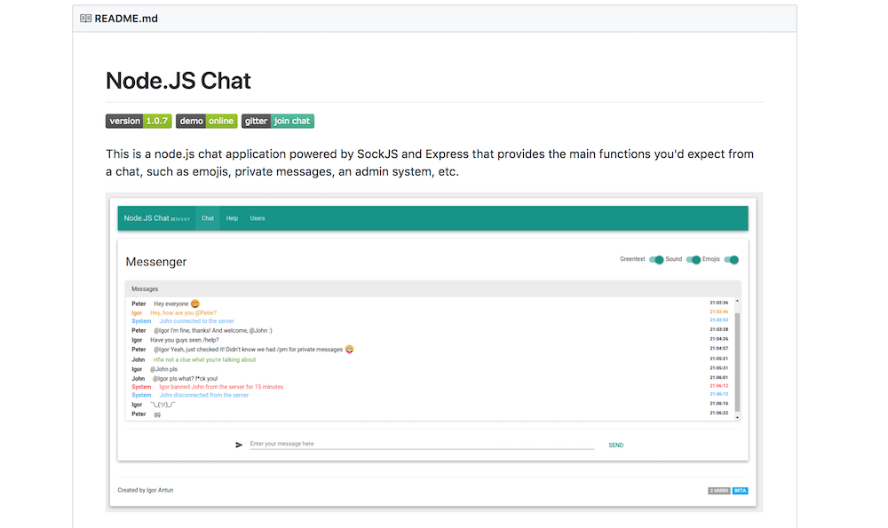

## Why Write a README

From [Trilogy Gitlab](https://uwa.bootcampcontent.com/UWA-Bootcamp/UW-SEA-FSF-PT-11-2019-U-C/blob/master/01-week-html-css/Resources/Good-README-Guide/README.md)

_"Your GitHub profile is an extremely important aspect of your public identity as a developer. A well-crafted one allows you to show off your work to other developers as well as potential employers"_

From [A Beginners Guide to writing a Kickass README](https://medium.com/@meakaakka/a-beginners-guide-to-writing-a-kickass-readme-7ac01da88ab3)

_"A great README file helps your project to stand out from the sea of open-source software on GitHub. A README is like the face of your project. It is the first file a person should read when encountering a source tree, and it should be written as a very brief and very basic introduction to the software"_

From [How to write good README and why should you care](https://thejunkland.com/blog/how-to-write-good-readme.html)

_"Thinking you're the only person ever reading the file might act as a motivation to neglect the writing of a good README._

_"No matter how big or small your project is, you should always take pride in the hours you put in to writing code; you'll never know who's having a look at it in the next weeks, months or even years."_

## README Examples

### Templates

- [Template](https://github.com/ritaly/README-cheatsheet)

### Bootcamp project READMEs

- [Dance Network](https://github.com/ElreyB/dance-network) - Elrey
- [CRM](https://github.com/DaneShrewsbury2288/CRM) - Dane

### READMEs in the Wild

- [TypeScript-Node-Starter](https://github.com/microsoft/TypeScript-Node-Starter#getting-started)
- [Bootstrap](https://github.com/twbs/bootstrap)
- [vscode](https://github.com/microsoft/vscode)
- [awesome](https://github.com/sindresorhus/awesome)
- [postgres](https://github.com/porsager/postgres)
- [Gymnast](https://github.com/gymnastjs/gymnast)
- [Victory](https://github.com/FormidableLabs/victory)
