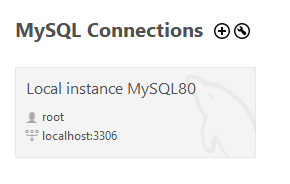
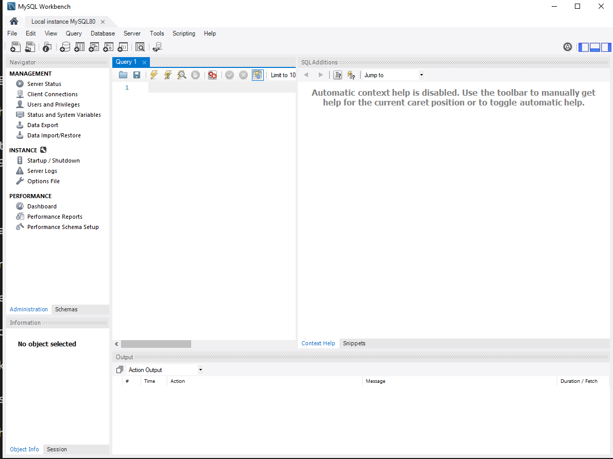

## MySQL Server Installation Guide (Mac)

- Go [here](https://dev.mysql.com/downloads/mysql)

- Scroll down and find macOS 10.13 (x86, 64-bit), DMG Archive and click “Download”.

- Click “No thanks, just start my download.”

- Open the .DMG file and go through the installation process.

- Click “Continue” to get to the Software License Agreement Screen.

- Click “Continue” to agree with the Software License Agreement and click “Agree”.

- Click “Install” and input your password to allow the installer to continue.

- **IMPORTANT**: Make sure to select “Use Legacy Password Encryption” and click “Next”.

- Create a root password. WARNING. Do not forget this password! After entering a password, click “Finish”.

- You can verify that the installation was correct by going to “System Preferences” and the MySQL icon should show up at the bottom.

- Once complete with the MySQL Server install, move onto installing MySQL Workbench below.

- Click the MySQL Icon in "System Preferences". This will bring up a GUI in which you can Start or Stop your server. You can also set it to start server when you turn on your computer.

- Once complete with the MySQL Server install, move onto installing MySQL Workbench below.

## MySQL Workbench Install (Mac)

- Go [here](https://dev.mysql.com/downloads/workbench/)

- Scroll down to macOS (x86, 64-bit), DMG Archive and click “Download”.

- Click “No thanks, just start my download.”

- Open the DMG file and go through the installation process.

## Try it out!

- Double click this card

  

- This should open the workbench

  

- You can now write SQL queries and press the lightning icon to execute your query

  

- Example SQL statements [here](../1-tuesday-intro/01-animalsDB/animalsDB.sql) and copy/pasted below for convenience:

```sql
-- Drops the animals_db if it exists currently --
DROP DATABASE IF EXISTS animals_db;
-- Creates the "animals_db" database --
CREATE DATABASE animals_db;

-- Makes it so all of the following code will affect animals_db --
USE animals_db;

-- Creates the table "people" within animals_db --
CREATE TABLE people (
  -- Makes a string column called "name" which cannot contain null --
  name VARCHAR(30) NOT NULL,
  -- Makes a boolean column called "has_pet" which cannot contain null --
  has_pet BOOLEAN NOT NULL,
  -- Makes a sting column called "pet_name" --
  pet_name VARCHAR(30),
  -- Makes an numeric column called "pet_age" --
  pet_age INTEGER
);

-- Creates new rows containing data in all named columns --
INSERT INTO people (name, has_pet, pet_name, pet_age)
VALUES ("Ahmed", TRUE, "Rockington", 100);

INSERT INTO people (name, has_pet, pet_name, pet_age)
VALUES ("Ahmed", TRUE, "Rockington", 100);

INSERT INTO people (name, has_pet, pet_name, pet_age)
VALUES ("Jacob", TRUE, "Misty", 10);

INSERT INTO people (name, has_pet)
VALUES ("Peter", false);

-- Updates the row where the column name is peter --
UPDATE people
SET has_pet = true, pet_name = "Franklin", pet_age = 2
WHERE name = "Peter";
```
