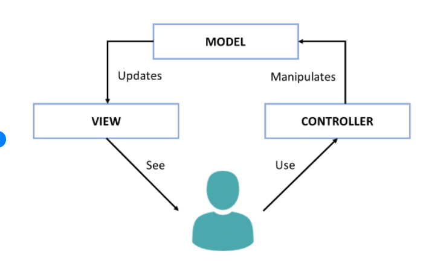

# <center> MVC (Model, View, Controller)



<center> DESIGN PATTERN </center>

- VIEW: **Handlebars** / **Public**: In simple words, View is the User Interface on which our customer/user can perform some actions. It contains HTML,CSS,JS, XML or any other markup language that we can use to create a beautiful user interface. It also contains code to show the data that it receives form our application.

- MODEL: **MySql** / **DB** / **ORM** Model works directly with the database. It does not have to deal with user interface or data processing. In real world scenario, you will simply use model to fetch, insert, update and delete data from your database.

- CONTROLLER: **Controller** / **ORM** Controller is the part in which we process the data after we get a request from View and before updating anything in our database with our Model.

```js
.
├── config
│   ├── connection.js // Handles connected to db. Exported as module for use in orm.js file.
│   └── orm.js // Contains functions to query database. Returns data as callback.
│ 
├── controllers
│   └── burgers_controller.js // Send / Receives data to / from burger.js. Re-directs data to orm / view. 
│
├── db
│   ├── schema.sql // DB info
│   └── seeds.sql // Dummy data for testing / testing foegin keys in DB
│
├── models
│   └── burger.js // Object with orm functions based on input data. 
│ 
├── node_modules
│ 
├── package.json // npm init and --save when add modules
│
├── public // Static files 
│   └── assets
│       ├── css
│       │   └── burger_style.css
│       ├── img
│       │   └── burger.png
│       └─js
│         └── script.js // Contains front-end logic. (AJAX calls)
│  
│
├── server.js  // Central command / Manages routes
│
└── views
    ├── index.handlebars // Receives data from burger_controller.js. Sends to main.handlebars. 
    └── layouts
        └── main.handlebars // Final result

// If I want to create burger. 
//   0. User clicks create button on page. Script.js makes ajax call.
//   1. Controller runs create method for burger.js
//   2. Burger calls ORM 
//   3. Orm runs query to db
//   4. DB creates a new burger
//   5. ORM (callback) to controller
//   6. Controller runs get method. Passes data into index (HB)
//   7. Index.handlebars processes data
//   8. Main.handlebars updates with new burger.
//   9. Great Success! 
 ```     

---

## <center>Advantages of MVC architecture:

1. Development of the application becomes fast.
1. Easy for multiple developers to collaborate and work together.
1. Easier to Update the application.
1. Easier to Debug as we have multiple levels properly written in the application.

## <center> Disadvantages of MVC architecture:

1. It is hard to understand the MVC architecture.
1. Takes time to lay foundation.
1. Must have strict rules on methods.

## <CENTER> Handlebars Basics
---
1. Templating language 
1. How do I render a handlebars file? 
    - Send data through a layout / partial layout


```js
   res.render('index', { object: data});
   res.render('indexTwo', { object: data});
   // This will pass the object through the layout or partial of handelbars.
   // You can have multiple layouts or partials for differing results.
   // It will generally all end in main
   └── views
    ├── index.handlebars
    ├── indexTwo.handlebars
    └── layouts
        └── main.handlebars
```
```js
EX: 1

{
  person: {
    firstname: "Yehuda",
    lastname: "Katz"
  }
};

<h1> Hello! My name is {{person.firstname}} {{person.lastname}}. </h1>

 Hello! My name is Yehuda Katz.

--------------------------------------------------------------------------------------

EX: 2

{
  people: [
    "Yehuda Katz",
    "Alan Johnson",
    "Charles Jolley"
  ]
};

<ul class="people_list">
  {{#each people}}
    <li>{{this}}</li>
  {{/each}}
</ul>

<ul class="people_list">
    <li>Yehuda Katz</li>
    <li>Alan Johnson</li>
    <li>Charles Jolley</li>
</ul>

--------------------------------------------------------------------------------------

EX: 3

** Unless vs If **

   { 
       animals: [
       {
           id: 1,
           name: 'dog',
           housePet: true
       },
       {
           id: 2,
           name: 'cat',
           housePet: true
       },
       {
           id: 3,
           name: 'alligator',
           housePet: false
       },
       {
           id: 4,
           name: 'T-rex',
           housePet: false
       },
    ]
   };

    {{#each animals}}
    {{#if this.housePet}}

    <p> I would love to have a {{this.name}} in my house. 

    {{/if}}
    {{/each}}

      <p> I would love to have a dog in my house. 
      <p> I would love to have a cat in my house.

-----------------------------------------------------------------------

    {{#each animals}}
    {{#unless this.housePet}}

      <p> I would hate to have a {{this.name}} in my house. 

    {{/unless}}
    {{/each}}

      <p> I would hate to have an alligator in my house. 
      <p> I would hate to have a T-rex in my house.

```

## <center> BONUS
1. Demo/Call on students for practice.js file
1. Great article on ES6 Object Destructuring [HERE](https://codeburst.io/es6-destructuring-the-complete-guide-7f842d08b98f)
