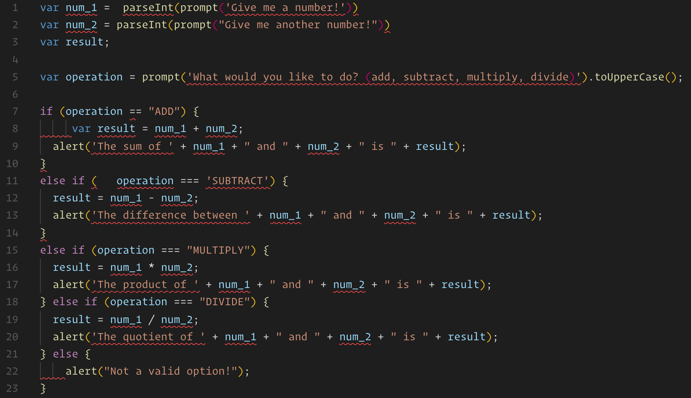

# Eslint Example

In this example we will use eslint to fix issues a calculator app.

## Instructions

- Install the [VS Code Eslint Extension](https://marketplace.visualstudio.com/items?itemName=dbaeumer.vscode-eslint).

- Open the [Unsolved](Unsolved) directory and run `npm install` from your terminal to install dependencies.

- Now open [Unsolved/example.js](Unsolved/example.js) in your code editor. If you were able to complete the previous steps correctly, you should see red annotations under different parts of the code. Hovering over each displays a popover with an eslint rule being broken.

  

- Work to fix each part of the annotated code.

### Bonus

- Run `eslint --fix` to auto-fix rules

- Setup `eslint` to automatically fix all issues on save

- add a `.eslintignore` to exclude some files ([example](../../../../14-full-stack/.eslintignore))

- Try changing the quote style to enforce single-quotes instead of double-quotes.

- Try switching to the more complete eslint rules used in the previous unit [here](../../../../14-full-stack/.eslintrc.json)

  - Experiment with breaking and fixing rules

### Hints

- If you're unsure about what an eslint rule is asking for, type it into Google for examples.
