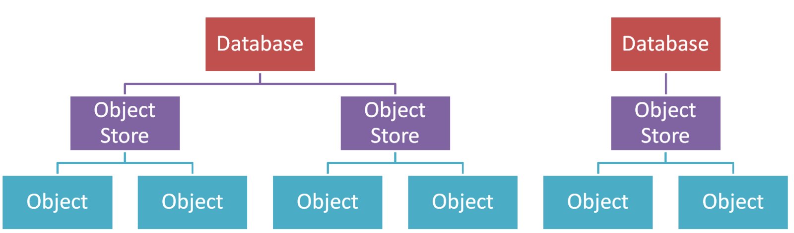
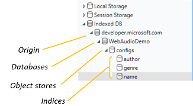

# IndexedDB

## About

- Client-side NoSQL storage

- Intended for high performance storage with lots of data

  - Web Storage (`localStorage` or `sessionStorage`) is still useful to store small pieces of data

- Uses an object store - JavaScript Objects, files, arrays, numbers, ...anything that can be cloned

- Key/Value based (like `localStorage`)

- Transactional

  - every operation occurs in a combined unit of work that is done (or fails) together

  - read more about the importance of transactions by reading about [ACID and BASE](https://neo4j.com/blog/acid-vs-base-consistency-models-explained/) database paradigms

- Asynchronous and follows an event-based system

  - Instead of using promises, we will be listening to events in the same way we listen for buttons to be clicked (`button.onclick = function(e) {}`) or the page to load (`document.onload = function() {}`)

## Terminology

### Structure

| IndexedDB     | MongoDB    | SQL          |
| ------------- | ---------- | ------------ |
| Database      | Database   | Database     |
| Object Store  | Collection | Table        |
| Data / Object | Document   | Record / Row |

### CRUD

| Operation | IndexedDB | MongoDB | Mongoose | SQL    | Sequelize | HTTP   |
| --------- | --------- | ------- | -------- | ------ | --------- | ------ |
| Create    | add       | insert  | create   | insert | create    | POST   |
| Read      | get       | find    | find     | select | find      | GET    |
| Update    | put       | update  | update   | update | update    | UPDATE |
| Delete    | delete    | delete  | delete   | delete | destroy   | DELETE |

## Steps to Using IndexedDB

1. Open a database
1. Create an object store
1. Make a transaction request

## Debugging

## Important Events and Methods

- `window.indexedDB.open`

  - `const request = window.indexedDB.open('MyDatabaseName', myDbVersion)`

  - creates a request to open the database

- `request.onerror`

  - `request.onerror = event => {}`

  - called when a `request` encounters an error

- `request.onsuccess`

  - `request.onsuccess = event => {}`

  - called when a `request succeeds`

- `db.onerror`

  - `db.onerror = event => {}`

  - called when the database encounters an error. Events bubble, the `request` will receive this event first and then it will bubble to the corresponding database.

- `request.onupgradeneeded`

  - `request.onupgradeneeded = event => {}`

  - called when a new database is created or the version of number of an existing database has been increased (by specifying a higher number when opening the databas)

- `db.createObjectStore`

  - `const objectStore = db.createObjectStore('myStoreName', { keyPath: 'myKey', autoIncrement: true })`

  - creates a new object store

- `objectStore.createIndex`

  - `objectStore.createIndex('indexName', 'keyPath', optionalObjectParameters)`

  - creates a new index

- `objectStore.transaction.oncomplete`

  - `objectStore.transaction.oncomplete = event => {}`

  - called when the transaction has completed

- `db.transaction`

  - `db.transaction(['storeName1', 'storeName2'], 'readwrite')'`

  - initiates a new transaction and returns a new transaction object

- `transaction.objectStore`

  - `transaction.objectStore('storeName')`

  - gets the object store from a transaction

- `objectStore.add`

  - `const request = objectStore.add({my: 'cool object'})`

  - creates data in `objectStore`

- `objectStore.delete`

  - `const request someObjectStore.delete('key')`

  - deletes the data at `key` in `objectStore`

- `objectStore.get`

  - `const request = objectStore.get('key')`

  - gets data from the `objectStore` at `key`

- `objectStore.put`

  - `objectStore.put({my: 'cool object'})`

  - updates the data in the database to be `{my: 'cool object'}`

## Resources

- [MDN](https://developer.mozilla.org/en-US/docs/Web/API/IndexedDB_API)
- [Google Chrome Developers (YouTube)](https://www.youtube.com/watch?v=vCumk1sXHcY)
- [TutorialsPoint](https://www.tutorialspoint.com/html5/html5_indexeddb.htm)
