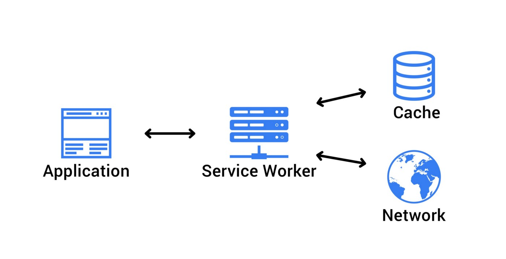

# 
 PWA 

## 
 Focus on understanding concepts / structure
    1. There is a lot of code involved with PWA, but most of it is easily accessible and templated.  
    2. Understand the purpose of each part.

## 
 Components of a progressive web app
    1. Manifest 
        1. A web app manifest gives information (i.e., icon, name, author, and description) about an app in a JSON text file(link is external).

    2. Service Worker
       1. A service worker is a JavaScript file that runs separately from the main browser thread, intercepting network requests, caching or retrieving resources from the cache, and delivering push messages.
       2. Pre-caching of static assets (Increased performance)
       3. Fetch / Cache

    3. HTTPS
        1. Service workers have the ability to intercept the network requests and can modify the responses. Service workers perform all the actions on the client side. Hence, PWA requires secure protocol HTTPS.

## 
 Service Worker

## 
 Lifecycle of a service worker
    1. Registration
    2. Installation
    3. Activation
[Life-cycle by Google](https://developers.google.com/web/fundamentals/primers/service-workers/lifecycle)

## 
 Benefits of a progressive web app
    1. Increased performance 
    2. Mostly functional offline
    3. Cheap development cost
