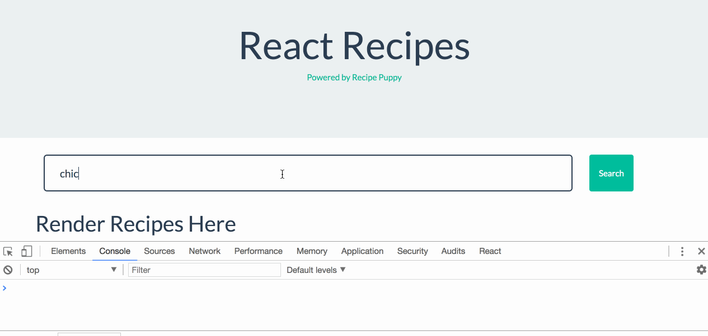
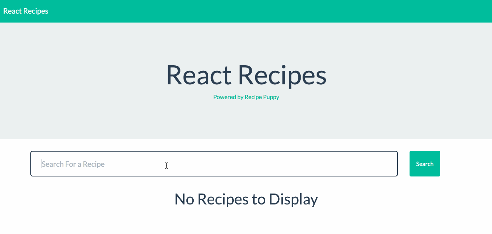

# React Recipes

In this activity we will render a list of recipes retrieved via an AJAX request.

## Instructions

- Open [Unsolved](Unsolved) in your editor. From the root of the project folder, run `npm install` to install the required dependencies.

- Run `npm start` to start the React app and Express server. Visit [localhost:3000](http://localhost:3000) in your web browser to view the app.

- Enter a search term, e.g. "pizza" in the input field and submit. This won't have any visible affect on the page yet, but should submit an AJAX request and log the response to the console. Take a moment to study the response logged.

  

- The goal of this activity is to render these recipes to the DOM. You are a front-end developer, somebody has already written a working back-end.

### Part 1

- For this section the only file you will need to modify is `App.js`. Take a few moments to study the code in the file.

- Using the `RecipeList` and `RecipeListItem` components, add code to render the array of recipes where indicated in the file.

  - The `RecipeList` component renders a `ul` tag and accepts children. The `RecipeListItem` component renders an `li` tag with some formatting to hold the recipe's title, thumbnail, etc.

- Using a `RecipeList` component as a container, map over `recipes` and render one `RecipeListItem` component for each recipe object in `recipes`.

- Pass the rendered `RecipeListItem` components each property of their recipe object, i.e. :

  - `title`

  - `href`

  - `ingredients`

  - `thumbnail`

- Test your solution by searching for a recipe in your browser. If successful so far, you should see the following:

  

- No matter the search query, the same hard coded recipe is being rendered in each `RecipeListItem` component. We'll address this problem next!

### Part 2

- If the previous section was completed correctly, the only file you should need to modify for this section is `RecipeListItem.js`.

- Currently the rendered `RecipeListItem` components are displaying hard coded recipe data. Modify the `RecipeListItem` component file so that it utilizes all of the passed props where appropriate. Look at the hard coded data to determine how each prop should be used.

- If completed successfully, searching for a recipe in your browser should render dynamic results relevant to the search.

  

### Hints

- Check out the [React Documentation](https://facebook.github.io/react/docs/lists-and-keys.html) on rendering lists of components if you need a refresher on this.

- Rather than mapping over recipes and rendering primitive `ul` and `li` tags, you'll be using the pre-built `RecipeList` and `RecipeListItem` components.

- Ask for help if you're stuck!

### Bonus

- Add code so that if a recipe doesn't come with a thumbnail url, use a placeholder image instead. Check out [placehold.it](https://placeholder.com/) for placeholder images.

- Add code so that if `recipes` is an empty array, render a message indicating that no recipes are available.

- Try running `npm run build`
