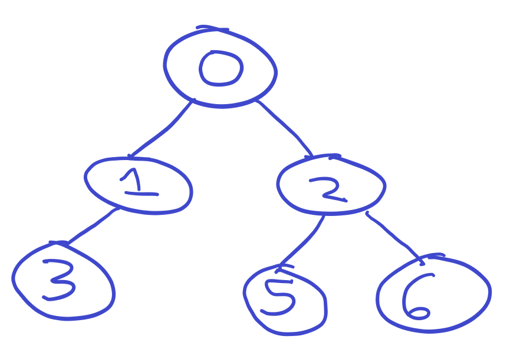
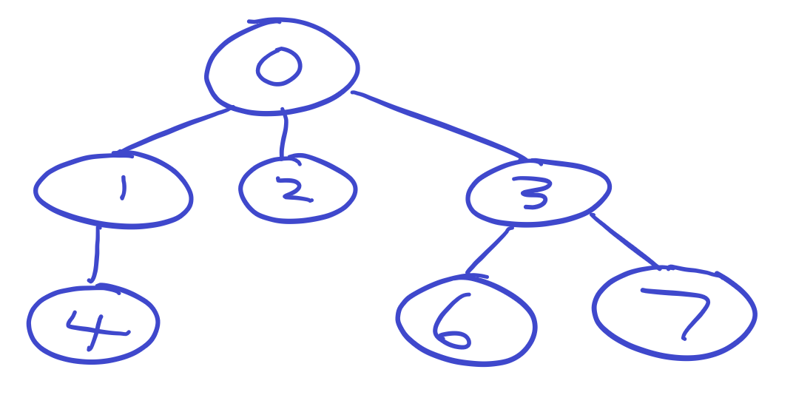

# Trees

## Instructions

### Pseudocode

#### Binary Tree

- Draw a tree (the code kind)

- Pseudocode a class to represent a binary tree ([example binary tree](./tree.png))

- Pseudocode how you might be able to leverage that class to create a binary tree with several nodes

- Pseudocode traversing the binary tree to reach different nodes

#### N-Ary Tree

- Pseudocode a class to represent an n-ary tree ([example n-ary tree](./n-ary-tree.png))

- Pseudocode how you might be able to leverage that class to create an n-ary tree with several nodes

- Pseudocode traversing the n-ary tree to reach different nodes

### Code

#### Binary Tree

- Create a class which can represent a binary tree (tree with at most two children)

- Use that class to write code representing [this tree](./tree.png):

  

- Traverse the tree to print the `5`

#### N-Ary Tree

- Write a class which can represent an n-ary tree (tree with any number of children)

- Use that class to write code representing [this tree](./n-ary-tree.png):

  

- Traverse the tree to print the `7`

### Bonus

- What is the Big O of inserting, removing and finding a node in a tree?

- Research what it means for a tree to be balanced

- How can you ensure your tree is balanced?

- After class try some of [these problems](https://leetcode.com/tag/tree/)

## Hints

- To represent data structures in programming languages we use classes

- Each node in a tree is just another smaller tree

- The two main steps to this are representing a single node and figuring out how to connect nodes together to compose larger trees

- If you are stuck on the code there are many resources available online if you search for "binary tree JavaScript"

  - do not do this unless you are truly stuck
