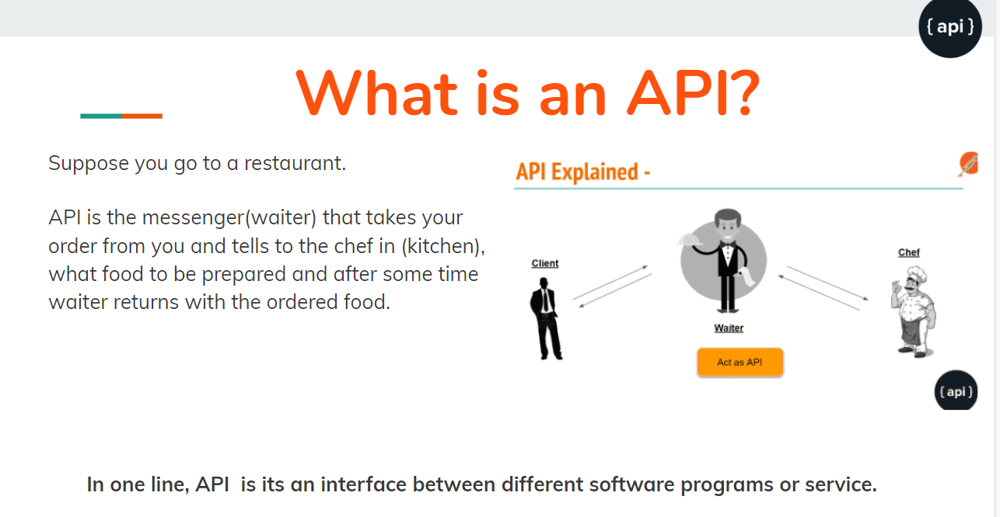
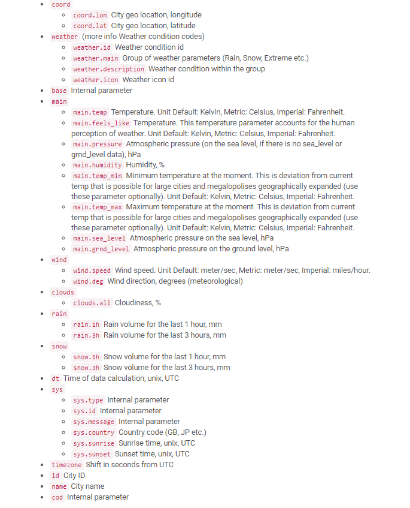
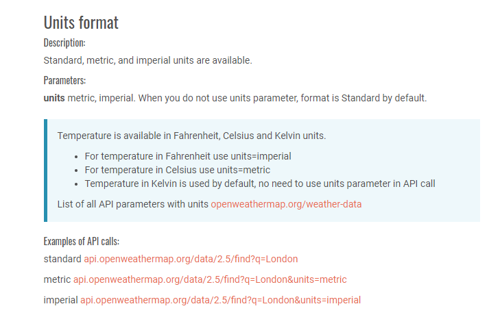

# Week 6 - API

## API

- Application Programming Interface
- Essentially the interface or communication protocol between different parts of a computer program intended to simplify the implementation and maintenance of software.



## AJAX Call
---

- Asynchronous JavaScript XML
- Web applications can send and receive data from a server asynchronously without interfering with the display and behavior of existing page.  

```
 $.ajax({
        url: **Sample URL**
        method: 'GET'
      })
```

- Sample URL: http://api.openweathermap.org/data/2.5/weather?q=Seattle
- var cityName = Seattle
- URL w/ Input: 'http://api.openweathermap.org/data/2.5/weather?q=' + cityName

## Promises
---

- The Promise object represents the eventual completion (or failure) of an asynchronous operation, and its resulting value.

```
   .then(function(response) {
        console.log(response);
   });
```

## Response
---

- JSON
  1. JavaScript Object Notation
- XML
  1. Extensible Markup Language

- Example JSON response

```

{
  "coord": {
    "lon": 122.08,
    "lat": 37.39
  },
  "weather": [
    {
      "id": 800,
      "main": "Clear",
      "description": "clear sky",
      "icon": "01d"
    }
  ],
  "base": "stations",
  "main": {
    "temp": 282.55,
    "feels_like": 281.86,
    "temp_min": 280.37,
    "temp_max": 284.26,
    "pressure": 1023,
    "humidity": 100
  },
  "visibility": 16093,
  "wind": {
    "speed": 1.5,
    "deg": 350
  },
  "clouds": {
    "all": 1
  },
  "dt": 1560350645,
  "sys": {
    "type": 1,
    "id": 5122,
    "message": 0.0139,
    "country": "US",
    "sunrise": 1560343627,
    "sunset": 1560396563
  },
  "timezone": -25200,
  "id": 420006353,
  "name": "Mountain View",
  "cod": 200
}

```

## Traversing the JSON Response

---

- Coordinates
  - lat:
  - lon:
- WindSpeed
- City Name
- Cloudiness
- Date/Time


**Extra Documentation**




