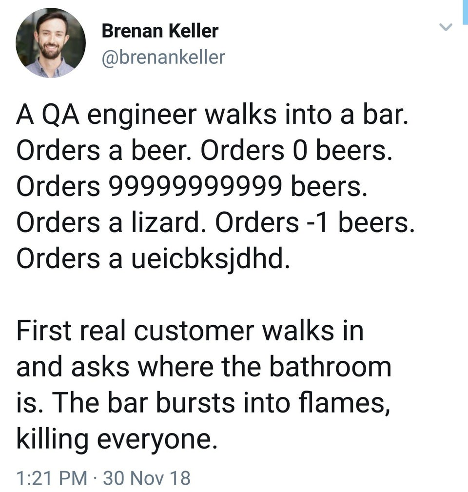
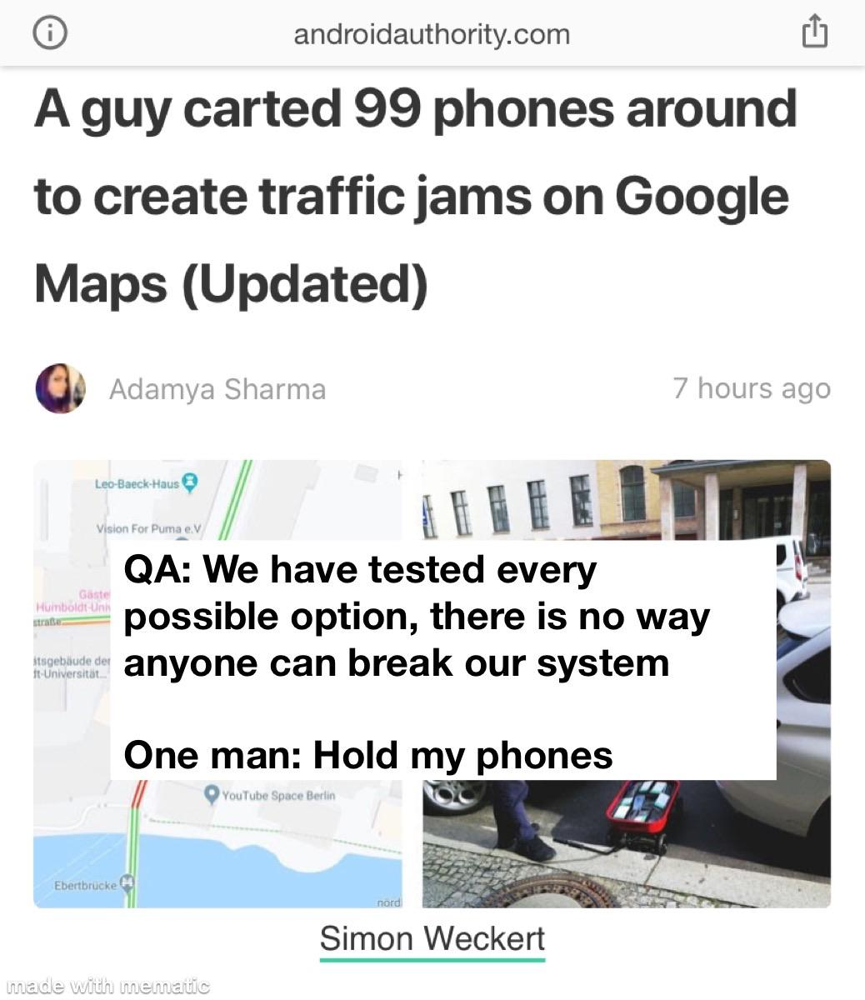

## <center> Testing / Express

## Unit Testing

---

- Unit testing is testing individual components of a feature/app.

- Some times you will spend more time writing test code than actual code.

- Consider use cases.

  - How will this help accomplish my final product?

- Buddy Testing / Manual Testing
  - Pull over another developer and explain feature to them. Have them test it out.
  - Second set of eyes.
  - ++RubberDuck
- Keep tests simple and precise
  - Each test should isolate a specific potential error.
  - This can isolate specific errors very quickly.

## Function Testing

---

1. What is the purpose of this function?
   - Is this function necessary? What is it trying to accomplish?
1. Input
   - Validate Input ( Type / Null / Undefined / Min / Max )
1. Output
   - Validate Output ( Type / Null / Undefined / Min / Max )
1. Edge Cases
   - Occurs at an extreme (maximum or minimum) operating parameter.
1. Errors
   - How should this function handle errors?
   - Which corresponding errors should be thrown?

## <center> Real QA:

---



## Time Efficiency

---

- You cannot posibly test for everything
  - Remember your MVP (minimum viable product)



## <center> Express

---

Express is the most popular Node web framework, and is the underlying library for a number of other popular Node web frameworks. It can:

1. Write handlers for requests with different HTTP verbs at different URL paths (routes).
1. Integrate with "view" rendering engines in order to generate responses by inserting data into templates.
1. Set common web application settings like the port to use for connecting, and the location of templates that are used for rendering the response.
1. Add additional request processing "middleware" at any point within the request handling pipeline.

## Template

### Server.js

```js
- const express = require('express');
// Dependency

- const app = express();
// Creates an express server.

- const PORT = process.env.PORT || 3000;
// Declares the port either local or hosted.

- app.use(express.urlencoded({ extended: true }));
// Express app to handle data parsing.

 - app.use(express.json());
// express.json() is a method inbuilt in express to recognize the incoming Request Object as a JSON Object.

- require('./route')(app);
// Points the server to the route files.

- app.use('/static', express.static(path.join(__dirname, 'public')));
   or
- app.use(express.static('public'));
// The above code to serve images, CSS files, and JavaScript files in a directory named public:

- app.listen(PORT, () => {
  console.log('App listening on PORT: ' + PORT);
});
// Spins up the server.
```

### <center> CRUD

---

- const app = express();

- app.METHOD(PATH, HANDLER);

1. Create - app.post('/', (req, res) => { res.send(`Hello World`) });
1. Read - app.get();
1. Update - app.put();
1. Delete - app.delete(); or app.put();

### <center> Package.json

---

- This file holds relevant metadata for the application.
  - dependencies
  - dev dependencies
  - scripts
- `npm init`
- `npm install --save` to install a dependency and update the package.json

### <center> .gitignore

---

- You can specify to create a gitignore when you create a repository
- Create the file by right clicking and creating `.gitignore`:

```
node_modules/
.vscode
.idea/
.DS_Store
~*.pptx
```
