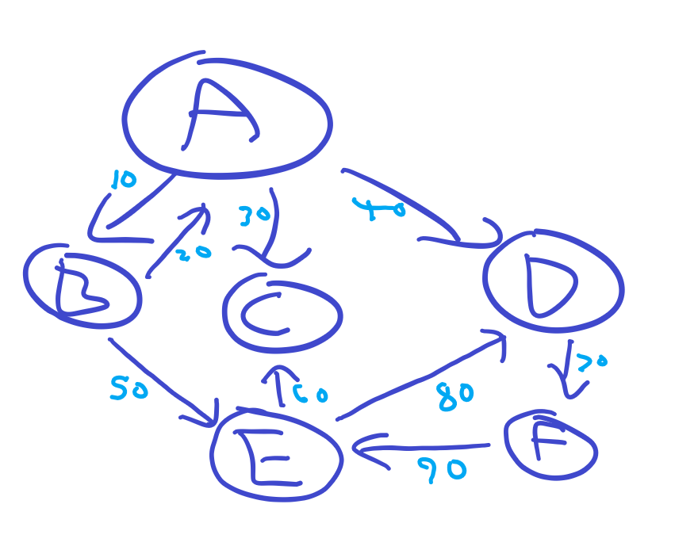

# Depth-First-Search (DFS)

Update the `dfs` method in [Graph.js](./unsolved/Graph.js) to count the number of reachable nodes.

For example, in the graph in the below graph starting at vertex A would return `6` because all six nodes are reachable.

Starting at vertex `C` would return `1` (C) and starting at vertex `E` would return `4` (E, C, D, F)

## Bonus

- Make the graph undirected (uncomment line 45)

- Find the sum of all edge weights using DFS
