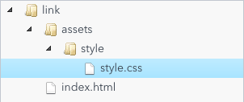
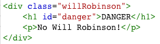
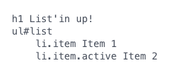
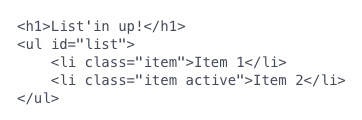
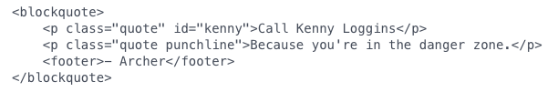

## Questions

1. Bare Bones HTML Document - `HTML` `Syntax Recollection`

   ❓ Write out a basic bare bones HTML Document.

1. Linking External Style - `link` `HTML` `External CSS` `Syntax Recollection`

   

   ❓ Given the structure of the directories, write HTML that will pull in style.css into index.html

1. CSS of `
` tag - `HTML` `CSS` `Selector` `Syntax Recollection`

   

   ❓ Write CSS that will:

   - make the `
` tag bold
   - make the text red of the element with an id, and
   - give the element with a class a fifteen pixel red border (without modifying the HTML)

1. Div vs Section - `HTML` `Technical Vocabulary`

   ❓ Compare and contrast the `div` and `section` elements.

1. Templating - `HTML` `Pseudocoding` `Pug`

   ❓ Because HTML/CSS are presentational, pseudocoding isn't really a common practice. However, a common practice is to use templating languages to shorthand HTML. One such templating language, Pug, can be used to generate HTML from very minimal markup. For _example_:

   

   would output the following HTML when compiled:

   

   How would you write a Pug template which would output the following HTML?

   
