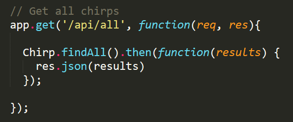

## 14.1 - The Sequel to MySQL

## Overview

- **DO NOT HAVE STUDENTS CONNECT TO A REMOTE DATABASE WHEN DEVELOPING LOCALLY.** The correct process is described in `Supplemental/SequelizeHerokuDeploymentProcess.pdf`, and if you try to skip this, your students may not be able to work on activities or homework on your classroom's internet connection (also, using a remote database for local development is considered bad practice).

### Ins: Intro

- 630-32 (5 min)

- We will cover sequelize today which makes interacting with databases much nicer

  - it's a Node ORM

  - this will require reading the documentation, stackoverflow, etc.

- Discuss the full week plan

- It's okay if you don't nail everything, this is tough stuff. If you're not understanding something talk to us.

### 00-MVCDiagram

- 633-35 (3 min)

- draw the diagram on the whiteboard

  - add Express, MySQL, ORM, HTML, CSS, handlebars, etc. to the diagram (ask for each one, which one do they think it belongs to)

### Stu: 01-Chirpy-mySQL

- 635-55 (20 min)

- Review of `MySQL`

- Demo the app first

### Ins: Review

- 655-705 (10 min)

- go over structure

- explain `express.static`

  - middleware built-in to express
  - it will look at the given directory for static assets and server those when requests matching the path are reqeusted (relative path to the static directory)

- demo connecting with the "MySQL" VS Code extension

  - show the extension download
  - expand to the chirpy directory
  - select top 1000
  - highlight text and run it

### Ins: Introduce Sequelize

- 705-10 (5 min)

- Draw on board diagram of:

  - Node (server) <-> Sequelize (ORM) <-> MySQL (database)

- chirp table looked like this

  ```sql
    CREATE TABLE `chirps` (
    `id` INTEGER AUTO_INCREMENT NOT NULL,
    `author` VARCHAR( 255) NOT NULL,
    `body` VARCHAR( 255 ) NOT NULL,
    `created_at` DATETIME NOT NULL,

    PRIMARY KEY (`id`)
  );
  ```

- this can be visualized as a class

  ```js
  class Chirp() {
    constructor(id, author, body, createdAt) {
      this.id = id;
      this.author = author;
      this.body = body;
      this.createdAt = createdAt;
    }
  }
  ```

- each instance of this class (object) represents a record in the DB

- All an ORM does is figure out how to map between the two so that we don't have deal with SQL, instead we work with objects like we're used to

- We will be converting Chirpy to use Sequelize

### Partners: 02-SequelizeQuestions

- 710-25 (15 min)

* Have your students partner up into two-person teams. Each team will need to come up with answers to the questions in the quiz. Check out the answers in the solved portion in the meantime.

* Tell them they should use the Sequelize documentation, as well as any info they may find on the usual sites (stack overflow, quora, etc.) to answer these questions.

### Everyone Do: Go over Answers

- 725-35 (10 min)

* Open the unanswered version of `02-SequelizeQuestions` and display it. Go down the list and ask your students to give you their answers. If everyone is stumped, refer to the answers in the solved version, then ask the students if this makes sense. If not, offer more of an explanation.

* Ask your class the same question you asked on week 1: "How would you define full-stack development?" At this point students should be much more savvy than they were on Week 1, so expect solid answers.

### Ins: Chirpy with Sequelize

- 735-50 (15 min)

* Open the Sequelize version of the Chirpy app and show it off again. This time inform students that this new version of Chirpy is using the Sequelize ORM we just learned about. Slack out the completed Chirpy-Sequelize app `03-Chirpy-Sequelize` and encourage students to follow along as you work through the code.

* Open up the Chirpy code in your editor and illustrate the key differences between using Sequelize and stock MySQL.

  - In the connection.js file we require the Sequelize package, and use it to create a connection to our database. This is very similar to how we use the MySQL package.
  - One of the biggest changes is the addition of a models directory with our new `chirp.js` file.

        * Note how we first require the Sequelize library, and then the connection that we will use to connect to the database (Sequelize with a little "s").

    - Reiterate the key aspects of Sequelize models. A model represents a table in the database. Here we are defining the different columns that will be in our table, as well as assigning them a data type. In addition, we sync our model with the database. Sequelize will create a table in our database for each model if it does not already exist. Point out that we don't need to define an id column in our Sequelize models. By default, we're given a NOT NULL, auto-incrementing id of type INTEGER to serve as the primary key. We can explicitly define an id column if we wanted to give it a different configuration, but we can just omit this most of the time.

      - In api-routes.js we first require the Chirp model, then we use sequelize query methods to query our database. In our example we are using `Model.findAll()` and `Model.create()` but there are many more! Illustrate how instead of having to write out an entire mySQL query string, we can use predefined query methods defined by Sequelize. This allows us to greatly simplify how we retrieve data from our database!

    

  - **Note**: If we were to `console.log` the `result` object returned from a sequelize query, we'd see that it is a large object with many nested keys and methods. It contains a `dataValues` property that contains the record data we're looking for.

  - When we send the large `result` object back to the client using `res.json`, only the `dataValues` property is sent back.

  - This is worth knowing since it may come up when debugging students code.

### Stu: Star Wars MySQL to Sequelize

- 750-810 (20 min)

* Now it's the students' turn to get their hands dirty with Sequelize. They will be taking an app that currently uses the MySQL package, and updating it to use the Sequelize ORM.

* Open the Star Wars app `04-StarWars` and demonstrate its functionality. Inform students that they will be taking this fully functioning app and converting it to use Sequelize!

* Slack them the Star Wars skeleton directory `04-StarWars` along with the following instructions:

  - Using the instructions in server.js, reconfigure the Star Wars app to use the Sequelize ORM.
  - If you need help, refer to the previous example for guidance.

* Note that a question mark will appear in certain `get` routes. This `?` character indicates an _optional parameter_—these routes will load even if the parameter wrapped in `:?` is absent from the request.
  - _A question mark in an Express route indicates an optional parameter._

### Ins: Review

- 810-20 (10 min)

### BREAK

- 820-35 (15 min)

### Stu: Sequelize Library

- 835-9 (25 min)

* In this activity, students will be building the backend of a Sequelize application.

* Open the Sequelize-Library solution `05-SequelizeLibrary` and demonstrate its functionality. Add a few books to the library then show students how we can search for books by title/author/genre, choose to view all books, or view short/long books.

* This app will require students to research more advanced sequelize querying. Urge students to use the Sequelize documentation to find these answers.

* Slack them the Sequelize Library skeleton directory `05-SequelizeLibrary` along with the following instructions:
  - Instructions
    - Create a `'sequelize_library'` DB.
    - Modify `'connection.js'` to include your MySQL user/database information.
    - In the `'models'` folder, modify the `book.js` file to create a book model. Further details can be found inside this file.
      - Your book model must include a title, author, genre, page numbers.
    - Modify `'api-routes.js'` using sequelize query methods to create the required routes.

### Ins: Go over Sequelize Library

- 9-10 (10 min)

* Go over Sequelize implementation. Focus on aspects of this activity that were new such as the advanced querying techniques as well as the CRUD operations. Inform students that this was a difficult activity and that we will spend more time with CRUD operations next class.

### Ins: Intro to Sequelize CLI

- 910-25 (15 min)

- Explain to students that we can also initialize Sequelize projects using the Sequelize Command Line Interface.

- This will allow us to quickly start new projects, take advantage of advanced Sequelize features, as well as work with multiple models more easily at scale an ultimately have to write less code as our project grows.

- Slack out the Sequelize CLI Skeleton `06-SequelizeCLI` as well as the `Supplemental/SequelizeQuickStartGuide.pdf` have the students follow along with you as you initialize a new project using the Sequelize CLI.

We will be using this method of setting up Sequelize projects going forward, so encourage students to practice with this guide before next class.

**NOTE**: The Sequelize CLI has a lot of functionality, including creating models via the CLI. **We will only be using be using the CLI to initialize an index.js file, and a config.json file**. Discourage model creation with the CLI (if it comes up at any point), as while this is fine for simple models, it will create far more trouble than it's worth later in the week when our models become more complex if students have never written them by hand before.

### Ins: Wrap Up and Dismiss

- 925-30 (5 min)

- Slack out the `Supplemental/SequelizeHerokuDeploymentProcess.pdf`. This describes the process for deploying a Sequelize application to Heroku and making use of JAWSDB.
