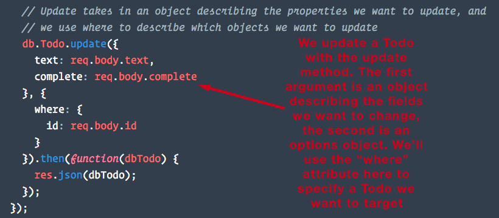

# 14.2 - Getting In The CRUD with Sequelize

### Ins: Pulse Check and Sequelize Review

- 630-40 (10 min)

- we will be introducing methods to update and delete records and validate using sequelize

- today we will be converting an app to use sequelize

- ask: how are people liking sequelize?

  - What is Sequelize?

    - An ORM designed for Node that lets users handle complex SQL database queries with JavaScript methods, rather than typing out SQL code.

  - What is a Sequelize model?

    - A representation of a table as a JavaScript object that Sequelize uses to help expedite the coding of data queries.

  - What Sequelize CRUD methods did we already go over?
    - findOne
    - findAll
    - create

### Ins: TodoList Demo

- 640-50 (10 min)

- demo the final TODO list

- there is an existing todo list app that was using a simple ORM, we're going to make it more functional by adding all CRUD actions

### Warm Up: 07-ORM-To-Sequelize

- 650-720 (30 min)

- starts with `orm.js`, remove all references and setup sequelize

### Ins: Review

- 720-30 (10 min)

  - Then highlight the fact that we sync() our models in the `server.js` file before we start our server. This is what ensures our tables are created and ready when we try and start up our express server.
  - Show them where our models are required inside of the `api-routes.js` file where will use it in the next exercise.

- Show students how the Todos table its made for us when we run `node server` and our database syncs.

- Inform the class that they will be implementing functionality to retrieve Todos from the database using the Sequelize "findAll" and "create" methods.

### Partners: 08-Sequelize-Create-Read

- 730-45 (15 min)

### Everyone Do: Review findAll and create

- 745-55 (10 min)

- Go through the `08-Sequelize-Create-Read/Solved` as a class.

- Point out how in the `api-routes.js` file, the db.Todo.create method takes in an object with the values we want our new Todo to have as an argument.

  - Run the app, create a new todo and open your terminal. There will be a console log of the data being passed to the db.Todo.create method, as well as the MySQL code this executes.

- **Note**: If we were to `console.log` the `dbTodo` object returned from a sequelize query, we'd see that it is a large object with many nested keys and methods. It contains a `dataValues` property that contains the record data we're looking for.

  - When we send the large `dbTodo` object back to the client using `res.json`, only the `dataValues` property is sent back.

  - This is worth knowing since it may come up when debugging students code.

### Instructor Demo: Update and Delete

- 755-8 (5 min)

- Inform students that now they will be working on functionality to delete todos and to update todos.

- Open the solved file `09-Sequelize-Update-Delete/Solved` and run the program. Show students how they can delete todo items by clicking the `x` button on the todo. Refresh the page to prove that todo is gone.

- Demonstrate how when clicking a todo item, you can update the todos text. After editing, hit "Enter" to finish editing, or click anywhere else on the page to cancel editing. Also demonstrate how clicking the check mark toggles a todo's complete property. Refresh the page again to prove this works.

### Partners: 09-Sequelize-Update-Delete

- 8-20 (20 min)

### BREAK!

- 820-35 (15 min)

### Ins: Review

- 835-50 (15 min)

- Slack out the `09-Sequelize-Update-Delete/Solved` directory and have students explain to you how the "where" query attribute works when it comes to filtering the records you want to query.
  

  - Inform students that now that they have a good grasp on CRUD actions with Sequelize, as well as how to filter queries with "where", they already know how to do what they'll be doing 80% of the time with an ORM.

  - Explain to students that at first the Sequelize documentation can be a little difficult to navigate, but after understanding the basics they're much more useful.

- Thank students for working to find answers to the past few exercises. Reading documentation is it's own skill they'll become better at with practice. In the meantime, we've created a Sequelize CRUD actions cheat sheet for them that should make basic usage much easier.

- Slack out the Sequelize CRUD actions cheat sheet `Supplemental/SequelizeCRUDActionsCheatSheet.pdf`

### Ins: Validations

- 850-55 (5 min)

- Explain to the class that as some of them may have already noticed, there's a small flaw with our todolist application. And that is that while our Todos table's text column won't save any data type other than a Sequelize.STRING, it is possible to save a todo with empty text or even one with a null text value.

- While it is possible to restrict this functionality client side (and we definitely should at some point), if someone knew how to use Chrome Developer Tools, they could circumvent any restrictions we put in our front-end JavaScript.

- Knowing that any code we write on the client is potentially available for the user to tamper with. Ask the class what steps we might be able to take on the back end to validate what we're receiving to put into our database.

### Everyone Do: Discuss With Partners

- 855-905 (10 min)

- Have the class discuss with their partners for a few minutes about what options we may have to further restrict what kinds of data can be saved into our Todos table.

- After a few minutes have any volunteers suggest their solutions. Most likely suggestions will be to have a conditional that checks the value before trying to insert it. Some may suggest that Sequelize may have something built in for this.

- Inform students that Sequelize does indeed have built in validations and flags we can include with our models.

- An example of a validation might include making sure that text is a URL or email, or that a credit card number is formatted correctly.

- A flag might include making sure a value is not null before entering it into the database or having a default value for a field if one is not supplied.

- The difference is that flags are ways for us to implement MYSQL constraints we're already familiar with such as "NOT NULL" or "DEFAULT" and validations are additional built in or custom methods we can run before Sequelize inserts a record.

### Partners: 10-Sequelize-Validations

- 905-20 (15 min)

### Instructor: Review

- 920-30 (10 min)

- Slack out `10-Sequelize-Validations/Solved` and show students how we added validations and flags to the Todo model. Go through each new item and have students try and explain to you what they believe each piece of new code does.

  - Assure students there's no need to memorize these. Validations are some of the easier things to look up in the Sequelize documentation. Or even easier, refer back to this project.

### End

- Inform the class that we've just covered a lot of ground today. We've learned everything and more needed to complete this week's homework assignment. If they feel they haven't caught onto everything, encourage them to continue practicing, check out the solution files, and browse through the Sequelize documentation. Of course, they can also talk to you or a TA between classes for one-on-one advice.
