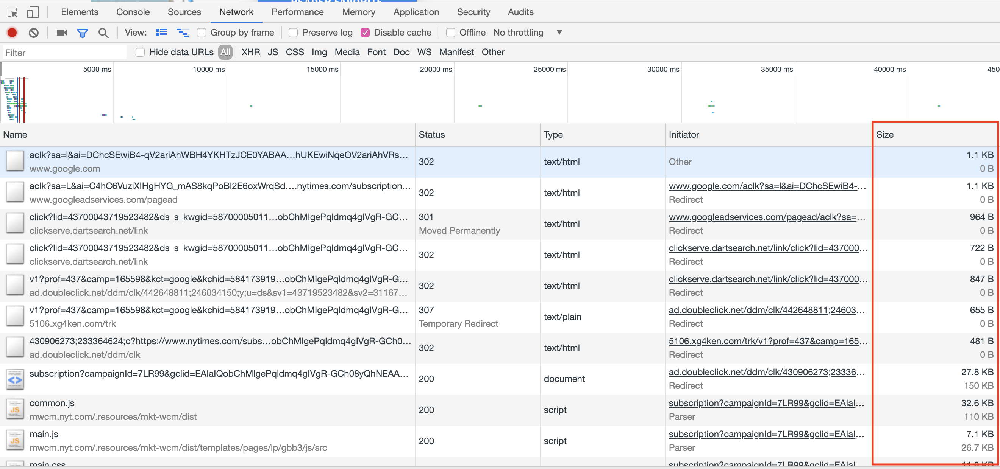

# 18.1 - Web Performance

### Ins: Welcome/Intro Web Performance

- 630-40 (10 min)

- We're going to focus on web performance

  - Lighthouse auditing

  - Minification

  - Compression

  - lazy loading

- we're going to use project 2 for these tests

- ask for someone's favorite website

  - load it in Slow 3G with the network tab open (disable cache too)

    - explain throttling

  - hover on one of the bars to get color legend

  - lots of stuff is just waiting because browsers only support about 6 concurrent connections to handle requests

    - could improve by having fewer requests

  - lots of stuff takes a long time to download

    - could improve by making stuff smaller

- A study by Strangeloop, a web acceleration company that performed various surveys, which Tableau is using to inform our product decisions found the following:

  - 78% of users felt stress or anger when using a slow website

  - 47% of users expect a web page to load in 2 seconds or less

  - A 1 second delay results in a 16% decrease in satisfaction

  - A single bad experience caused about half o f users to express a less positive perception of the company overall

  - user behavior changed with delays as small as 100ms (time to blink your eyes)

    - likely a subconscious reaction

    - issued fewer queries, less likely to click links and waited longer to engage with the page

    - after improving performance Google found it took some users six weeks to return to their baseline behavior (this means if your site performs poorly within six weeks you get suboptimal behavior and perception)

  - iconic (visual) memory lasts about 100ms, the same as above

    - when clicking a button our brain expects to see the button change to its pressed state in our iconic memory (100ms)

    - short term meory lasts 10-15s

  - strangeloop found that users have to concentrate up to 50% harder when using a slow site

  | Time Spent | Interaction Class | Notes                                                          |
  | ---------- | ----------------- | -------------------------------------------------------------- |
  | < 100ms    | Instantaneous     | Software objects that mimic physical objects (ex. Buttons)     |
  | < 1s       | Immediate         | Signal or acknowledgement that a command has been received     |
  | 2-5s       | Flow              | Does not break user's concentration                            |
  | 7-10s      | Captive           | User is likely to switch to something else and come back later |

### Ins: Demo Lighthouse

- 640-50 (10 min)

- Demo the [Gallery App]

- Open the [Gallery App](https://ancient-brushlands-76706.herokuapp.com/) and run the application. Let students know this is an application they will be working with after break later today.

  - Google has created a tool called Lighthouse which will allow us to run an audit on our page and find out different metrics about how it performs and what is hindering its performance. Lighthouse is a quality auditing tool developed by Google for analyzing web pages.

  - It provides audits for performance, accessibility, SEO, and progressive web applications.

  - Lighthouse can be run directly from our Chrome Dev Tools. This makes it a fast, simple, and effective way to get insights into our pages overall performance metrics.

  - Open chrome dev tools, and click the `Audits` tab.

  - Scroll down and click `Run Audits`

- Open the generated `Audit Report` and walk students through the following:

  - The _performance_ section will be the first you encounter, and one of the most useful for todays class. This section will tell us why our site might be performing poorly and delivering a poor user experience. It will also give us actionable items to fix.

  - Hovering over the different status signs next to the times shown will give you information on what that test means.

  - Each audit has a reference doc explaining why the audit is important, as well as how to fix it. These reference docs will lay out why this metric is important to the user experience and give reasons why we might be lacking in the specified audit.

  - One of the main metrics Lighthouse looks for is the _first meaningful paint_.

  - A paint occurs when content is loaded on the screen. Lighthouse measures the first _Contentful_ paint, which means when any content is loaded. It also measures the first _meaningful_ paint which occurs when the primary content becomes visible.

  - One of the most important metrics it takes is _Time to Interactive_. This is the time it takes for the webpage being audited to become usable. A long delay in interactivity can lead to page abandonment.

- Ask the class, "What is web page abandonment?"

  - Abandonment occurs when a user leaves a web page without completing the task they set out to.

- When working on improving a webpage's performance, we should use Lighthouse to complete frequent audits. These can be incredibly helpful in pinpointing where our efforts should be focused.

### Stu: Lighthouse Audit

- (10 min)

- Direct students to the activity instructions found in [01-Stu_Lighthouse]

```md
# Lighthouse Audits

In this activity you will use Google Lighthouse to audit your second group project to find out performance metrics.

## Instructions

- We are going to utilize your second group project for these coming activities to check its performance metrics.

- Navigate to the deployed URL of your project.

- Open the Chrome Dev Tools and click the `Audits` tab.

- Scroll down and click `Run Audits` and allow Lighthouse to run.

- Read through the provided report and be prepared to talk about the `Opportunities` portion of your audit!
```

### Ins: Review

- (5 min)

  - What are some of the 'Opportunities' for improvement you found in your applications?

  - How long did the first content paint take?

  - How long did the first meaningful paint take?

  - How long did it take to become interactive?

- Are there any commonalities you hear?

### Ins: JS Minification

- (10 min)

- "What do you think minification means"?

  - Minification is the process of taking our code and removing all unnecessary characters and whitespace without loss of functionality in an attempt to save file space.

- Ask the class, "Where have we seen minification before?"

  - Bootstrap and jQuery are two examples of minified source code

- Open [JSCompress](https://jscompress.com/) and paste the following code into the textarea:

  ```js
  const myArray = [1, 2, 3, 4, 5];

  for (let i = 0; i < myArray.length; ++i) {
    console.log(myArray[i]);
  }
  ```

- Click the `Compress JavaScript` button to minify the code snippet and explain the following point(s):

  - The minifier moved our `myArray` declaration into our `for loop`.

  - The minifier removed all whitespace between characters, and put all of our code on one line.

  - The minification process resulted in a 30% decrease in the size of the JavaScript.

  - While the code may look different after minification, it will function exactly the same

- Ask the class, "What are the benefits of minification?"

  - Minification saves us space, and smaller file sizes create faster downloads for the user. The faster our assets can download, the faster the page will load them for our user.

### Stu: Minify your JavaScript

- (10 min)

- Direct students to the activity instructions located in [02-Stu_Minifiy-JS]

### Ins: Review

- (5 min)

- Ask the class the following question(s):

  - How much of a reduction they saw in JS sizes from Input to Output?

  - How this could benefit developers, especially those with massive code bases?

- While the minified code certainly appears different than the code we input to start, all of the functionality is retained.

- Ask the class, "Why might we not want to edit our minified code?".

  - It is important to have minified code in it's own file. It is not recommended to attempt editing minified code as it can be difficult to read, and even more difficult to debug due to the lack of readability.

  - How might we minify image files?

- Use students answers to transition to the next activity.

### Ins: Compression npm package

- (10 min)

- Ask the class, "What do we do with files that are so large they are slowing load times?"

  - We compress those files.

- Ask the class, "What is a zip file?"

  - A `.zip` file is a compressed version of a normal directory. When you `unzip` it, the directory contains all of the information it had before it was zipped.

- On the web we can use something called GZip compression via an NPM Package called `compression`.

  - GZip is a form of data compression -- it takes a piece of data and makes it smaller. The original data can be restored by un-zipping the compressed file.

  - It is relevant to web apps and web sites because the HTTP protocol includes the ability to gzip data that is being sent.

  - This middleware will enable compression for our project, allowing for compressed versions of our files to be sent over the network for faster download times.

- Navigate to [compression npm](https://www.npmjs.com/package/compression)

- Tell the class that using this middleware enables compression with just 3 lines of code.

- Now we are going to show students around the `Network` tab in Chrome Dev Tools.

- Open up your `network` tab in the chrome dev tools. Navigate to the [New York Times](https://www.nytimes.com/).

  

- Point students to all the incoming network traffic shown, and more specifically the file sizes column.

  

- There is a file size showing the compressed size (Smaller number) and its uncompressed size (larger number).

  - Files that don't have two numbers are uncompressed files being sent unchanged.

### Stu: Enable Compression

- (10 min)

- Direct students to the activity instructions located [03-Stu_Enable-Compression]

### Ins: Review

- (5 min)

- Open [03-Stu_Enable-Compression](../../../../01-Class-Content/18-PWA/01-Activities/03-Stu_Enable-Compression/Solved) in your IDE and explain the following points

  - We first `npm install compression`

  - We then add the following code to our `server.js`:

  ```js
  const express = require('express');
  const mongoose = require('mongoose');
  const compression = require('compression');

  const app = express();

  app.use(compression());
  ```

### BREAK

- (15 min)

### Ins: Introduce Image Compression

- (5 min)

- Have you ever gone to a site and experienced slow image loading times?

  - Images are one of the most used assets on the web. They are everywhere, and there are more than you can imagine.

  - This is normally due to oversized images or high resolution images being downloaded and taking time. Images are one of the main culprits in slowing down web loading times.

- How might we be able to fix the problem of images that are too large?

  - We can use a concept called _Image Compression_. For the purposes of our course we are going to talk about _Lossy Image Compression_.

- What do we mean by "lossy" image compression?

  - What lossy image compression basically means is that some of the image data is lost during compression. Once an image has used lossy compression, you cannot reverse the process due to this loss of data. The data lost will normally result in almost unnoticeable changes in image quality most of the time.

### Stu: 04-Stu_Image-Compression

- (10 min)

### Ins: Review

- (5 min)

- Did you see a loss in image quality?

  - Image compression allows us to lower load times for our users without a loss of visual fidelity.

- Do you see the benefits of compressing images?

  - When we can save space while maintaining visual quality, that is a win win. It allows for us to have high resolution images for our page while we are still decreasing download/load times for our user.

- What are some other things we can do to decrease our load times?

  - We can load only images that are present on the screen. If the image is not visible to the user, we shouldn't bother downloading it yet.

- Ask the class, "What if a user doesn't scroll through all of the images?"

  - Now that we have compressed all of our images, we are certainly saving space. Point out, we are loading all 38 images when there is only 6-9 images showing at any time. If a students user is on mobile, it would only be 1-2 images at any time.

  - This poses multiple problems. It not only makes loading slower, but is costly when it comes to data and those people using mobile who may not have an unlimited data plan. We certainly don't want to cost our user time and money, so what can be done?

- Ask the class, "Why do we load all of the images at page load, if the user might not see them all?"

  - Loading everything at once is the default. There is a concept in programming referred to as `lazy loading` that allows us to only download assets as they are needed.

- Use students answers to transition to the next activity.

### Ins: Lazy Loading

- (10 min)

- Open our completed [Lazy Loading Gallery App](https://ancient-brushlands-76706.herokuapp.com/) and demo the lazy loading functionality by scrolling to the bottom of the page.

  - If it loads too quickly, open your `Network` tab in your Dev Tools and throttle to `slow 3g`, disable cache, and refresh the page.

- Ask the class, "What would enable us to know when an image is coming into the users viewport?"

  - A Web API based on `scroll` events and the viewport intersection would allow us to keep an eye on when an element is or is not in view of our user.

  - In the case of this application, we are loading 38 images when we may not need them all. Using lazy loading, If images were scrolled onto the screen that event would then load the images if they had entered the viewport.

- Ask the class, "What web API would allow us this functionality?

  - The `Intersection Observer API`. It provides a way to asynchronously observe when an element is or is not within our users viewport.

  - We can use this API to watch and then target elements as they enter the viewport

- Ask the class, "How can the Intersection Observer API help us with loading images?"

  - We are able to target images we would like, and observe them. As they enter the viewport of our user we can trigger a function that will then and only then load the image that has entered the viewport.

  - Let's look at a code snippet that enables image lazy loading via JavaScript.

- Walk through the comments below:

```js
function initLazyImages() {
  // Gather all of our images into a variable
  const lazyImages = document.querySelectorAll('.lazy-image');

  function onIntersection(imageEntities) {
    imageEntities.forEach(image => {
      // When the image begins to intersect viewport, execute the if code block
      if (image.isIntersecting) {
        // Now that it is in viewport, we do not need to observe it anymore.
        observer.unobserve(image.target);
        // Set the image src to the image that has entered viewport.
        image.target.src = image.target.dataset.src;
      }
    });
  }
  // Create a new instance of Intersection Observer
  const observer = new IntersectionObserver(onIntersection);
  // Observe all images on load.
  lazyImages.forEach(image => observer.observe(image));
}
```

- Ask the class, "How does this benefit our user?"

  - By loading only necessary images, we can cut download/load times consistently and ensure as fast an experience as possible.

- Use student answers to transition to the next activity.

### Stu: 05-Stu_Gallery-Lazy-Load

- (15 min)

### Ins: Review

- (5 min)

- Open the [solved Gallery Lazy Loading app](../../../../01-Class-Content/18-web-performance/01-Activities/05-Stu_Gallery-Lazy-Load/Solved/).

- Walk students through the code that enables lazy loading in our application.

```js
function initLazyImages() {
  const lazyImages = document.querySelectorAll(".lazy-image");
```

- First we create a `const` called `lazyImages`. We save all elements with the class `lazy-image` to this constant variable

```js
function onIntersection(imageEntities) {
  imageEntities.forEach(image => {
    if (image.isIntersecting) {
      observer.unobserve(image.target);
      image.target.src = image.target.dataset.src;
    }
  });
}
```

- Next, we create an `onIntersection` function. In this function we state that for each mage, if the image is intersecting the viewport we load our image and stop observing it as it is now on screen.

```js
const observer = new IntersectionObserver(onIntersection);
```

- We used a constructor function to create a new instance of IntersectionObserver, saving it to a constant variable `observer`. This allowed us to use it in our `onIntersection` function.

```js
  lazyImages.forEach(image => observer.observe(image));
}
```

- The final line subscribes all images to be observed by IntersectionObserver to it can download the proper image when the placeholder is scrolled into view.

### Ins: Intro Gallery App Full Optimization

- (5 min)

- Let students know they did a great job today. Web performance is important, and they now have a foundation to learn more and become great at optimizing applications.

- For the final activity of the day students wil take the completed gallery application and minify all of the JS.

### Stu: 06-Stu_Gallery-Optimize

- (20 min)

### Ins: Review

- (5 min)

- Navigate to [06-Stu_Gallery-Optimize/Solved](../../../../01-Class-Content/18-PWA/01-Activities/06-Stu_Gallery-Optimize/Solved) and run the following commands:

  - npm install

  - npm install compression

- Navigate to the [06-Stu_Gallery-Optimize/Solved/server.js](../../../../01-Class-Content/18-PWA/01-Activities/06-Stu_Gallery-Optimize/Solved/server.js)

```js
const compression = require('compression');

app.use(compression());
```

- With these two lines of code we can easily enable GZip compression in our application for our served files.

- Ask the class, "Is Tiny PNG our only option for Image Compression?"

  - We can use many different tools when looking to compress images. For our purposes we chose to use Tiny PNG for its ease of use. Feel free to research other image compression tools if you'd like to dive deeper.

  - We will not go through the process of compressing all of the images as we did that earlier in the class, but image compression is an important and easy way to decrease load times.

- Ask the class, "Can you see the ways you can use these performance enhancements in your existing applications?"

  - Optimizing our applications to be performant on all devices and connection speeds will make us better developers. We need to consider those with smaller devices or slower speeds at all times as to not alienate any user base.

### Ins: End (0 min)

- Congratulate students on beginning their journey into web performance. They learned a lot today, let them know they did a good job.

- Answer any questions before wrapping up.
