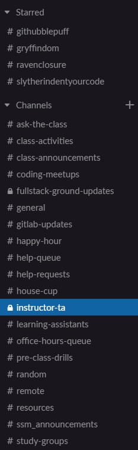
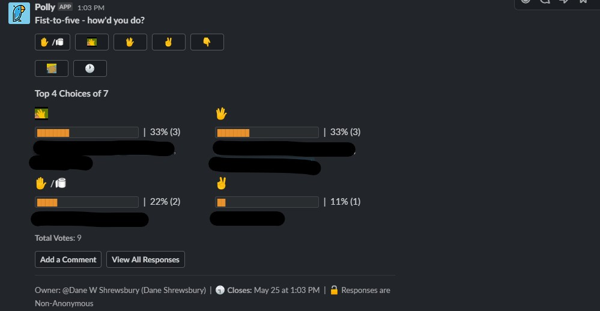
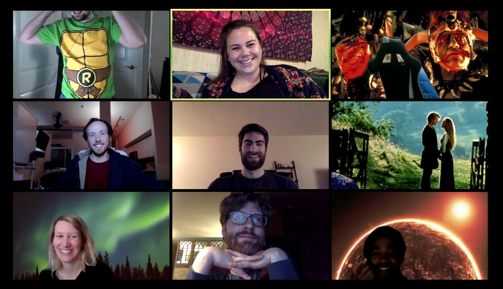

## 
 Bonus Features
---

## Title
1. Description
1. Student Response
1. Overall thoughts 

## Spencer's Knowledge and Composure 
1. This was by far the greatest asset to this section and it wasn't even close. His ability to answer all the student's questions with clarity and thoroughness was impressive. This really set the tone for the course and gave the students confidence in his knowledge/accuracy. He would always spend the extra time to thoroughly answer each question, narrating his process as he is coding/debugging so that students can understand the process and learn from it. He would spend extra time reviewing each lesson plan and make sometimes entire alterations that was more reflective of current SWE trends (I.e. removing float and replacing it with FlexBox). Unafraid to alter the course and focus on the important aspects (Increased React / Computer Science). 
1. Nearly perfect instructor score week after week.  
1. Great hire. Gained a lot of knowledge/insight working beside him. 

## Slack Channels
1.  
1. Positive. 
1. I think we could have combined help-queue/office-hours-queue/help-requests into a single channel. The class-activities channel had a web-hook to GitLab so whenever updates were pushed, there was a notification within the channel. 

## Fist-To-Five
1. 
1. Positive. This was done after every activity to guage feedback and response. 
1. This was a great tool to get feedback from students. 

## Instructional Staff Standup
1. Normally about 10-15 minutes before office hours, the instructional staff met for a stand-up meeting. This normally addressed blockers, student successes, and any ideas that could improve the course. 
1. N/A
1. This was great to make sure everyone was on the same page about issues that came up. 

## Pre Class Drills (Optional)
1. 15 minutes before the lecture began, one of the instructional staff would demonstrate an interview style whiteboard question. The students were given these questions generally 1 week in advance so they had ample time to attempt them. 
    - One alteration we added later was themed weeks (recursion, dynamic programming... etc.)
1. I would say overall mixed. A lot of the `stronger` students really enjoyed these questions and even formed groups to try to tackle them together. Not all students participated, but they did enjoy the demonstration of the solving process. 
1. This was overall a great success and I think it added a lot to the course in terms of preparation for REAL interview style questions.
   - The only alteration I would reflect on would be deciding on the difficulty curve of the questions. 
   - You want a nice mid-point. Where weaker students can understand, but still is a challenge for harder students. Maybe adding bonus challenges within questions.

## Mock-Interview
1. Spencer(instructor) performed a full 1 hour mock-interview with Dane(TA). This interview included a behavior section, technical section, and then a reflection of positives/negatives of that interview. 
1. Overwhelmingly positive. Every student was able to take a lot of information away from that experience and I believe it calmed a lot of nerves for students seeing the entire process. Removed a lot of the `mystique` about whiteboard interviews. 
1. Extremely positive. Would recommend for each section.  

## Homework Demonstration
1. One of the TA's would perform a homework demonstration at the end of each week. They would go over the application and describe the required features in greater detail. Students were given time to ask questions about it as well. 
1. Positive.
1. This just helps clear up any misconceptions from the HW README. 

## House Cup
1. We split up the students into four sections. (GithufflePuff, Gryffindom, Ravenclosure, and SlitherIndentYourCode). This was decided on NSEW directions from main campus. Points were awarded for various bonus activites or outstanding performance on class homework, activities, PreClassDrills, meeting up outside class, helping other students. Rewards were given out at different intervals of the class. 
1. Very positive, people really enjoyed the arbitrary point system and influenced people to get to know people in their area. 
1. Positive, but hard to maintain in a Zoom setting.  

## Happy Hour
1. With the Covid-19 pandemic and mandatory quarantine, its difficult all around. We would meet up in a zoom call and play games, BYOB, and relax. 
    Games list:
    - skribbl.io
1. 
1. Very Positive
1. Its was a very positive experience to relax and get to know fellow classmates. The overall response was very positive and many people came back every other week to participate. 

## Mid Course Reflection
1. This was a recommendation from another instructor, the weekly homework was to write a few paragraphs on your journey, reflect on where you started, celebrate all the successes, and visualize their path into the future. 
1. 10/10
1. As a TA, I enjoyed reading all these and it was very motivating to hear all their stories. The pace of the boot camp is so fast that its often hard to remember how far they've come and how much they've learned along the way. We replaced a homework assignment just for this and I think that was worth it. 

## Weekly Zoom Background Contests  
1. Each week we took a poll among the students to choose the theme. At the end of the week, we held a poll to choose the best. Small prizes would be delegated. Some of the themes included: 
    - favorite book
    - favorite movie
    - 90's
    - favorite record/album
    - favorite anime
    - food
1. Very positive
1. This was just a fun little game that most people participated in. 

## Post Class Bonus Lectures
1. Description
1. Student Response
1. Overall thoughts 

