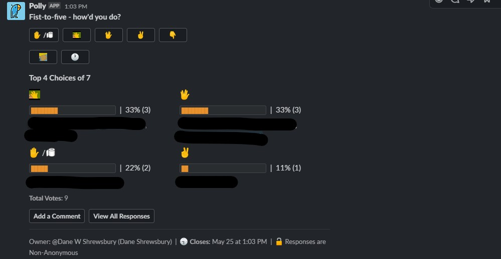
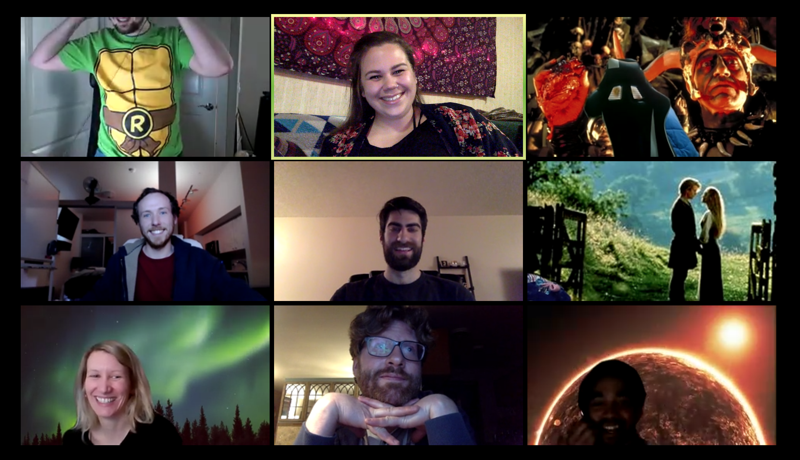

## 
 Bonus Features

---

## Title

1. Description
1. Student Response
1. Overall thoughts

## Spencer's Knowledge and Composure

1. This was by far the greatest asset to this section and it wasn't even close. His ability to answer all the student's questions with clarity and thoroughness was impressive. This really set the tone for the course and gave the students confidence in his knowledge/accuracy. He would always spend the extra time to thoroughly answer each question, narrating his process as he is coding/debugging so that students can understand the process and learn from it. He would spend extra time reviewing each lesson plan and make sometimes entire alterations that was more reflective of current SWE trends (I.e. removing float and replacing it with FlexBox). Unafraid to alter the course and focus on the important aspects (Increased React / Computer Science).
1. Nearly perfect instructor score week after week.
1. Great hire. Gained a lot of knowledge/insight working beside him.

## Slack Channels

1.  
1.  Very positive.
1.  I think we could have combined help-queue/office-hours-queue/help-requests into a single channel. The class-activities channel had a web-hook to GitLab so whenever updates were pushed, there was a notification within the channels.

## Fist-To-Five

1. 
1. Positive. This was done after every activity to guage feedback and response.
1. This was a great tool to get feedback from students.

## Instructional Staff Standup

1. Normally about 10-15 minutes before office hours, the instructional staff met for a stand-up meeting. This normally addressed blockers, student successes, and any ideas that could improve the course.
1. N/A
1. This was great to make sure everyone was on the same page about issues that came up.

## Pre Class Drills (Optional)

1. 15 minutes before the lecture began, one of the instructional staff would demonstrate an interview style whiteboard question. The students were given these questions generally 1 week in advance so they had ample time to attempt them.
   - One alteration we added later was themed weeks (recursion, dynamic programming... etc.)
1. I would say overall mixed. A lot of the `stronger` students really enjoyed these questions and even formed groups to try to tackle them together. Not all students participated, but they did enjoy the demonstration of the solving process.
1. This was overall a great success and I think it added a lot to the course in terms of preparation for REAL interview style questions.
   - The only alteration I would reflect on would be deciding on the difficulty curve of the questions.
   - You want a nice mid-point. Where weaker students can understand, but still is a challenge for harder students. Maybe adding bonus challenges within questions.

## Mock-Interview

1. Spencer(instructor) performed a full 1 hour mock-interview with Dane(TA). This interview included a behavior section, technical section, and then a reflection of positives/negatives of that interview.
1. Overwhelmingly positive. Every student was able to take a lot of information away from that experience and I believe it calmed a lot of nerves for students seeing the entire process. Removed a lot of the `mystique` about whiteboard interviews.
1. Extremely positive. Would recommend for each section.

## Student Mock Interviews

1. We created a Google sign up sheet where students could sign up for a full mock-interview (behavioral + technical). We would roleplay as an interviewer and write notes for the student.
1. Mixed/positive
1. A lot of students were very intimidated by this process in general and it was only the `stronger` students who signed up for this activity. I would attempt to emphasize this at greater lengths, but its hard to convince students to try.

## Homework Demonstration

1. One of the TA's would perform a homework demonstration at the end of each week. They would go over the application and describe the required features in greater detail. Students were given time to ask questions about it as well.
1. Positive
1. This just helps clear up any misconceptions from the HW README.

## TA - Weeekly Review

1. Each week we would have a weekly review of major concepts throughout the week. This was generally located in a weekly-review markdown file and students would use it as a reference. My mindset going into this was to emphasize the major topics, foreshadow important topics related to the weekly homework, and sometimes even add extra material if I felt that was the most benefit. Even if students couldn't stay late in class to watch this review, a lot of students viewed the recordings and learned from it.
1. If the average weeks fist-of-five was low, it might be pertinent to review the material, but if most students had high marks in terms of understanding, the weekly review can be converted into further information lecture.
1. If I felt the homework was particularly challenging, I would give hints or bonus information that pertains to that specific homework. Even bonus tips and tricks.
1. Options:
   - Kahoot.it
   - Markdown
   - VSC - JS file
   - Whiteboard
1. Very positive.
1. This was an essential asset.

## Architecture - Tuesday

1. We would spend some office hours time to hold a discussion panel with students to talk about how best to organize and approach the homework. Laying out the foundation of file/folder structure greatly helped students.
1. Very positive.
1. Extremely helpful, especially for weaker students. They were about to have some insight in how to start and approach the problems.

## House Cup

1. We split up the students into four sections. (GithufflePuff, Gryffindom, Ravenclosure, and SlitherIndentYourCode). This was decided on NSEW directions from main campus. Points were awarded for various bonus activites or outstanding performance on class homework, activities, PreClassDrills, meeting up outside class, helping other students. Rewards were given out at different intervals of the class.
1. Very positive, people really enjoyed the arbitrary point system and influenced people to get to know people in their area.
1. Mixed/Positive, but hard to maintain in a Zoom setting.

## Happy Hour

1. With the Covid-19 pandemic and mandatory quarantine, its difficult all around. We would meet up in a zoom call and play games, BYOB, and relax.
   Games list:
   - skribbl.io
   - Steam games : Jackbox games
1.  [more photos](https://photos.app.goo.gl/zMNVHH8ePtaDrcCj9)
1. Very Positive
1. Its was a very positive experience to relax and get to know fellow classmates. The overall response was very positive and many people came back every other week to participate.

## Mid Course Reflection

1. This was a recommendation from another instructor, the weekly homework was to write a few paragraphs on your journey, reflect on where you started, celebrate all the successes, and visualize their path into the future.
1. 10/10
1. As a TA, I enjoyed reading all these and it was very motivating to hear all their stories. The pace of the boot camp is so fast that its often hard to remember how far they've come and how much they've learned along the way. We replaced a homework assignment just for this and I think that was worth it.

## Weekly Zoom Background Contests

1. Each week we took a poll among the students to choose the theme. At the end of the week, we held a poll to choose the best. Small prizes would be delegated. Some of the themes included:
   - favorite book
   - favorite movie
   - 90's
   - favorite record/album
   - favorite anime
   - food
1. Very positive
1. This was just a fun little game that most people participated in.

## Post Class Bonus Lectures

1. After class a "bonus lecture" was held with content that did not fit into the class.
1. Very positive, there was ~90% attendance of people staying after class for these.
1. It took a lot of extra work but the students seemed to appreciate it and the extra material often helped them to better understand the base material.

## Project Award Ceremonies

1. Every project had awards given out to groups for things like "People's Choice", "Most Technical", etc.
1. Positive - students received trophies and some people put them up on display. They really seemed to like this.
1. I recommend this, it is low cost with medium to high value.

## Extended Computer Science

1. Unit `22-computer-science` was extended across four classes (instead of the original half a day deck) and added numerous bonus lectures and preclass drills to account for what couldn't fit in those four days.
1. Positive - students understood that computer science was solved the _how_ to get a job and really cared about the content. They wanted it to be extended even further.
1. I would make this even more extended, if I could go back. Four days, preclass drills and bonus lectures were not enough to cover everything. I think 2-3 weeks, bonus lectures and preclass drills would be necessary to provide a solid foundation. I would also start much earlier, not at the end of the course when senioritus kicks in.

## Student-Organized Breakout Rooms

1. Students were all made co-host and allowed to move around in breakout rooms as they desired.
1. Positive
1. Students enjoyed the social interaction of being with their friend groups without the stress of social anxiety from having random partners are feeling isolated being alone.

## Activity Rewrites

1. Some activites did not seem useful and detracted from the learnings so I removed a few of them. For example, the CSS `float` property.
1. Students did not know that these changes took place
1. There were far fewer bugs after the rewrites and material better reflected what they would need to know to be successful. I believe they are stronger web developers as a result.

## Linting

1. Added a linter to every unit conforming to the latest learnings to ensure consistent style and highlight errors.
1. Students did not notice (behind the scenes changes)
1. This enabled me to fix literally thousands of bugs easily. In every unit there were hundreds of bugs to fix and linting automated fixing most of them.

## Data Visualizations

1. The metrics of the class were visualized using the API from BCS and Tableau
1. They did not directly know about this but it did enable positive early conversations with students when it was noticed they weren't attending class, had missed a few homeworks, etc.
1. This enabled easily and quickly identifying students that fell behind, how well a homework went and served as a general dashboard for the class.

## Q&A

1. Three Q&A sessions were held - Facebook (managers and recruiter), Microsoft (senior engineer), Bootcamp (four bootcamp graduates who are now successfully employed.) This was done during project 3 weeks at the beginning of class.
1. Postive - many comments said they really appreciated the opportunity to ask questions to industry professionals.
1. I recommend this as a standard practice for all bootcamps. Without it there was a lot of missing information that students were wondering about.

## Grading Template

1. `meta\grading\template.md` is a template to quickly and easily grade homework and projects. It contains common responses to expedite responses and tools to quickly retrieve metrics.
1. Students were not aware of this but the faster turnaround time for homework was a positive for them.
1. I highly recommend creating something like this early and adding to it as generalized responses on homework are created.

## Kahoot

1. Kahoot.it is a service to make questions interactive similar to jackbox games. This was used for reviews (replacing powerpoints) and in a few other small places where asking a series of questions was used.
1. Students had a positive reaction (when asked the first time doing it 88% said they loved it with the rest saying they would need more time to decide)
1. This increases student engagement and makes what can easily become a mundane review exciting

## GitLab Slack Integration

1. Any updates to the GitLab repo were automatically posted to the #activities channel in Slack using the GitLab slackbot with webhooks.
1. Students enjoyed being able to transparently see exactly what changed when. Every update would automatically inform the students with an easy way for them to tell what had changed.
1. This is a quick and easy addition with really only positive outputs. I recommend this be done by the Trilogy team when they create Slack workspaces for all classes.

## Zoom Slack Integration

1. Zoom was added to slack and set as the default calling app
1. Students used this feature constantly throughout the class. It made working in a group much easier, they just click the phone icon from their channel and it starts a Zoom call with everyone.
1. This was quick and easy with only positive outcomes. I recommend adding it.

## GitHub Slack Integration

1. Any updates to GitHub were automatically notified to slack channels. I showed students how to do this for their projects.
1. Positive - students set this up in their slack channels which fostered communication.
1. Recommended - very low cost with medium return

## Auto Daily Reminders

1. Slack reminders were sent at the beginning of each class to sign in and pull the repo
1. Neutral - I did not hear anything about this, postive or negative
1. It was nice to have an automated reminding system, especially at the beginning of the class.

## Slack Polls

1. When multiple potential choices had to be made slack polls (polly) were often sent out to enable students to voice their opinion.
1. Postive - students appreciated have a voice in the direction of the class
1. A balance needs to be struck with this. Too many polls shows indecisiveness and can overwhelm the students. With too few students do not feel empowered to help make the class better and you don't have as much information to make educated decisions.
