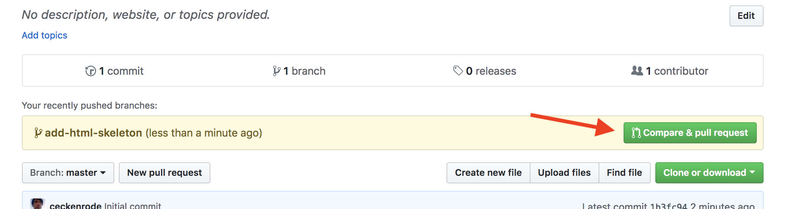
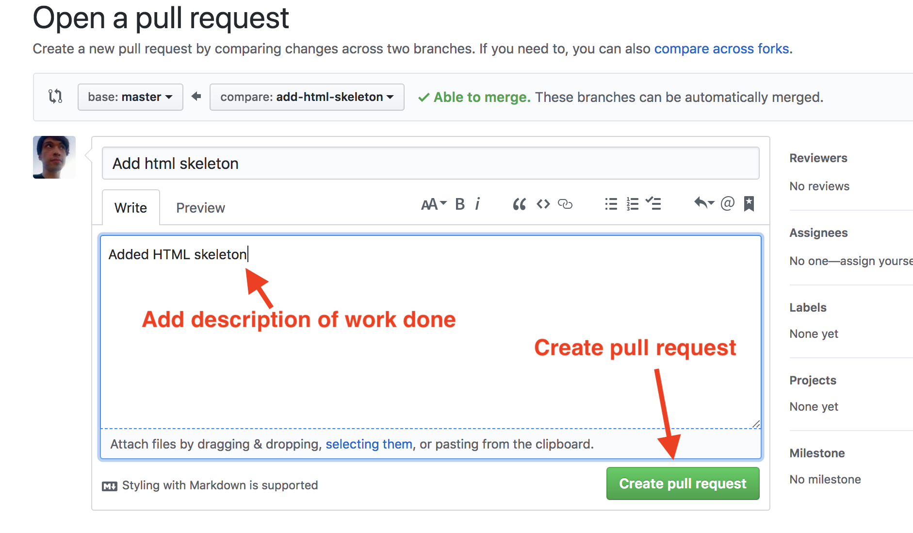
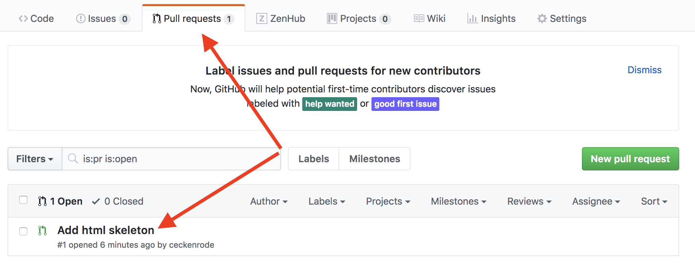

# Common Workflows for Git

## Work on a new branch

- In your terminal navigate to a `git` repository

- Check what branch you're on (`git branch`) (should be "master")

- Create a new branch (`git checkout -b my-cool-new-branch`) (the `-b` is a flag that creates a new branch)

- Check what branch you're on (`git branch`) (should be "my-cool-new-branch")

- Make a change (modify a file, create a file, etc.)

- Commit your change (`git status`, `git add -A`, `git commit -m "made a change on my new branch"`)

- Push your branch to the remote repository `git push -u origin my-cool-new-branch`

### Create a pull request

- Go to your repository in GitHub

- Go to the main repo page at github.com and you should see the following:

  

- Click "Compare & pull request".

- On the next screen, add a description of the work that was done and click the "Pull Request" button.

  

- Click the gear next to "Projects" and select your project to have it appear in your Kanban board

- If completed successfully, you should see the pull request listed under the repo's "Pull request" tab.

  

### Review the code and merge into master

- Someone other than the person who created the pull request needs to review and approve the change

- Once the code is merged, delete the branch on both the remote repository (GitHub) and your local repository

  - `git checkout master`
  - `git pull`
  - `git branch -d my-cool-new-branch`

## Merge changes from master into your feature branch

If you have a branch which needs changes which have been merged into master (a second feature branch, for example) then you need to merge master into your second feature branch

- `git checkout master`
- `git pull`
- `git checkout my-feature-branch`
- `git merge master`

The changes from master should now be included in your feature branch
