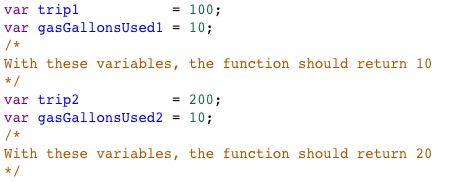
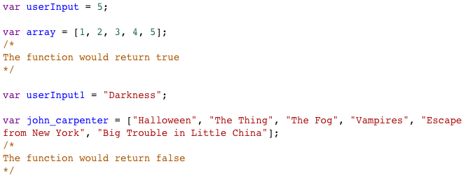

## Questions

1. Array Declaration - `Syntax Recollection` `Arrays`

   ❓ Write an array that will hold someone's name, age, address, height, and whether they have visited outside the country.

1. If/Else Statement - `Syntax Recollection` `if` `else`

   ❓ With the two variables, write an if statement that tests whether they are the same age.

1. For Loop - `Syntax Recollection` `for loops` `push`

   `var numbers = [];`

   ❓ Using a **for loop**, populate the array `numbers` with numbers 1 through 100.

1. Objects - `Syntax Recollection` `object`

   ❓ Make an Object that has named values of someone's name, age, height, if they have blue eyes, and city where they live. Also, write a method called thisIsMe that will console.log their info.

1. JavaScript vs jQuery - `jQuery` `vanilla` `Technical Vocabulary`

   ❓ Compare and contrast JavaScript and jQuery.

1. Gas Mileage - `new problem solving`

   

   ❓ Write in code that will take two variables trip and gasGallonsUsed into a function called mpg and will calculate the car's mpg.

1. Checker Function - `new problem solving`

   

   ❓ Write code that will take in user input and an array into a function called checker. The function will return true if the user input is found in the array and false if it is not found in the array.
